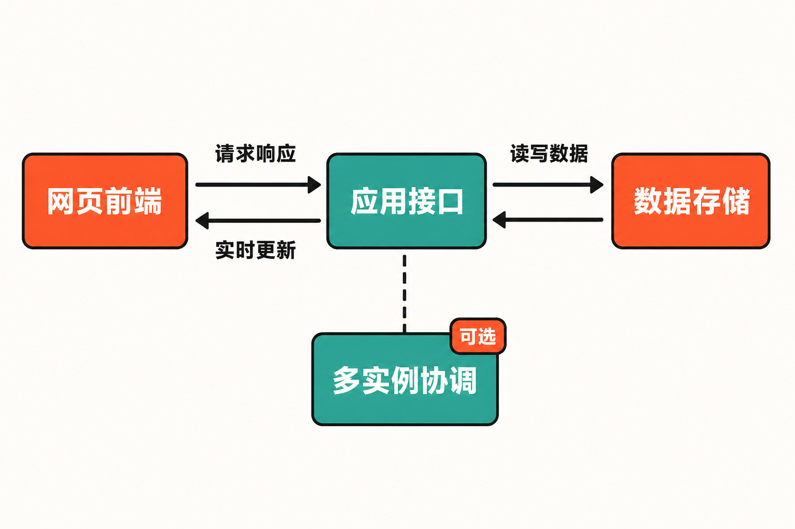

项目只有十来个人，任务却散落在聊天记录、表格和代码仓库里。团队想引入正式工具，又担心先花几周配置字段、权限和工作流；选择在线服务省事，却可能碰到数据存放、账号体系或定制能力方面的限制。

Kaneo 瞄准的正是这种夹缝：它试图保留任务协作的必要结构，同时减少传统项目管理平台里的按钮、通知和流程负担。但“轻量”并不意味着零成本——采用自托管之后，数据库、升级、安全和备份都会成为团队自己的责任。

## 30 秒认识项目

- **一句话定位：**面向团队的开源、自托管轻量项目管理与 Issue 跟踪平台。
- **仓库地址：**[usekaneo/kaneo](https://github.com/usekaneo/kaneo)
- **许可证：**[MIT License](https://github.com/usekaneo/kaneo/blob/main/LICENSE)，允许商业使用、修改和分发，但须保留版权及许可声明。
- **主要语言与技术：**TypeScript；后端采用 Hono，Web 前端采用 React 与 Tailwind CSS，数据存储使用 PostgreSQL。
- **活跃度：**截至 **2026 年 8 月 25 日 16:43（北京时间）**，仓库页面约有 8.5k Stars、710 Forks、30 Watchers、42 个开放 Issue 和29个 Pull Request；最新 Release 为 **v2.22.0**，发布于2026年8月21日。动态数据见[仓库主页](https://github.com/usekaneo/kaneo)与[Release 页面](https://github.com/usekaneo/kaneo/releases)。

这些数字只能证明项目获得关注且仍有人参与，不能直接证明可靠性。更值得观察的是：8月11日至21日出现了多个功能或修复版本，主分支在8月20日仍有连续提交。由此可以判断项目近期维护活跃；但发布密集也说明它仍处在快速变化阶段。

## 它要解决的不是“任务太少”，而是工具太重

Kaneo 的[官方文档](https://kaneo.app/docs)将问题归因于功能堆叠和复杂工作流：团队本来只需要确定做什么、由谁负责、何时完成，却不得不适应工具预设的流程。Kaneo 因此强调“只提供所需内容”，让工具顺应团队现有工作方式。

与 Jira、Linear 或 Trello 相比，来源材料能够确认的差异主要有两点：一是 Kaneo 明确追求更克制的界面和流程；二是它可以自托管，并提供开放 API。至于性能、总成本或具体功能覆盖率，现有资料没有给出可比测试，不能武断地说它全面优于这些产品。

**编辑观点：**Kaneo 真正的价值不是把成熟商业工具复制一遍，而是提供一个“结构化协作的最低可用集合”。这也是它最鲜明、同时最容易被误解的产品取舍。

## 四项核心能力，分别有什么实际价值

### 1. 看板、列表与积压工作统一组织任务

团队可以通过看板观察工作所处阶段，也可以用列表集中检查任务；积压工作则用于存放尚未进入当前流程的事项。实际价值在于，同一批任务既能服务日常推进，也能支持集中梳理，不必为了不同视角维护多份记录。


### 2. 用负责人、标签、优先级和日期建立上下文

任务可设置负责人、标签、优先级与截止日期，并可据此筛选。标签还能表达 onboarding、backend、customer-feedback 等跨项目语义。它解决的不是“给任务增加更多字段”，而是让成员快速回答三个问题：这件事属于什么、谁来做、现在是否紧急。

### 3. 从讨论延伸到时间和文件记录

评论、附件与时间跟踪把执行过程留在任务旁边，减少上下文散落。角色权限则用于限制不同成员的操作范围。这里仍需保持边界意识：来源能确认这些能力存在，但没有提供大规模团队下的权限模型或性能测试。

### 4. 通过集成与 API 接入开发流程

项目提供 GitHub、Gitea 集成、开放 API，以及内置 HTTP/stdio MCP 接入。官方 API 基于 OpenAPI 生成，通常通过 Bearer API Key 认证，自托管实例的基础路径为 `/api`。这使团队有机会把任务系统连接到代码仓库或自动化流程，而不必只依赖网页操作。

**推断：**对有开发能力的小团队，开放 API 和自托管可能比内置功能数量更重要，因为它们决定了工具能否嵌入现有工作流。是否值得自行集成，仍取决于团队的维护能力。

## 工作原理：一个不复杂，但并非无运维的系统

Kaneo 的基本链路可以概括为：浏览器中的 React/Tailwind Web 前端访问 Hono/TypeScript API，API 读写 PostgreSQL；事件和 WebSocket 将任务变化实时推送给其他客户端。单实例部署不强制依赖 Redis，只有多个 API 实例需要协调实时消息时，Redis 才是可选组件。

这套结构的优点是组件关系清楚，也便于容器化部署。代价则是生产环境至少要管理应用和 PostgreSQL，并正确处理持久化、认证密钥、HTTPS与访问地址。



## 最小安装：先跑起来，再谈生产化

官方[Quick Start](https://kaneo.app/docs/core/index)推荐先安装 `drim`，再启动交互式配置：

```bash
curl -fsSL https://assets.kaneo.app/install.sh | sh
drim setup
```

安装完成后，按官方默认配置从以下地址访问：

```text
http://localhost:5173
```

这就是可复制的最小使用入口：在浏览器打开页面，创建项目，再以看板或列表组织任务。来源没有提供可安全照抄的具体 UI 操作命令，因此不虚构额外步骤。

需要更高控制力时，官方仓库还提供 Docker Compose、Coolify、Helm/Kubernetes和源码开发方案。Compose 的最小结构由 Kaneo 应用与 PostgreSQL 16 组成，启动命令为：

```bash
docker compose up -d
```

生产部署不能照搬默认值：`AUTH_SECRET` 至少应为32个字符，且需要正确设置 `KANEO_CLIENT_URL` 与 `KANEO_API_URL`。Docker 内数据库主机名应使用 `postgres`；若 API 在宿主机直接运行，则应使用 `localhost` 或明确配置 `DATABASE_URL`。

## 优点、限制与成熟度

Kaneo 的优势很明确：MIT 许可宽松；界面和流程强调克制；支持自托管；任务管理基本能力较完整；并为 API、代码托管平台及 MCP 留出了扩展接口。近期提交和连续发布也说明项目没有停滞。

限制同样不能省略。第一，它并非无需配置的单文件应用；前端与 API 分离部署时，需要处理 CORS、Cookie、HTTPS和反向代理。官方[环境配置指南](https://github.com/usekaneo/kaneo/blob/main/ENVIRONMENT_SETUP.md)指出，`KANEO_API_URL`、`KANEO_CLIENT_URL`、`VITE_API_URL`或允许来源不一致，可能导致 Failed to fetch、网络错误或 CORS 拦截。

第二，快速迭代伴随升级风险。[Release 记录](https://github.com/usekaneo/kaneo/releases)显示，v2.19.1曾修复任务切换时描述可能保存到错误任务的数据一致性问题；v2.19.0还涉及 Secure Cookie 与任务优先级迁移，大型看板升级时可能短暂获取 `task` 表独占锁。其安全策略只支持最新版本，不为旧版本回移安全修复。

第三，截至核实日期，分享预览仍有已知限制：Slack、Teams、Discord 等服务可能只抓取通用 Kaneo 标题和统一图片，而不是具体任务或项目的信息。相关问题见官方资料所述的开放 Issue #1553。

**事实判断：**Kaneo 已有正式版本、文档、多种部署方式和持续维护，不能视作概念原型。**谨慎推断：**从频繁发布、开放问题及曾出现的数据一致性修复看，它更接近快速成长中的可用产品，而非升级节奏高度保守的成熟基础设施。

自托管者还要自行承担数据库备份、恢复演练、监控、安全加固和版本升级。MIT 许可证明确按“现状”提供软件，不附带担保；开源许可并不等于托管服务承诺。

## 适合谁，不适合谁

Kaneo 更适合希望掌握数据和部署方式、有基本容器及 PostgreSQL 运维能力，同时觉得现有项目管理工具过重的小型或中小型团队。需要用 API、GitHub/Gitea 或 MCP 串联内部流程的开发团队，也值得在非关键项目中评估。

它不适合没有任何运维资源、希望供应商承担备份与升级责任的团队；也不适合依赖复杂审批、成熟合规体系、长期版本支持或经过验证的大规模权限治理的组织——至少现有来源不足以证明 Kaneo 已覆盖这些要求。

## 结语：值得试，但应从低风险场景开始

Kaneo 值得尝试，理由不是它拥有约8.5k Stars，而是它对“工具是否应该强迫团队改变工作方式”给出了清楚答案，并把自托管、基础协作与开放接口组合在一个相对简洁的产品里。

更稳妥的采用路径是：先用非关键项目验证任务流程、中文场景、升级和备份，再决定是否迁移核心协作。若团队愿意为数据控制权承担运维成本，Kaneo 是有辨识度的候选；如果期待开箱即用、免维护和企业级保障，托管型成熟产品仍可能更合适。

## 参考资料

1. [usekaneo/kaneo GitHub 仓库](https://github.com/usekaneo/kaneo)
2. [Kaneo 官方文档](https://kaneo.app/docs)
3. [Kaneo Quick Start](https://kaneo.app/docs/core/index)
4. [Kaneo Releases](https://github.com/usekaneo/kaneo/releases)
5. [Kaneo 主分支提交记录](https://github.com/usekaneo/kaneo/commits/main/)
6. [Kaneo MIT License](https://github.com/usekaneo/kaneo/blob/main/LICENSE)
7. [Kaneo Environment Setup](https://github.com/usekaneo/kaneo/blob/main/ENVIRONMENT_SETUP.md)
8. [Kaneo 官方产品演示图](https://assets.kaneo.app/readme.png)
