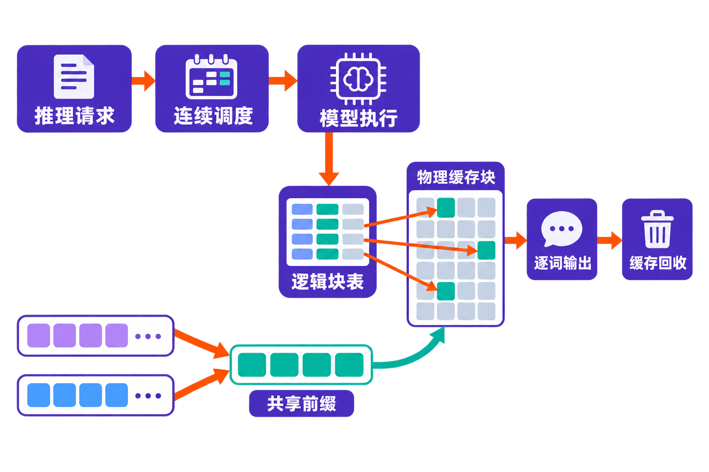

一块 GPU 明明还能计算，却接不下更多请求；模型权重没有变化，并发一高，显存却被迅速吃满；为了避免超时，只能增加卡数，结果服务成本随之上升。

这类问题不完全是模型“太大”，还来自推理过程中不断增长的 **KV Cache**。每条请求长度不同、生成何时结束也不确定，传统连续内存分配容易产生碎片，还可能为了最坏情况提前预留空间。vLLM 正是从这处看似底层、实则决定吞吐量的内存问题切入。

它不是一个新模型，也不是聊天应用，而是一套面向大语言模型推理与在线服务的开源引擎。

## 30 秒认识项目

- **一句话定位：**通过更高效地管理 KV Cache，并配合动态批处理和优化执行能力，提高大模型推理服务的并发效率。
- **仓库地址：**[vllm-project/vllm](https://github.com/vllm-project/vllm)
- **许可证：**[Apache License 2.0](https://raw.githubusercontent.com/vllm-project/vllm/main/LICENSE)
- **主要语言：**主体是 Python，同时包含大量 C++/CUDA、构建配置以及正在发展的 Rust 前端；因 GitHub 页面未正常显示语言占比，本文不提供百分比。
- **最新版本：**截至 **2026 年 8 月 20 日**，GitHub Releases 显示最新版本为 [v0.27.1](https://github.com/vllm-project/vllm/releases)，发布于 2026 年 8 月 11 日。
- **活跃度：**截至 **2026 年 8 月 20 日**，仓库约有 89.5k Stars、20.9k Forks、595 Watchers、20,180 次提交及约 2.2k 个开放 Issue。上述数字均会变化，只能说明关注度和协作规模，不能证明稳定性或性能。


## 它真正解决的是“显存怎么分”

自回归模型每生成一个 token，都要保存前文的注意力键和值，也就是 KV Cache。它体积可观，而且会随序列增长。请求之间的输入长度、输出长度又不相同，使连续内存很难被紧凑利用。

vLLM 团队在早期文章中称，其测量里的传统方案会因碎片与过度预留浪费 60%—80% 的相关内存；PagedAttention 将实际浪费降至 4% 以下。论文则测得，既有系统预留给 KV Cache 的空间中，真正存储 token 状态的比例只有约 20.4%—38.2%。这些都是特定历史实验结果，不应直接当作当前任意模型、硬件和负载下的保证。[官方技术文章](https://vllm-project.github.io/2023/06/20/vllm.html)、[SOSP 2023 论文](https://arxiv.org/abs/2309.06180)

PagedAttention 借鉴操作系统分页：逻辑上连续的 KV Cache，不必在显存中物理连续。系统把它切成固定大小的块，按需分配，再通过块表建立映射。这样，服务端不必过早为未知的最长输出占满一整段连续显存。

与常见替代路径相比，差异可以这样理解：

- **直接使用 Hugging Face Transformers** 更接近通用模型加载与推理工具；vLLM 的重点则是多请求服务时的显存管理、调度和吞吐。
- **TGI、FasterTransformer、Orca 等服务或研究系统**同样关注高性能推理。vLLM 的标志性设计是 PagedAttention 及其块级 KV Cache 管理。
- 官方 2023 年实验曾报告，vLLM 在特定 LLaMA-7B/A10G 与 LLaMA-13B/A100 工作负载中，相比当时的 Transformers 最高达到 24 倍吞吐、相比当时的 TGI 最高达到 3.5 倍；论文也报告相近延迟下较 FasterTransformer 和 Orca 提升 2—4 倍。**事实边界是：这些是历史版本和指定环境的结果，不构成今天选型时的横向结论。**

## 五项核心能力，价值分别在哪里

### 1. PagedAttention：让显存按需供给

固定大小的物理块可以非连续存放，减少碎片和过度预留。块表负责逻辑到物理的映射；引用计数和写时复制又允许多个输出序列共享提示词部分的 KV Cache。

实际价值是：相同显存容量有机会容纳更多并发序列，尤其适合输入和输出长度差异较大的在线请求。

### 2. 连续批处理：请求不必整批等齐

传统静态批处理往往要等一批请求全部结束，再接纳下一批；短请求会被长请求拖住。vLLM 的连续批处理可在运行过程中重新组织批次，让已完成请求释放的位置被新请求利用。

它解决的是服务流量参差不齐时的 GPU 空转问题，而不只是把离线 batch size 调大。

### 3. 分块预填充与前缀缓存：照顾长输入和重复上下文

分块预填充把较长的 prompt 处理拆开，避免一次预填充长期占据执行资源；前缀缓存则面向系统提示词、公共文档上下文等重复输入，减少重复计算。结合 KV 块共享，这对多轮应用、检索增强生成和代理式负载具有现实价值。

不过，Q3 2026 路线图仍把面向代理负载的前缀缓存策略、分层 KV Cache 卸载等列为继续推进事项，不能把路线图目标写成已经完成的能力。[Q3 2026 路线图](https://github.com/vllm-project/vllm/issues/48168)

### 4. 多种执行优化：在延迟、显存与质量间取舍

项目 README 列出的能力包括 CUDA/HIP Graph、量化、推测解码和 `torch.compile`。它们分别从减少执行开销、降低模型占用、提前猜测 token 和编译计算图等方向优化推理。

价值不在于“选项很多”，而在于团队可以围绕自己的模型、硬件和延迟目标组合策略。代价是组合越多，兼容性与回归测试也越复杂。[vLLM README](https://raw.githubusercontent.com/vllm-project/vllm/main/README.md)

### 5. 从单机接口延伸到服务体系

vLLM 支持张量、流水线、数据、专家和上下文并行，并提供流式输出、结构化输出、工具调用、推理解析与多 LoRA。对外接口包括 OpenAI 兼容 API、Anthropic Messages API 和 gRPC；README 还称其覆盖 200 多种 Hugging Face 模型架构。

这使已有 OpenAI 风格客户端更容易迁移到自托管模型。但“接口兼容”不等于每个模型都具备相同的工具调用、模板或结构化输出表现，仍需逐模型验证。

## 一次请求如何穿过 vLLM

在来源能够支持的范围内，可以把流程简化为：请求携带提示词进入引擎；调度器持续组织可执行序列；模型执行预填充与逐 token 解码；KV Cache 被切为固定大小的逻辑块，并通过块表映射到非连续物理块；请求结束后，相应块被回收。若多个输出共享同一提示词，引用计数与写时复制可减少重复的 KV 存储。

**编辑推断：**vLLM 的核心竞争力不是单个算子快多少，而是把内存管理、请求调度和模型执行联合起来，提高整套服务系统的资源利用率。这个判断来自其公开架构与功能组合，不是官方给出的统一性能承诺。



## 安装与最小示例

根据 2026 年 8 月 6 日更新的[官方 Quickstart](https://docs.vllm.ai/en/latest/getting_started/quickstart/)，当前文档要求 Linux 与 Python 3.10—3.13；Apple Silicon 需要采用独立的 vLLM-Metal 路径。以下是 NVIDIA 环境的官方推荐命令：

```bash
uv venv --python 3.12 --seed
source .venv/bin/activate
uv pip install vllm --torch-backend=auto
```

最小离线推理可按官方示例的核心写法运行：

```python
from vllm import LLM, SamplingParams

prompts = ["Hello, my name is"]
sampling_params = SamplingParams()
llm = LLM(model="facebook/opt-125m")
outputs = llm.generate(prompts, sampling_params)
```

启动一个 OpenAI 兼容服务：

```bash
vllm serve Qwen/Qwen2.5-1.5B-Instruct
```

服务默认监听 `http://localhost:8000`。需要注意，当前单个服务进程一次只托管一个模型；预构建 wheel 也不包含 FlashInfer，选择该注意力后端前要另行安装。

还有一个容易踩中的坑：`llm.generate` 不会自动为 Instruct/Chat 模型套用聊天模板。应手动调用 tokenizer 的 chat template，或改用 `llm.chat`，否则输入格式可能不符合模型预期。

## 优点、限制与成熟度

vLLM 的优点相当明确：KV Cache 管理思路有论文与公开实现支撑；模型和硬件能力覆盖面广；服务接口丰富；社区活跃，版本推进速度快。v0.27.0 一次发布包含 561 次提交，来自 242 名贡献者，其中 64 名为首次贡献者。

但快速演进也是风险。v0.27.0 同时升级到 PyTorch 2.13.0、torchvision 0.28.0 和 Triton 3.7.1，官方明确提示这是破坏性的环境变化。生产升级前必须验证驱动、依赖、量化方式、模型实现和自定义扩展。

开放 Issue 数量较多，说明项目规模和使用面很大，也意味着问题积压不可忽视。路线图仍在推进长上下文并行、弹性专家并行的快速扩缩容与故障恢复、AMD 能力对齐，以及更广的多节点与硬件测试覆盖。**这些不是项目“不成熟”的直接证据，却足以说明复杂分布式部署不能只凭 README 上线。**

Apache 2.0 允许使用、修改和分发，并包含专利许可条款，但再分发需要附许可证、标明修改并保留适用声明；它不授予任意使用项目商标的权利，软件也按“现状”提供，不附带适用性保证。

## 适合谁，不适合谁

vLLM 更适合：需要自托管大模型 API；有明显并发压力；希望复用 OpenAI 风格客户端；需要量化、多 LoRA、结构化输出或多种并行策略；并且具备 GPU 运维与性能测试能力的团队。

它未必适合：只做少量本地实验、没有 Linux/GPU 环境、希望单进程同时托管多个模型，或没有能力处理驱动与依赖兼容问题的用户。若工作负载很轻，部署和维护一套高性能推理引擎未必比直接使用托管 API 或更简单的本地工具划算。

## 结语：值得试，但要用自己的负载回答

**本文观点：vLLM 值得进入大模型自托管团队的候选清单。**它抓住了 KV Cache 这一真实系统瓶颈，并把论文思路扩展为覆盖调度、执行优化、并行与服务接口的完整工程。

但正确的尝试方式不是引用 2023 年的“最高倍数”，更不是看 Star 数下结论。应固定目标版本，在自己的模型、量化方案、GPU、上下文长度、并发量和延迟目标下，与现有方案做端到端对照；同时验证输出正确性、峰值显存、升级成本和故障恢复。只有这些数据，才能回答它是否真的更快、更稳、更省。

## 参考资料

1. [vLLM GitHub 仓库](https://github.com/vllm-project/vllm)
2. [vLLM README](https://raw.githubusercontent.com/vllm-project/vllm/main/README.md)
3. [vLLM Releases](https://github.com/vllm-project/vllm/releases)
4. [vLLM Quickstart](https://docs.vllm.ai/en/latest/getting_started/quickstart/)
5. [Apache License 2.0 — vLLM LICENSE](https://raw.githubusercontent.com/vllm-project/vllm/main/LICENSE)
6. [vLLM Q3 2026 Roadmap](https://github.com/vllm-project/vllm/issues/48168)
7. [vLLM：使用 PagedAttention 实现大模型服务](https://vllm-project.github.io/2023/06/20/vllm.html)
8. [Efficient Memory Management for Large Language Model Serving with PagedAttention](https://arxiv.org/abs/2309.06180)
