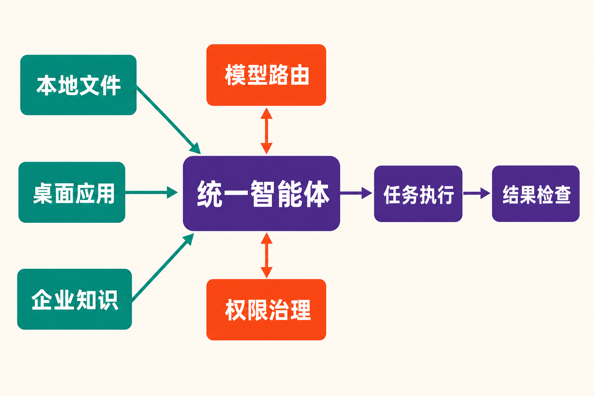

# Glean发布Tau：企业AI桌面争夺战，从“谁更聪明”转向“谁用得起”

企业AI的下一场竞争，可能不再发生在聊天框里，而是在每位员工的桌面上。

8月26日，企业搜索与知识管理公司Glean公布桌面工作区Tau。它试图把员工电脑里的文件、日常使用的应用和代码，与公司内部知识、权限体系及可执行工具接入同一个智能体。工程师可以让它参与编码和故障排查，财务人员则可以用自然语言更新大型Excel表格、构建财务模型。

更值得注意的是，Glean没有只讲能力，还把矛头直接指向Anthropic的Claude Cowork：按照Glean自行组织的测试，前者完成一次任务的平均成本为0.58美元，后者为2.98美元。

这是一次产品发布，也是一份明确的竞争宣言：当智能体开始替员工连续执行复杂任务，企业关心的不只是它能不能做，还要计算每一次执行究竟要花多少钱。

## Tau是什么：给企业智能体补上“桌面”这一块

根据[Glean官方公告](https://www.glean.com/blog/intelligent-secure-proactive-ai)，Tau面向代码执行和通用知识工作，可以跨获准工具承接复杂、长时间运行的任务。它汇集的不是单一数据源，而是三类此前相对割裂的上下文：本地文件和多模态资料、桌面应用与代码，以及带有权限信息的企业知识。

独立科技媒体SiliconANGLE将Tau概括为一个连接本地文件、应用、代码与Glean企业AI的桌面工作区。报道还称，它采用开源智能体框架，可以规划多步骤工作、代表用户执行任务并检查输出；适用场景包括文件整理、文档分析、电子表格制作和工程工作流。[SiliconANGLE的报道](https://siliconangle.com/2026/08/26/glean-unveils-tau-desktop-workspace-claims-token-cost-edge-over-claude/)同时确认，Tau目前仍是“即将推出”，并未普遍可用。

这一区别很重要。Tau不是简单地给企业搜索产品增加一个桌面客户端，而是想把“知道什么”和“能做什么”放在同一入口里。

过去，企业知识助手通常擅长回答“某项政策是什么”“这个项目进展如何”；桌面智能体则更擅长打开文件、操作应用和生成结果。Tau的产品逻辑，是让智能体先调用公司的知识与权限上下文，再在员工获准使用的工具中执行任务。

**事实层面**，Glean称其AI Gateway可以统一管理模型、工具、MCP服务器、路由、安全和治理策略。

**由此可以作出的推断是**，Tau真正的卖点未必是某一个模型能力更强，而是把模型选择、公司知识、桌面执行与管理控制组合成企业可部署的整体系统。这是基于其产品结构的判断，不等同于已经得到客户部署数据验证的结论。

## 一次任务0.58美元：Glean如何挑战Claude Cowork

Glean公布的核心对比覆盖180多项跨部门企业任务，涉及销售、工程、营销、财务、人力资源和客户支持。测试中，Glean Assistant开启自动路由；Claude Cowork固定使用Claude Sonnet 5和高推理等级。

按照[Glean披露的内部基准结果](https://www.glean.com/blog/go-glean-cowork)，Glean一侧平均任务成本为0.58美元，Claude Cowork为2.98美元，前者据此宣称节省81%；总令牌用量约为130万，对方约为440万，相差70%。Glean还称，其输出在78%的比较中更受偏好。

Glean另以1000项任务、37种模型及推理配置绘制成本—质量关系。其主张背后的思路可以概括为“按任务匹配智能程度”：不是把所有请求都交给同一种高成本配置，而是通过自动路由，为不同任务选择相应的模型和推理强度。

对企业而言，这一思路确实击中了现实问题。普通聊天通常只产生一次或数次模型响应；复杂智能体任务却可能拆成多个步骤，反复调用模型、工具和子智能体。Anthropic也在[Claude Cowork产品页](https://claude.com/product/cowork)明确提醒，Cowork消耗使用限额的速度快于普通Chat，因为复杂任务会调用多个子智能体和工具。

因此，单次推理价格并不是企业智能体的完整成本。任务被拆成多少步、调用多少上下文、是否反复尝试，以及能否把简单步骤路由给更经济的配置，都会影响最终账单。

但这些数字必须附带三个限定条件。

第一，这是Glean设计并执行的厂商测试，并非独立第三方评测。第二，测试查询为了保护隐私而采用合成方式，同时使用Glean自身的生产数据。第三，两侧配置并不相同：Glean使用自动路由，Claude Cowork则固定使用高推理等级。Claude一侧虽然配置了现成及本地MCP连接器，这种设置仍不能排除测试设计对结果的影响。

所以，**可以确认的事实**是Glean报告了0.58美元、81%和78%这组结果；**不能直接下定论的部分**是Tau已经在所有真实企业场景中比Cowork便宜81%，或者其输出质量普遍更高。后两项仍需独立测试及实际部署数据支持。

## 为什么偏偏对标Cowork

因为两者争夺的是相似的入口。

Claude Cowork面向研究、分析和文档创建等非编码知识工作，使用与Claude Code相同的智能体方法。其桌面版能够访问用户选择的本机文件夹和应用，也能结合已连接工具完成端到端、多步骤任务。

在具体执行时，Cowork会依次考虑直接连接器、浏览器和屏幕交互，优先选择更快、更可靠的连接器。它既可以综合本地文件和已连接工具生成报告，也可以填写电子表格，或操作没有连接器的内部应用。[Anthropic的计算机使用说明](https://support.claude.com/en/articles/14128542-let-claude-use-your-computer-in-cowork)显示，屏幕交互会逐个请求应用权限，用户可以随时停止操作；这项能力目前仍处于研究预览阶段，电脑需保持唤醒且Claude Desktop保持打开。

由此看，Tau与Cowork的正面交集并不只是“能读取本地文件”。双方都在尝试成为知识工作的执行层：理解资料、规划步骤、调用工具，再交付结果。

差异在于各自的出发点。Cowork从通用模型和智能体体验向企业工作延伸；Glean则从企业搜索、公司知识和权限治理向桌面执行延伸。前者的品牌重心是模型能力，后者强调企业上下文、自动路由和统一治理。

**本文的观点是**：桌面入口只是表面战场，真正的竞争发生在“上下文—执行—治理—成本”这条链路上。谁能让智能体获得足够信息，同时不越权、可管理，并把反复执行的成本压到企业可接受的水平，谁才更可能成为组织内的默认工作入口。

## Tau的机会：企业知识正在从资料库变成行动条件

Glean此前积累的企业知识与权限体系，为Tau提供了一条有别于通用桌面智能体的路线。

当智能体要修改表格、分析文件或排查工程问题时，只理解屏幕内容并不够。它还需要知道哪些信息可信、用户有权访问什么、不同系统中的资料如何关联，以及操作应遵守哪些治理策略。企业知识在这里不再只是回答问题的素材，而是决定智能体应当如何行动的条件。

这也解释了为何Glean把AI Gateway与Tau放在同一个叙事中：如果一个企业同时使用多种模型、内部工具和MCP服务器，统一路由与治理就可能成为控制质量、安全和成本的基础设施。

不过，这仍属于产品逻辑上的潜力，而非既成的市场结果。目前Tau尚未普遍可用，来源材料也没有提供企业客户的真实部署规模、任务成功率、故障率或长期成本。因此，现在更准确的说法是：Glean展示了一套有竞争力的架构和一组有冲击力的内部测试，而不是已经证明Tau全面胜出。

## 结语：成本战背后，是企业AI进入运营阶段

Tau传递出的关键信号，不只是桌面智能体市场又多了一个产品。

当AI从“回答一个问题”升级为“代替员工执行一串步骤”，竞争指标也随之改变：模型能力依然重要，但上下文是否完整、权限是否可控、工具调用是否可靠、任务成本能否预测，开始共同决定产品价值。

Glean用0.58美元对2.98美元的内部测试，把成本问题推到了台前；Claude Cowork则代表通用智能体进入本地文件和桌面应用的另一条路线。现阶段，Glean的数字需要独立验证，Tau也要等到正式可用后才能接受真实企业环境的检验。

但方向已经清楚：企业AI正在从演示能力的阶段，走向计算投入产出比的运营阶段。下一轮赢家未必只是拥有最强模型的公司，更可能是能把知识、行动、治理与成本真正装进同一个工作入口的公司。

## 参考资料

1. [Glean：The intelligence era is here](https://www.glean.com/blog/intelligent-secure-proactive-ai)
2. [Glean：Right-sizing intelligence](https://www.glean.com/blog/go-glean-cowork)
3. [SiliconANGLE：Glean unveils Tau desktop workspace](https://siliconangle.com/2026/08/26/glean-unveils-tau-desktop-workspace-claims-token-cost-edge-over-claude/)
4. [Anthropic：Claude Cowork产品页](https://claude.com/product/cowork)
5. [Anthropic Help Center：Let Claude use your computer in Cowork](https://support.claude.com/en/articles/14128542-let-claude-use-your-computer-in-cowork)
