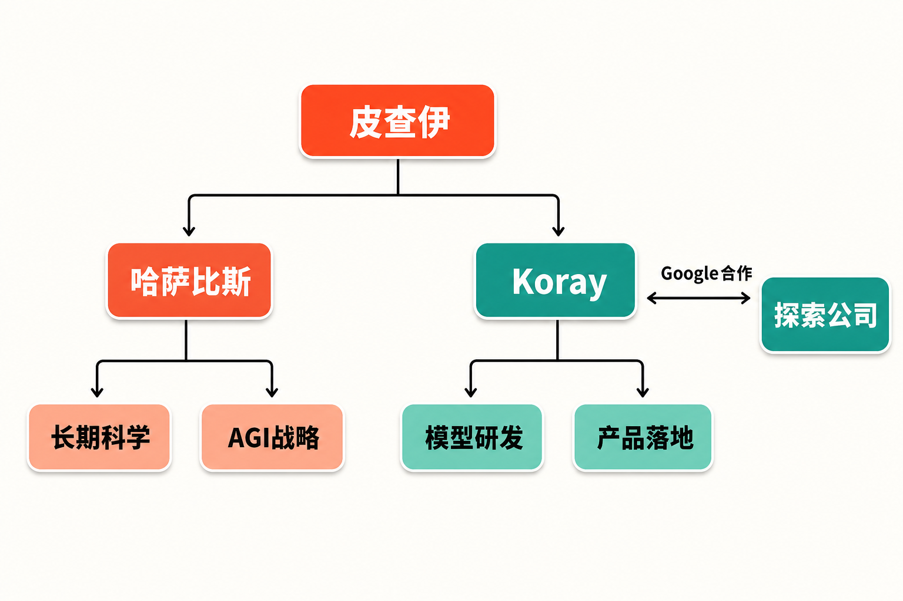

Google的AI权力结构，迎来了一次罕见的大调整。

当地时间8月5日，Google与Alphabet CEO桑达尔·皮查伊宣布：德米斯·哈萨比斯不再负责Google DeepMind的日常运营，转任Google DeepMind主席及新设的Alphabet首席科学家；Google首席AI架构师Koray Kavukcuoglu升任Google DeepMind高级副总裁，接掌模型、研究和产品团队。

另一边，在Google工作27年的Jeff Dean与Sanjay Ghemawat离职，共同创办独立公益公司Discovery Loop。Google没有与这批老将彻底告别，而是成为新公司的创始投资者与云服务合作伙伴。

表面上，这是一次人事更替；放在一起看，它更像是Google对“科学探索、模型研发、产品落地”三类任务重新划界。

## 哈萨比斯不是退场，而是从经营者变成科学总设计师

先看最容易被误读的一点：哈萨比斯卸下日常管理职责，并不等于被边缘化。

按照[Google官方公告](https://blog.google/company-news/inside-google/message-ceo/next-chapter-ai-momentum/)，他将担任Google DeepMind主席和Alphabet首席科学家，聚焦AGI战略、全球议题与科学研究，同时继续为DeepMind团队提供建议，并继续领导Isomorphic Labs。后者意味着，他仍然处在Alphabet利用AI推动科学发现的重要位置。

《国家报》进一步指出，[Alphabet首席科学家是为哈萨比斯设置的新职位](https://elpais.com/tecnologia/2026-08-05/google-nombra-cientifico-jefe-al-premio-nobel-demis-hassabis.html)，工作重点面向AGI的未来与科学研究。

**事实层面**，哈萨比斯的组织身份从Google DeepMind CEO转向DeepMind主席与Alphabet首席科学家，职责重心由日常运营转向长期科学战略。

**合理推断**是，这次变化扩大了他的议题范围：过去主要统筹一个AI组织，现在则可能在Alphabet层面连接基础研究、AGI方向和科学应用。但来源没有披露该职位的具体决策权限，因此不能据此断言哈萨比斯已经获得对Alphabet所有研究项目的统一指挥权。

**本文观点**是，“升维”比“退居二线”更能描述这次调整。Google把一位兼具AI研究、组织领导与科学应用影响力的人，从高强度的产品经营中释放出来，让其关注更长周期、也更难用季度指标衡量的问题。

## Koray接棒：Gemini进入统一执行阶段

哈萨比斯留下的日常指挥权，由Koray Kavukcuoglu接手。

根据[Google披露的职责安排](https://blog.google/company-news/inside-google/message-ceo/next-chapter-ai-momentum/)，Koray将向皮查伊直接汇报，负责Gemini模型开发、前沿AI研究，以及Gemini应用和开发者团队。《国家报》称，他还将继续担任Google首席AI架构师。

这份职责清单很关键：模型、研究、应用和开发者生态被放在同一名负责人之下。它覆盖了从技术探索到产品触达用户的主要链路。

**事实层面**，Google明确集中了一组过去可能分属不同节奏的任务，并缩短了Koray与Alphabet CEO之间的汇报链条。

**合理推断**是，Gemini接下来可能更强调研发与产品的协同效率：研究选题需要更快进入模型，模型能力也需要更快进入应用和开发者工具。不过，现有来源没有提供发布周期、预算或绩效指标的变化，所谓“提速”目前只能作为组织设计意图来理解，而非已经兑现的结果。

从管理逻辑看，这形成了一条相对清晰的双轨结构：哈萨比斯负责更长期的科学与AGI方向，Koray负责把模型、研究和产品体系持续运转起来。前者关注“未来往哪里走”，后者回答“今天如何把它做出来”。

## Jeff Dean离开，但Google选择保留连接

如果哈萨比斯的变化代表内部重新分工，Jeff Dean的离开则更具象征意义。

Google确认，Jeff Dean结束27年任职，与Sanjay Ghemawat创建一家独立公益公司，目标是加速机器学习、科学和工程领域的发现。Google将担任创始投资者和云服务合作伙伴。

据[Axios报道](https://www.axios.com/2026/08/05/google-deepmind-demis-hassabis-ai)，新公司名为Discovery Loop，Oriol Vinyals与Quoc Le也将加入。换言之，这不是一位高管单独创业，而是一批资深技术人才共同开启的新组织。

**事实层面**，Discovery Loop在组织上独立于Google，但双方仍存在资本和基础设施合作关系。

**合理推断**是，这种安排提供了一种折中路径：研究者获得更独立的目标与运行机制，Google则通过投资和云合作继续参与其成果生态。它可能降低人才离开带来的“完全失联”风险，也让一些未必适合在大型产品组织内部推进的探索获得新空间。

但边界同样要说清：来源并未披露Google的投资金额、持股比例、知识产权安排，也没有列出Discovery Loop的首批项目。因此，现在还不能判断它会成为Google的外部研究院、潜在收购对象，还是一家真正独立发展的科研机构。

## 一场重组，解决的是三种时间尺度

把三条人事线索合并，可以看到Google正在处理三种不同的时间尺度。

第一种是长期科学尺度。AGI、全球议题和AI驱动的科学发现，验证周期很长，交给哈萨比斯在Alphabet层面统筹。

第二种是模型与产品尺度。Gemini模型、前沿研究、应用和开发者业务需要持续迭代，由Koray统一管理并直接向皮查伊汇报。

第三种是独立探索尺度。Discovery Loop脱离Google内部体系运作，同时通过投资与云合作保持接口。

这是基于公开职责划分得出的**分析框架**，并非Google官方对重组的命名。它的价值在于解释：为什么“哈萨比斯转任”“Koray接棒”与“Jeff Dean创业”会在同一时间公布——三件事共同勾勒出Google对AI研究和商业执行边界的重新安排。

Axios还报道称，[消息公布后Alphabet股价下跌超过4%](https://www.axios.com/2026/08/05/google-deepmind-demis-hassabis-ai)。这是市场反应的事实，但仅凭同期波动，不能证明调整本身就是下跌的唯一原因，更不能据此判断重组最终成败。

真正值得跟踪的，不是某一天的价格变化，而是接下来三个问题：哈萨比斯的新职位拥有怎样的实际协调权；Koray能否让研究、模型和产品形成更顺畅的闭环；Discovery Loop会选择哪些足以体现独立价值的项目。

## 结语

这次调整没有让Google减少对AI的投入，反而把不同目标拆得更清楚：最长期的科学问题交给哈萨比斯，Gemini的研发与产品执行交给Koray，一批资深研究者则转向组织之外继续探索。

**本文观点**是，Google正在从“依赖少数明星人物统领一切”，转向按时间尺度配置领导力。这样的结构能否奏效，取决于长期科学判断与短期产品执行之间是否既有边界，也有足够紧密的连接。

权力重组只是起点。最终证明它价值的，仍会是研究成果、产品表现，以及新组织真正做出的东西。

## 参考资料

- [Google：The next chapter of our AI momentum](https://blog.google/company-news/inside-google/message-ceo/next-chapter-ai-momentum/)
- [Axios：Google DeepMind CEO Demis Hassabis is stepping aside](https://www.axios.com/2026/08/05/google-deepmind-demis-hassabis-ai)
- [EL PAÍS：Google nombra científico jefe al premio Nobel Demis Hassabis](https://elpais.com/tecnologia/2026-08-05/google-nombra-cientifico-jefe-al-premio-nobel-demis-hassabis.html)
