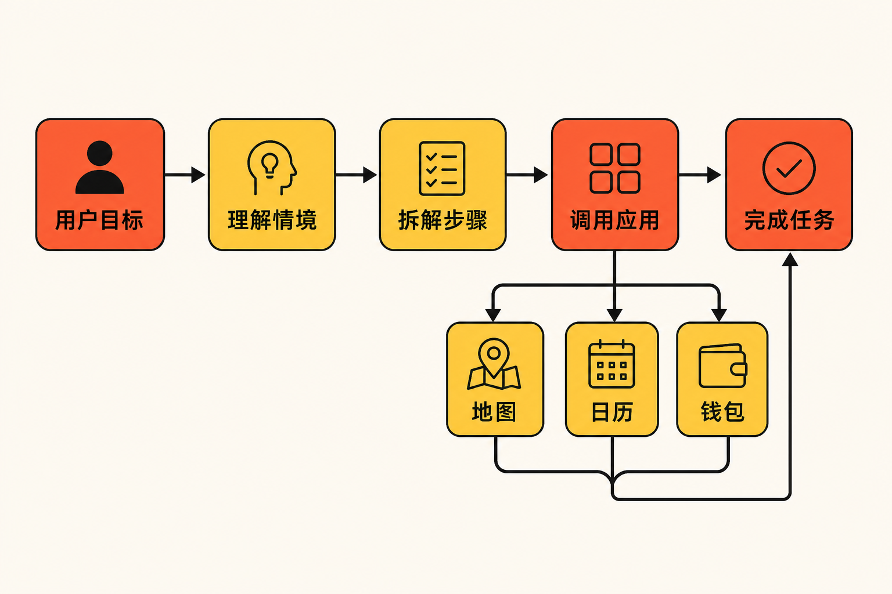

智能手机过去十多年的基本逻辑，是把越来越多的能力装进一个个App：用户先明确目标，再找到入口、逐层点击，最后完成任务。

Pixel 11试图改变这个顺序。

Google发布Pixel 11、Pixel 11 Pro和Pixel 11 Pro XL时，把Gemini Intelligence放到了产品叙事的中心。它不只回答问题，还会理解对话情境，主动建议下一步行动，并在多个应用之间继续执行任务。[Google称，Gemini已经能够在超过40款应用中处理多步骤任务](https://blog.google/products-and-platforms/devices/pixel/pixel-11-features/)。

如果这套机制能够稳定运行，手机的角色就会从“等待操作的工具”，逐渐变成“理解目标并组织工具的助手”。这也是Pixel 11真正值得关注的变化。

## 不只是聊天：Gemini开始接管“下一步”

按照Google给出的例子，当用户在对话中提到餐厅、地点或活动时，Gemini Intelligence可以结合语境，主动建议预订餐厅、保存日历事件、把地点加入地图，或者调用钱包中的会员信息。这些操作原本分散在聊天、日历、地图、钱包等不同入口中。

另一个例子是“位置洞察预览”：手机可以在锁屏界面主动显示当前地点，并从Google Maps的评论和照片中提炼相关信息。这里的关键词并不是“信息更多”，而是“无需先问”。

**事实是**，Google正在把情境理解、主动建议和跨应用执行组合为一套系统能力。

**由此可以推断**，Pixel 11想要减少的并非某一次点击，而是用户自己拆解任务、寻找应用和搬运信息的过程。以前用户需要决定“打开哪个App”；现在，用户可以先说出目标，再由Gemini选择和调用工具。

这一变化可以概括为三步：理解正在发生什么，判断用户下一步可能需要什么，再代表用户调用对应应用。前两步决定它是否“懂你”，最后一步决定它是否真的有用。

## 跨越40多款应用，意味着什么？

“支持40多款应用”是这次发布中最关键的数字之一，但数量并不是唯一重点。真正重要的是，多款应用可以被组织进同一条任务链。

9to5Google在发布前的早期测试中，通过长按电源键或语音启动Gemini，并要求它处理航班、酒店和出行任务。测试中，Gemini能够查询并尝试预订指定日期的航班。这说明跨应用能力已经不只是产品演示中的概念。[但实测也发现，指令不够精确时，系统可能只返回搜索结果；功能还会偶发无法正确触发，或要求用户先选择应用](https://9to5google.com/2026/07/23/i-briefly-tried-gemini-intelligence-and-im-still-not-sure-who-its-for/)。

因此，现阶段需要区分“可以完成”和“总能完成”。前者已有早期实测支持，后者尚不能从现有材料中得出。

**笔者的观点是**，跨应用智能体的竞争不会只看覆盖多少App，还要看任务完成率、出错后的恢复能力，以及用户能否清楚知道系统正在做什么。一个偶尔成功的自动化功能令人惊喜；一个能够被长期依赖的助手，则必须足够稳定和可预期。

## Tensor G6为何是这套体验的底座

主动理解和持续执行，需要设备端模型与硬件共同支撑。Pixel 11系列搭载Tensor G6并运行最新版Gemini Nano。[Google澳大利亚公布的数据是：Tensor G6的TPU计算能力提升50%，设备端AI任务速度最高提升3.5倍，能耗最高降低3.5倍](https://blog.google/intl/en-au/products/devices-services/the-pixel-11-series-your-most-personal-pixel-yet/)。这些都是厂商口径中的“最高”数据，不能直接等同于所有实际场景都会达到相同提升。

Gemini Intelligence也存在明确的硬件门槛：设备需要支持端侧Gemini Nano，拥有至少12GB内存和符合要求的SoC；功能能否使用还会因国家和语言而异。换言之，它并不是发布后立即向所有Android手机、所有市场开放的通用能力。

Pro系列还加入了HiLight灯效，用不同的灯光状态表示Gemini正在聆听、思考或回答。它看似只是视觉反馈，却触及智能体交互中的一个实际问题：当手机在后台理解或执行任务时，用户需要知道系统当前处于什么状态。

## 硬件升级仍在，但AI成为解释中心

Pixel 11并没有放弃传统手机指标。三款机型都从256GB存储起步，不再提供128GB版本，并承诺提供七年系统、安全和Pixel Drop更新。Google称新机续航可达30小时，同时改进了无线充电；相机侧加入实时媒体翻译、Magic Capture和更快的夜景拍摄。[美联社将此次升级概括为借助AI减少用户完成任务所需的点击与滑动](https://apnews.com/article/google-pixel-11-android-3bbad7afc4d25e15527477123415e50a)。

Pixel 11本身还配备4800万像素主摄、5倍长焦和最高30倍Super Zoom。只是与过去相比，这些规格不再单独构成产品故事，而被放进了一个更大的问题里：手机能否更早理解需求，并替用户完成后续动作。

价格也反映了产品定位的上移。Google官方给出的美国起售价分别为899、1099和1299美元，8月20日上市；美联社采用四舍五入后的900、1100和1300美元表述，并指出三款产品均比上一代上涨100美元。Pro和Pro XL购买者还可获得六个月Google AI Pro订阅。

## “主动”越进一步，边界问题越重要

Gemini Intelligence的吸引力来自主动性，但它的挑战同样来自主动性。

根据现有材料，我们可以确认系统能够利用对话情境给出行动建议，也能尝试跨应用执行任务；但资料没有提供任务成功率、错误操作比例或不同语言市场的一致性数据。因此，现在还不能判断它能否替代用户日常使用App的主要路径。

**进一步推断**，系统越主动，就越需要清晰的确认机制。查询信息与真正预订航班并不是同一风险级别；保存地点和调用钱包信息，也意味着不同的数据与权限边界。现有来源没有完整说明这些机制，所以不宜替Google下结论。

**笔者认为**，Pixel 11的价值不在于宣告“App已经过时”，而在于首次把一个更现实的过渡路径摆到台前：App仍然提供服务，但用户未必每次都要亲自进入App。Gemini逐渐成为调度层，负责理解意图、寻找入口并串联步骤。

## 结语：手机正在从菜单变成代理人

Pixel 11最值得记住的，不是又多了一项AI功能，而是Google开始重新安排用户、系统与App之间的关系。

事实层面，Gemini Intelligence已经具备情境建议、锁屏位置洞察和40多款应用内的多步骤任务能力；早期测试也证明它能尝试处理真实的航班等任务。与此同时，触发不稳定、指令要求精确、地区与语言受限等问题同样存在。

因此，Pixel 11更像一个清晰的起点，而不是成熟终局。过去，智能手机把复杂功能放进菜单；现在，它开始尝试理解目的、预判下一步，并代替用户穿过菜单。能否从“偶尔帮忙”走向“值得托付”，将决定这场交互变革最终有多大。

## 参考资料

1. [Google：7 can’t-miss updates from our Pixel 11 launch](https://blog.google/products-and-platforms/devices/pixel/pixel-11-features/)
2. [Google Australia：The Pixel 11 series: Your most personal Pixel yet](https://blog.google/intl/en-au/products/devices-services/the-pixel-11-series-your-most-personal-pixel-yet/)
3. [Associated Press：Google unveils latest Pixel phones with slimmer cameras and more AI features](https://apnews.com/article/google-pixel-11-android-3bbad7afc4d25e15527477123415e50a)
4. [9to5Google：I briefly tried Gemini Intelligence, and I’m still not sure who it’s for](https://9to5google.com/2026/07/23/i-briefly-tried-gemini-intelligence-and-im-still-not-sure-who-its-for/)
5. [Cadena SER：Google presenta sus Pixel 11](https://cadenaser.com/nacional/2026/08/12/google-presenta-sus-pixel-11-mas-ia-mas-bateria-y-una-sorpresa-que-llega-por-partida-doble-cadena-ser/)
