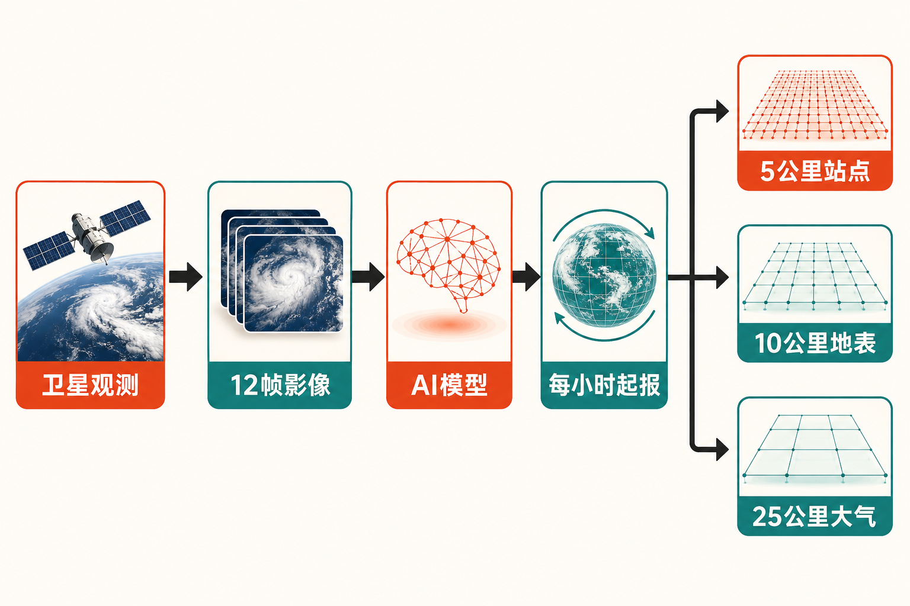

# Google发布WeatherNext 3：全球AI天气预报进入“每小时刷新”时代

天气预报最棘手的问题之一，并不是算得不够远，而是模型开始计算时，手里的“现在”可能已经不够新。

传统全球预报系统通常先将卫星、气象站等多类观测资料加工成统一的分析场，再以此作为模型初始状态。这个过程严谨，却需要时间。Google研究团队指出，传统运营分析场往往每6小时生成一次，叠加生产和发布延迟后，模型所使用的最新大气状态可能已经落后现实6至12小时。

Google DeepMind与Google Research新发布的WeatherNext 3，试图缩短这段时间差：它直接摄取低延迟的全球静止气象卫星拼接影像，每小时启动一次全球概率预报，并把部分输出的空间尺度推进到约5公里。[Google官方称](https://blog.google/innovation-and-ai/models-and-research/google-deepmind/introducing-weathernext-3/)，这是其迄今最先进、最准确的全球天气AI模型。

但“每小时更新、最高5公里”很容易被理解成整套全球预报都以5公里网格每小时重算。事实并非如此。WeatherNext 3的进步很重要，却需要放在准确的技术边界内理解。

## 最大变化：让模型看到更接近此刻的地球

WeatherNext 2采用25公里网格，预报初始化间隔为6小时。WeatherNext 3则使用最近12帧逐小时静止卫星拼接影像；研究论文称，其中最新一帧的运营延迟不足1小时。[论文披露](https://arxiv.org/abs/2609.03582)，这种输入方式帮助全球概率中期预报从6小时初始化转向每小时初始化。

这里的关键词是“直接”。卫星持续观察云系、水汽和天气系统的演变，WeatherNext 3能够把这些低延迟影像直接送入模型，不必完全等待新一轮传统分析场制作完毕。对于正在快速发展或转向的天气系统，更短的输入延迟意味着模型有机会更早捕捉变化。

这是已公开资料支持的事实。

进一步说，更新频率从6小时缩短到1小时，意味着一天可产生24个不同起报时刻，而不是4个。对用户而言，这不等于预报结果每小时都会发生巨大改变；它意味着系统每小时都获得一次依据新观测修正判断的机会。

这是基于更新机制所作的合理推断，而不是Google公布的效果保证。预报能否改善，仍取决于卫星覆盖、目标变量、天气类型和提前期等条件。

## “最高5公里”究竟覆盖什么

WeatherNext 3并非所有变量都统一达到5公里分辨率。按照[Google开发者资料](https://developers.google.com/weathernext)，一次模型运行会产生三类不同尺度的结果：

- 约5公里：经过站点校准的关键近地表变量，例如2米气温和露点；
- 约10公里：其他地表网格变量；
- 约25公里：大气层变量。

论文采用的另一种表述是：单层网格变量使用0.1度空间分辨率和1小时时间步长，而约5公里能力主要体现在结合地理特征校准的站点级输出上。因此，“最高5公里”应理解为部分变量或产品能够达到的最细尺度，而不是整个三维大气预报系统全部变成5公里网格。

Google将整体全球天气图像描述为比WeatherNext 2约清晰5倍。这个说法反映了产品输出尺度的提升，但不能简单等同于“所有天气预报都准确5倍”。空间分辨率描述画面能分得多细，准确率则描述结果与实际观测有多接近，两者相关，却不是同一个指标。

## 不只给出一个答案，而是给出64种可能

WeatherNext 3是一套概率预报模型。其运营产品包含64个集合成员，可以把它们理解为在略有差异的条件下生成的64条可能演变路径。集合预报的价值，不只是给出“明天下雨或不下雨”的单一答案，还在于表达不同情景及其不确定性。

预报时效也存在层级。[Earth Engine数据目录](https://developers.google.com/earth-engine/datasets/catalog/projects_gcp-public-data_weathernext_assets_weathernext_3_0_0_0p05deg)显示，每天00、06、12、18 UTC初始化的预报最长覆盖360小时，即15天；其他逐小时初始化的预报覆盖48小时。换句话说，“每小时更新”和“最长15天”都是真的，但并非每一次小时级起报都计算到15天。

Google还表示，WeatherNext 3针对地面气象站观测进行训练；2米气温和露点使用站点数据校准，降水则引入IMERG卫星观测等资料。这使部分输出更贴近人们实际生活和生产所在的位置，而不只是在规则网格上表现良好。

## 准确率提升，应该怎样阅读

根据[Google发布说明](https://blog.google/innovation-and-ai/models-and-research/google-deepmind/introducing-weathernext-3/)，对于一天以上提前期的降水预报，WeatherNext 3相较前代最高可提升50%。这里必须保留两个限定词：一是“降水预报”，二是“最高”。它不是对全部地区、全部变量和全部预报时效作出的统一承诺。

Google研究团队将其称为概率中期预报的新先进水平。不过，支撑技术细节的论文在发布时仍是arXiv预印本。对这类性能结论，更稳妥的观察方式是等待更多地区、极端事件以及独立机构的持续检验。

“直接读取实时卫星数据”也不代表AI已经绕过传统气象体系。独立报道指出，有业内人士对“首个直接纳入原始观测的高分辨率全球AI模型”这一表述提出异议；而且WeatherNext 3仍使用气象站、国家气象机构及其他观测体系产生的数据。[TechCrunch的报道](https://techcrunch.com/2026/09/03/googles-latest-ai-weather-model-gives-you-no-excuse-to-forget-your-umbrella/)提醒我们，这更像是缩短观测进入预测的路径，而不是抛弃传统气象基础设施。

## 从研究模型走向大众产品

WeatherNext 3已经开始进入Google搜索、Gemini、Google地图、Google Maps Platform Weather API和Google Earth Engine。实时与历史运营数据还可经Google Cloud Storage、Earth Engine和BigQuery访问，供开发者、企业及研究人员使用。

这意味着它不只是实验室里的一次模型升级。普通用户可能在搜索天气、规划路线或使用AI助手时接触其结果；开发者则可以把全球概率预报嵌入农业、能源、物流和风险分析等应用。

以上部署范围属于事实。至于它会否显著改变这些行业，是值得关注的趋势判断，而非现阶段已经得到来源证明的结果。真正的商业价值还要看接口成本、数据稳定性、地区表现，以及应用方如何处理概率信息和错误风险。

与此同时，Earth Engine中的WeatherNext 3数据仍标为实验性发布，且只提供集合均值、离散度等摘要统计；完整集合与大气数据需要通过Google Cloud Storage获取。这提醒使用者：产品已经开放，不等于所有渠道提供完全相同的数据，也不等于实验数据可以未经验证直接承担关键决策。

## 结语：更快看见现在，比单纯算得更远更重要

WeatherNext 3最值得关注的变化，不是某个孤立的排行榜数字，而是全球AI天气预报正在改造“观测如何进入模型”这条链路。低延迟卫星影像、每小时初始化、分层分辨率和概率集合预报结合起来，让模型更频繁地校正自己对现实世界的判断。

我的观点是，这代表AI天气预报开始从“加速传统计算”迈向重新设计预测流程。但它仍是气象系统的一部分，而不是权威预警体系的替代品。Google也明确提示，涉及公共安全、灾害预警或高风险行动时，应以当地气象主管机构发布的信息为准。

天气预测的下一场竞争，可能不仅是谁能算到15天以后，还包括谁能更快、更准确地理解刚刚发生的这一小时。

## 参考资料

1. [Google：Introducing WeatherNext 3](https://blog.google/innovation-and-ai/models-and-research/google-deepmind/introducing-weathernext-3/)
2. [Google for Developers：WeatherNext](https://developers.google.com/weathernext)
3. [Google Earth Engine：WeatherNext 3数据目录](https://developers.google.com/earth-engine/datasets/catalog/projects_gcp-public-data_weathernext_assets_weathernext_3_0_0_0p05deg)
4. [arXiv：WeatherNext 3研究论文](https://arxiv.org/abs/2609.03582)
5. [TechCrunch：Google’s latest AI weather model](https://techcrunch.com/2026/09/03/googles-latest-ai-weather-model-gives-you-no-excuse-to-forget-your-umbrella/)
6. [AI Watch：WeatherNext 3发布报道](https://ai.watch.impress.co.jp/docs/news/2138388.html)
