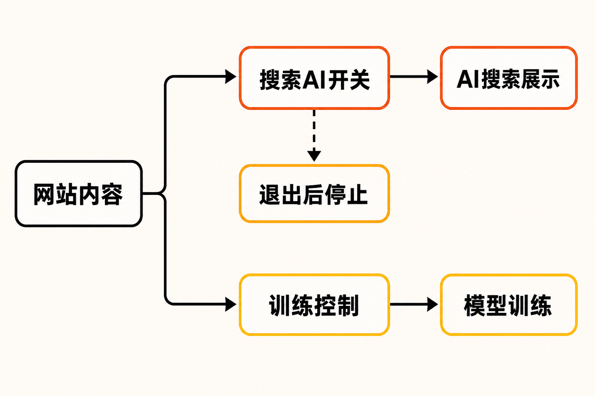

Google终于给全球网站发放了一枚真正可用的“退出键”。

从2026年8月31日起，网站所有者可以在Google Search Console中选择，不让自己的链接与内容进入AI Overviews、AI Mode以及Discover中的生成式AI功能。更关键的是，Google承诺：这一选择不会被当作生成式AI功能之外的搜索排名信号，也不会影响网站在传统搜索其他部分的收录或排名。

这项变化看似只是后台多了一个开关，实质上却把一个长期被捆绑的问题拆开了：网站是否愿意被Google正常抓取和索引，不再等同于网站必须同意自己的内容被拿去组织AI答案。

## 这个开关究竟控制什么？

**已确认的事实是：**Google已于8月31日把“Search generative AI”控制项推向全球所有网站。站长可进入Search Console的“设置”，按网站属性管理是否参与生成式AI搜索；默认状态为允许。如果存在父属性，子属性会默认继承父属性的设置。[Google官方公告](https://blog.google/products-and-platforms/products/search/new-controls-website-owners/)与[Search Console帮助文档](https://support.google.com/webmasters/answer/16908024?hl=en-1)均确认了这一范围。

选择排除后，网站的内容和链接将不再：

- 出现在相关生成式AI功能中；
- 被这些功能链接或用于展示；
- 作为生成回答及预览的输入。

覆盖的产品不只有搜索结果顶部的AI Overviews，还包括对话式的AI Mode，以及Discover中的生成式AI功能。

设置不会瞬间覆盖所有结果。Google称，变更的传播通常需要数天，部分内容可能在控制生效后的1至2天内完成排除。因此，站长切换开关后仍短暂看到旧内容，并不必然意味着设置失效。

这里还有一个容易被忽略的代价：退出后，网站也会失去来自这些生成式AI界面的展示和访问流量。换言之，这不是“只拒绝被摘要、仍保留AI推荐链接”的精细选项，而是一项针对相关生成式AI功能的整体退出选择。

## 最重要的变化：AI展示与传统排名解绑

过去，网站面对的核心顾虑是：如果拒绝自己的内容被用于生成AI答案，会不会连普通搜索排名也一起受损？

Google现在给出的正式答案是否定的。其帮助文档称，该控制不会影响网站在搜索其他部分的收录或排名；Google公告也表示，退出选择不会被用作生成式AI功能之外的搜索排名信号。[Search Engine Land的报道](https://searchengineland.com/google-search-console-ai-performance-reports-and-search-generative-ai-control-rolling-out-globally-486269)同样核实了这一点。

**据此可以作出的合理推断是：**Google正在把“进入网页索引”和“参与生成式AI搜索体验”处理为两个可分别选择的层次。网站仍能依靠普通网页结果触达用户，却不必同时授权内容进入AI答案。

但需要准确理解“保留传统搜索排名”的含义。它表示退出行为本身不会成为传统搜索的负面排名信号，并不意味着原有名次受到保证，更不代表网站流量不会变化。搜索排名仍会受其他因素影响；与此同时，退出站点将主动放弃AI Overviews、AI Mode等界面中的可见度。

因此，这枚开关解决的是“能否分开选择”的问题，而不是替网站消除所有流量风险。

## 这不等于拒绝AI模型训练

另一个必须划清的边界是：Search Console中的生成式AI退出开关，只控制网站是否参与Google搜索里的相关AI功能，并不控制Google是否将内容用于AI模型训练。

Google的正式文档明确指出，如需限制训练用途，网站仍需使用独立的Google-Extended机制。[Search Engine Journal](https://www.searchenginejournal.com/google-search-console-ai-reports-rolled-out-worldwide/587836/)也确认，生成式AI搜索控制与AI训练控制是两套不同机制。

**事实层面的结论是：**

- Search generative AI控制的是搜索产品中的展示、链接和生成回答输入；
- Google-Extended处理的是AI模型训练用途；
- 关闭前者不会自动关闭后者。

对站长来说，这意味着内容治理不能只看一个按钮。希望继续获得传统搜索曝光、退出搜索AI答案，同时限制训练用途的网站，需要分别检查两套设置，不能把“退出AI搜索”误认为“一键拒绝所有AI使用”。

## Google同时给了一块“仪表盘”

仅有退出权还不够，网站还需要知道自己将放弃什么。与开关一起全球上线的，是Search Console生成式AI表现报告。

根据[Google Search Central技术公告](https://developers.google.com/search/blog/2026/06/gen-ai-performance-reports)，报告覆盖AI Overviews、AI Mode及Discover生成式AI功能，可以查看展示次数，并按出现页面、国家、设备和日期等维度分析。截至资料核验时，报告主要提供展示数据；Search Engine Land指出，其中不包含点击数据。

这让站长至少可以先看见自己在AI搜索中的曝光，再决定是否退出。但展示次数只能说明内容曾被呈现，不能完整回答这些呈现究竟带来了多少点击、转化或品牌价值。

**本文的观点是：**在缺少点击等数据时，站长不宜只根据曝光量匆忙开关。更稳妥的做法，是结合现有自然搜索流量、内容类型、商业目标与版权风险进行判断，并在切换后留出数天观察期。

## 为什么Google现在开放全球退出？

这项变化有明确的监管背景。英国竞争与市场管理局（CMA）在针对Google搜索发布者的行为要求中，提出Google应向发布者提供有效的生成式AI内容控制、用户参与指标，以及对内容用途的清晰说明；同时还要求准确归因，并为用户访问原始内容提供明确路径。[英国政府公布的监管页面](https://www.gov.uk/find-digital-markets-measures/google-search-publisher-conduct-requirement)列出了这些要求。

Google最初于6月在英国进行小范围测试，随后在8月31日把控制与报告扩展至全球。

**可以推断，但不能当作Google官方表态的是：**监管压力至少构成了这套机制的重要制度背景。全球推出也说明，发布者对于内容控制、归因和流量透明度的争议，已经从原则讨论进入具体的产品设置。

这项调整并没有解决发布者与AI搜索之间的全部矛盾。它只是让网站第一次能够在“不退出传统搜索”的前提下，对生成式AI搜索明确说“不”。

## 网站应该退出吗？没有统一答案

一项包含1,100名参与者的预注册现场实验，为这道选择题提供了独立背景。研究比较了包含AI Overviews、AI Mode以及移除相关AI功能时的用户行为，报告称移除这些功能会提高用户点击发布者网站的概率；仅使用AI Mode的体验则降低了发布者引荐点击，并削弱受试者的使用体验和信息信任。[研究论文页面](https://arxiv.org/abs/2608.18352)提供了实验概况。

不过，这是一项特定实验，不宜直接外推为所有网站的必然结果。不同内容类型、用户需求与商业模式，可能面对不同取舍。

对于依赖广告、订阅或站内转化的媒体和垂直内容站，原站访问本身就是价值，退出可能更有吸引力；对于更看重品牌曝光、希望出现在新搜索入口中的机构，保留参与可能更符合目标。

**本文建议将决策拆成三步：**先看生成式AI报告中的展示规模及页面分布；再判断这些页面的核心价值来自曝光还是到站访问；最后分别配置搜索AI参与权与训练控制。退出不是道德宣言，保持参与也不等于无条件授权，它首先是一项流量与内容治理决策。

## 结语

Google的新开关真正改变的，不是哪一种搜索体验更好，而是把部分选择权交还给网站：你可以继续进入传统搜索，却不必同时进入生成式AI答案。

对发布者而言，这是一项迟来的边界确认；对Google而言，则意味着AI搜索不能再完全依赖默认捆绑。开关已经出现，但如何衡量AI曝光、原站流量与内容控制之间的得失，仍将是下一阶段更难的问题。

## 参考资料

1. [Google：New opportunities, control and insights for website owners](https://blog.google/products-and-platforms/products/search/new-controls-website-owners/)
2. [Google Search Console Help：Search generative AI control](https://support.google.com/webmasters/answer/16908024?hl=en-1)
3. [Google Search Central：Introducing Search Generative AI performance reports](https://developers.google.com/search/blog/2026/06/gen-ai-performance-reports)
4. [Search Engine Land：AI reports and generative AI control rolling out globally](https://searchengineland.com/google-search-console-ai-performance-reports-and-search-generative-ai-control-rolling-out-globally-486269)
5. [Search Engine Journal：Google Search Console AI Reports Rolled Out Worldwide](https://www.searchenginejournal.com/google-search-console-ai-reports-rolled-out-worldwide/587836/)
6. [UK CMA：Google search publisher conduct requirement](https://www.gov.uk/find-digital-markets-measures/google-search-publisher-conduct-requirement)
7. [arXiv：AI in Search Reduces Publisher Referrals Without Improving User Experience](https://arxiv.org/abs/2608.18352)
