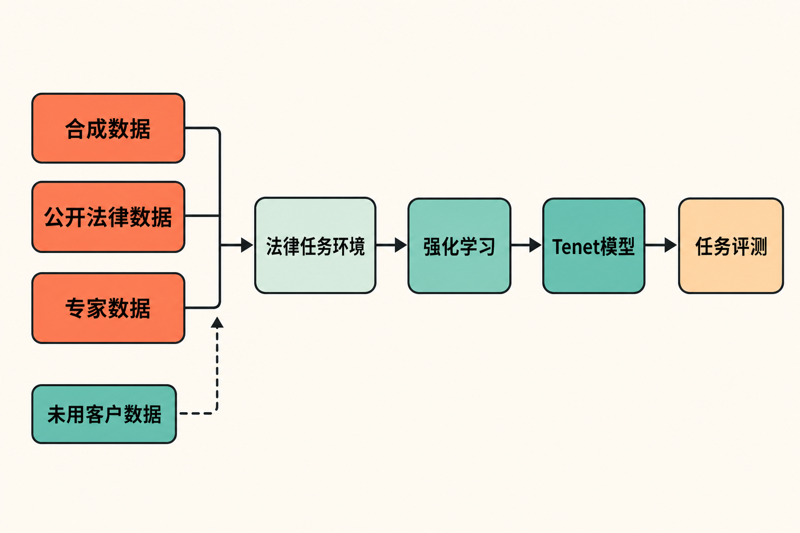

法律AI公司正在重新回答一个问题：既然通用大模型已经足够强，垂直厂商还有没有必要训练自己的模型？

Harvey给出的答案是：有必要，但未必需要从零开始。

8月20日，Harvey公布法律模型Tenet的研究预览。它以月之暗面开放权重模型Kimi K3为底座，由Harvey与Fireworks Research合作，针对长程、智能体式法律工作进行强化学习后训练。整个项目使用约150张NVIDIA B300 GPU，训练持续两个月。[Harvey披露的训练细节](https://www.harvey.ai/blog/post-training-update-harvey-tenet)显示，这不是一次轻量级微调，而是一笔明确投向垂直模型能力的算力押注。

但Tenet更值得关注之处，不只是“150张B300”。它折射出法律AI厂商的竞争重心正在变化：从接入谁家的通用模型，转向谁能掌握任务数据、训练环境、评测方法与推理成本。

## Tenet不是从零造大模型

先厘清一个容易产生误解的概念：所谓Harvey“自研模型”，并不意味着它从头预训练了一个基础大模型。

Tenet建立在Kimi K3之上。根据[Kimi K3技术论文](https://arxiv.org/abs/2607.24653)，K3是一个总参数量2.8万亿、每个token激活1040亿参数的混合专家模型，具备原生视觉能力和100万token上下文窗口。它的后训练本身已经覆盖通用、智能体与编程任务，并针对长程任务执行做了优化。

更重要的是，Kimi K3开放了完整模型权重。月之暗面还同步开放MoonEP通信库、FlashKDA算子以及AgentEnv沙箱系统；模型可用于内部研发或嵌入终端产品，但使用者仍须遵守相应许可证。[月之暗面的开放说明](https://www.kimi.com/news/kimi-k3-open-source)为下游公司开展私有后训练提供了现实基础。

因此，更准确的表述是：Harvey选择了一个能力较强且权重开放的通用底座，再用法律任务、专家知识和强化学习，把它定向塑造成自己的垂直模型。

这条路线绕开了基础预训练最昂贵的阶段，又让Harvey能够深入调整模型行为。它代表的不是“垂直公司取代基础模型公司”，而是上下游之间出现了新的分工方式。

## 150张B300究竟训练了什么

根据Harvey披露，Tenet的训练数据来自三个部分：合成数据、公开法律数据以及人类法律专家提供的数据。Harvey明确表示没有使用客户数据。

围绕专家数据，公司聘请全职及合同律师设计模拟纠纷和案件材料，并评估模型的法律推理表现；Mercor和Snorkel参与了合同人才的组织工作。[Digital Today的报道](https://www.digitaltoday.co.kr/en/view/94475/harvey-unveils-tenet-in-house-legal-ai-model)显示，法律专家在这里并非只做答案标注，还参与了任务设计与能力评估。

训练集包含约1750个智能体式法律任务环境。每轮训练执行150个优化步骤，产生超过1万次独立rollout，也就是让模型在任务环境中反复尝试、获得反馈并更新策略。

技术上，团队采用GSPO和rank-64 LoRA，对Kimi K3的全部注意力层、MLP及路由专家权重进行调整，涉及约50万个专家张量。对于一个超大规模混合专家模型，这种后训练的工程复杂度显然远高于只给少数层添加适配参数。

**事实是**，Tenet进行了覆盖范围较广的强化学习后训练；**合理推断是**，150张B300的主要价值不只是处理法律文本，而是支撑大批并行任务环境、长程轨迹生成以及混合专家模型的持续优化。来源没有披露详细成本，因此不能据此计算Harvey的具体投入金额。

## 初步成绩亮眼，但仍是厂商自测

在Harvey的LAB留出任务上，Tenet相较基础版Kimi K3，完整通过的任务数接近翻倍；在LAB Contracts上，完整通过任务数增加约20%。两套评测的完整通过率分别提升9个和2个百分点。

Harvey还称，Tenet在LAB Contracts上取得当时最佳成绩，并在综合LAB榜单中排名第二。[这些结果均来自Harvey的研究预览](https://www.harvey.ai/blog/post-training-update-harvey-tenet)，目前仍需要更多独立评测复核。

这里需要注意“完整通过”这个指标。对于需要检索、分析、生成文档或连续调用工具的法律任务，某个局部答案正确，不等于整项工作完成。Harvey选择强调端到端任务通过率，说明它关注的不是模型会不会回答一道法律问题，而是能否稳定完成多阶段工作。

**我们的观点是**，这比单纯比较知识问答分数更贴近法律AI产品的实际竞争。但评测由开发者设计并披露，任务覆盖面、评分机制和外部可复现性仍决定了成绩的说服力。现阶段应将其视为有积极信号的研究结果，而非已经得到行业公认的结论。

## 为什么法律AI公司开始掌握模型

开发Tenet首先是一笔产品质量投资。Harvey联合创始人Gabe Pereyra表示，自有模型不只是为了成本，也为了针对客户重视的法律任务改善质量。

其次是推理成本与利润率。法律工作往往涉及长文档、长上下文和多步骤执行，模型调用量可能很大。减少向外部基础模型厂商支付的推理费用，有可能改善垂直AI公司的盈利能力。[Bloomberg Law的行业分析](https://news.bloomberglaw.com/social-justice/legal-tech-ai-firms-shift-away-from-anthropic-openai-reliance)还提到，Thomson Reuters也在推进基于开放模型的自有法律模型，说明Tenet并非孤立案例。

再次是产品控制权。当模型权重、后训练方案和评测体系掌握在自己手中，厂商可以围绕特定法律流程迭代，而不必完全等待外部供应商升级模型或调整接口。

不过，自研并不等于只有收益。法律科技顾问指出，减少对外部模型厂商依赖的同时，也意味着公司要自行承担开发、维护与安全责任。模型更新、漏洞处置、输出可靠性以及基础设施运维，都会成为长期成本。

**由此可以推断**，垂直模型的商业账不能只比较单次推理价格。企业还要把训练、部署、评测、安全和持续维护计入总成本。只有当业务规模、任务复用率和质量收益足够高时，自有模型才可能形成优势。

## 不是替代所有模型，而是进入多模型组合

Tenet目前更像Harvey模型组合中的新选项，而不是对OpenAI、Anthropic等外部模型的全面替代。Digital Today在发布时报道，Tenet尚未正式用于Harvey服务，具体采用时间也未披露。

这个安排很现实。不同模型可能分别擅长推理、写作、视觉理解或工具调用；法律任务对准确性、速度、成本及数据边界的要求也不相同。保留多模型体系，可以让Harvey按任务选择合适模型，同时逐步验证Tenet在真实产品中的表现。

**我们的判断是**，垂直AI的下一阶段未必是“一家公司只用一个模型”，而更可能是“通用闭源模型、开放模型与自有后训练模型并存”。真正形成壁垒的，也不只是模型权重，而是任务环境、专家反馈、评测闭环和模型调度能力的组合。

## 结语

Tenet把法律AI的竞争向前推进了一层。

过去，垂直厂商的核心能力主要是把通用模型接入专业工作流；现在，开放权重的强模型让它们有机会直接参与后训练，并用自己的数据与评测定义“什么才算把工作做完”。

Harvey用约150张B300、两个月训练换来的，既是一组初步成绩，也是一种战略选择：不从零重造基础模型，却要掌握决定法律任务表现的关键环节。

这场押注是否成功，最终仍要看Tenet正式进入产品后的真实质量、推理成本、安全性与维护负担。但可以确定的是，垂直AI公司的护城河，正在从“调用模型的应用层”，向“能够训练、评测和运营模型的系统层”延伸。

## 参考资料

1. [Harvey：Tenet Research Preview](https://www.harvey.ai/blog/post-training-update-harvey-tenet)
2. [Bloomberg Law：Legal Tech AI Firms Shift Away From Anthropic, OpenAI Reliance](https://news.bloomberglaw.com/social-justice/legal-tech-ai-firms-shift-away-from-anthropic-openai-reliance)
3. [Digital Today：Harvey unveils Tenet, its first in-house legal AI model](https://www.digitaltoday.co.kr/en/view/94475/harvey-unveils-tenet-in-house-legal-ai-model)
4. [arXiv：Kimi K3: Open Frontier Intelligence](https://arxiv.org/abs/2607.24653)
5. [月之暗面：Kimi K3开放日](https://www.kimi.com/news/kimi-k3-open-source)
