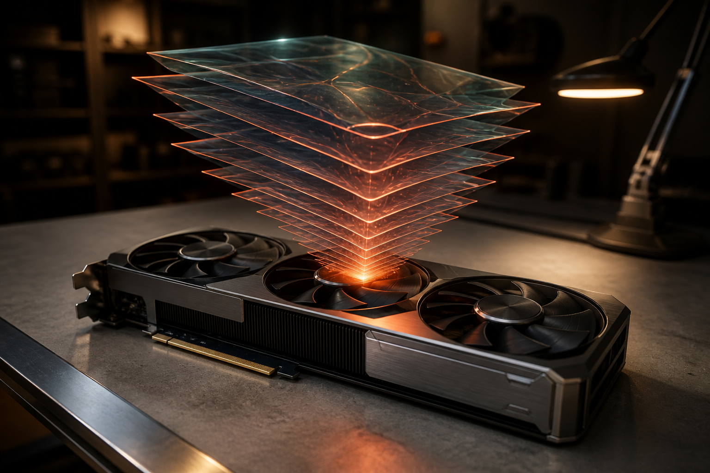

一张消费级显卡，能否承载一个会看图、会调用工具、还能执行多步任务的本地智能体？

Meta新发布的Muse Glimmer 30B，给出了一个颇具现实意义的答案：模型规模约296亿参数，经量化后，完整运行组件有机会装进24GB显存。它不是在追逐“最大模型”的纪录，而是在回答另一个更贴近开发者的问题——怎样把具备智能体能力的模型，压进个人工作站真正能够负担的硬件里。

这也是此次发布最值得关注的变化：本地模型的竞争重点，正在从“能不能聊天”，转向“能不能持续完成任务”。

## 30B模型，为什么能装进一张显卡？

根据[Meta官方模型卡](https://huggingface.co/meta-models/Muse-Glimmer-30B-GGUF)，Muse Glimmer是一款约296亿参数的稠密因果语言模型，同时配有约18亿参数的视觉感知编码器，由更大的Muse Spark蒸馏而来。它支持文本和图像输入，面向多步推理、工具调用、失败恢复等自主智能体场景。

“单卡可运行”的关键不是参数突然消失，而是量化与组件配置。

官方提供的17GB量化版文本模型文件实际约16.8GB；加入视觉编码器和用于推测解码的DFlash草稿模型后，官方估算总内存需求约20GB，目标硬件为24GB显存。另一款动态量化文本模型约19.7GB，完整组件约23GB，目标则是32GB显存。

因此，需要准确理解“单张消费级显卡”这句话：它主要指24GB级产品，并不意味着任意入门显卡都能无压力运行；实际显存占用还会受到上下文长度、缓存配置及运行框架影响。

第三方页面也给出了相近判断。[Unsloth的量化与运行说明](https://huggingface.co/unsloth/Muse-Glimmer-30B-GGUF)显示，约4比特权重可把语言模型本体压到20GB以内，从而为KV缓存、视觉编码器和推测解码组件留下空间。

**事实层面**，Muse Glimmer确实被设计成能够部署到单张高显存消费级GPU。**推断层面**，这种设计可能比单纯缩小参数更重要：它试图在能力、显存和速度之间寻找一个可以真正落地的交点。

## 它压缩的不只是模型体积

量化常见的代价是精度下降。Meta给出的结果是，约4比特量化版本相较全精度模型，在15项基准上的平均退化约为0.2%至1.0%。这是官方评测，不应直接等同于所有真实工作流中的体验，但至少说明此次压缩目标并非只求“能够加载”。

速度方面，模型引入了DFlash推测解码：草稿模型一次提出16个候选token，再由主模型并行验证。按官方在RTX 5090上的测试，生成速度从74.9 token/s提高至233.4 token/s。

这里同样需要划清边界。上述数据是特定硬件和配置下的官方结果，不代表所有显卡都能达到同等速度。DFlash也不是让主模型变小，而是通过“先猜一批、集中验证”减少逐token生成的等待。

社区已有一份更贴近日常硬件的实机记录。一名Reddit用户使用UD-Q4_K_XL量化模型、视觉投影组件与DFlash草稿模型，在单张RTX 3090上报告约22至23GB显存占用，生成速度约64至124 token/s；他还在约15万token的双针检索测试中成功找回两处信息。[这是一份个人测试](https://www.reddit.com/r/LocalLLaMA/comments/1vkm42m/muse_glimmer_actually_fits_on_a_single_rtx_3090/)，并非标准化实验，但它为官方的单卡定位提供了初步实机佐证。

## “本地智能体”才是产品重点

Muse Glimmer并非只是一款更容易部署的对话模型。Meta把它定位为自主智能体模型：支持多步推理、工具调用、图像理解和失败恢复，上下文长度达到131072以上，训练覆盖100多种语言。[官方Muse Glimmer集合](https://huggingface.co/collections/meta-models/muse-glimmer)同时提供基础权重与面向本地部署的GGUF产物。

技术媒体[MarkTechPost的发布梳理](https://www.marktechpost.com/2026/08/10/meta-ai-releases-muse-glimmer/)显示，其训练过程包括预训练阶段的logit蒸馏，中期的长上下文与智能体数据训练，以及后训练阶段的监督微调、在线蒸馏和强化学习。报道称其知识截止日期为2026年1月4日。

这些能力组合意味着，模型的目标不只是回答一个问题，而是读取较长资料、观察图像、选择工具、执行多个步骤，并在中途出错时尝试恢复。例如，本地代码助手、资料整理器、桌面自动化工具和对隐私敏感的企业工作流，都可能从这种模型中受益。

但“支持智能体任务”不等于“能够可靠地自主完成任何任务”。工具调用成功率、长任务中的误差累积、权限隔离，以及模型面对陌生环境时的稳定性，仍需在具体系统里验证。基准成绩只能描述一部分能力，不能替代真实生产测试。

## 真正的变化：部署权正在向用户侧移动

Muse Glimmer采用Apache 2.0许可证，可通过llama.cpp、Ollama、vLLM等本地工具运行。Unsloth还列出了SGLang和Unsloth Studio等部署路径。对于开发者而言，这意味着模型权重、推理环境与数据可以更多地留在自有设备上。

从事实看，这种方式带来三个直接特点：不必把每次输入都发送到远程模型服务；推理成本更多转化为本地硬件投入；开发者能够自行选择量化版本、上下文规模和运行框架。

从推断看，它可能推动两类应用加速出现。一类是需要处理私有代码、内部文档和本地图像的敏感工作流；另一类是需要智能体长时间常驻、频繁调用工具，而云端按量计费压力较高的任务。

不过，本地运行并不自动等于低成本或高安全。24GB级显卡仍有不低的购置门槛；长上下文会继续消耗显存；工具权限配置不当，也可能让智能体误操作文件或系统。模型权重留在本地，只解决了数据链路中的一部分问题。

## 如何看待这次发布？

我的观点是，Muse Glimmer 30B的意义不在于宣布“云端大模型已经不再需要”，而在于把本地智能体的可用门槛向前推了一步。

它展示了一条清晰路线：以更大模型蒸馏能力，用约4比特量化压缩权重，再通过推测解码改善速度，最终让一个具备视觉和工具能力的30B级模型进入单卡范围。每一环都不是新概念，但当它们被整合成可下载、可运行的发布物时，工程意义就超过了单独的参数指标。

对普通用户而言，这仍不是“一键获得私人贾维斯”。对拥有24GB显卡的开发者和小团队而言，它却已经是可以测试、改造和嵌入工作流的模型。

## 结语

Muse Glimmer 30B把一个过去常依赖服务器或云端API的能力组合，塞进了单张高显存消费级显卡：约296亿参数、图像理解、长上下文、工具调用与推测解码同时出现。

它能否成为真正可靠的本地智能体底座，还要经过更多独立评测和生产环境检验。但方向已经相当明确：下一阶段的本地AI竞争，比较的不会只是模型能否回答问题，而是谁能在有限硬件上，更稳定、更快速、更安全地把任务做完。

## 参考资料

1. [Meta：Muse-Glimmer-30B-GGUF官方模型卡](https://huggingface.co/meta-models/Muse-Glimmer-30B-GGUF)
2. [Meta：Muse Glimmer官方模型集合](https://huggingface.co/collections/meta-models/muse-glimmer)
3. [Unsloth：Muse-Glimmer-30B-GGUF量化与运行说明](https://huggingface.co/unsloth/Muse-Glimmer-30B-GGUF)
4. [MarkTechPost：Meta AI Releases Muse Glimmer](https://www.marktechpost.com/2026/08/10/meta-ai-releases-muse-glimmer/)
5. [Reddit用户RTX 3090实机测试](https://www.reddit.com/r/LocalLLaMA/comments/1vkm42m/muse_glimmer_actually_fits_on_a_single_rtx_3090/)
