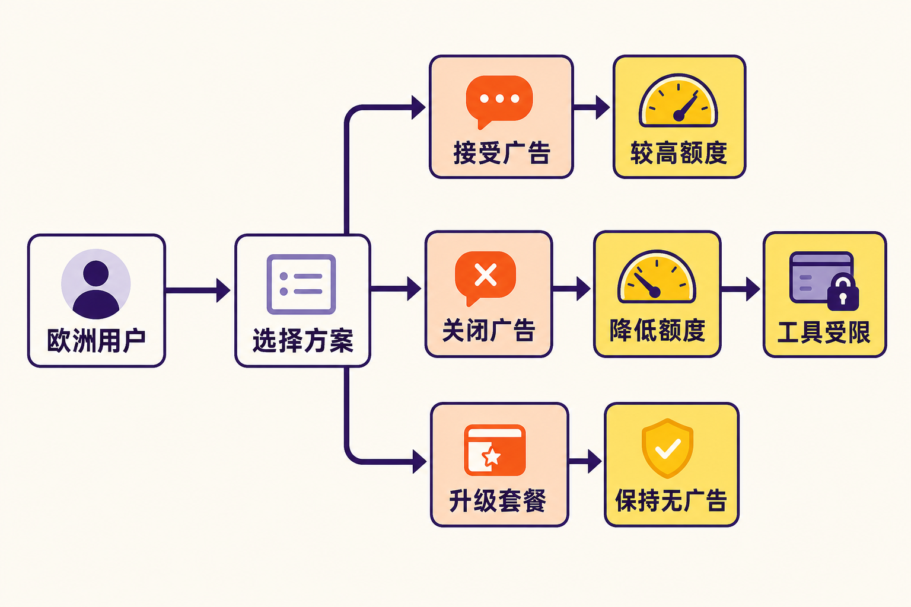

ChatGPT的广告试验正在跨出美国，进入监管环境更严格的欧洲。

据OpenAI向欧洲用户发送的隐私政策更新邮件，ChatGPT将在**2026年8月稍晚**开始向欧洲的Free和Go计划用户展示广告；Plus、Pro、Business、Enterprise和Education计划继续保持无广告。[PPC Land](https://ppc.land/chatgpt-free-and-go-users-in-europe-face-ads-from-later-this-month/)援引该邮件称，欧洲首批广告将采用情境匹配，不会立即启用个性化广告。

这次变化最值得关注的并不只是“ChatGPT开始插广告”，而是OpenAI设计了一道明确的交换题：Free用户可以不付费关闭广告，但需要接受更低的消息额度和更少的工具权限。

广告由此不只是一个新收入入口，也开始成为划分产品权益的工具。

## 先看事实：谁会看到广告？

根据[OpenAI官方广告说明](https://help.openai.com/en/articles/20001047-ads-in-chatgpt)，广告可向Free和Go用户展示，而Plus、Pro、Business、Enterprise和Edu账户保持无广告。

广告不会混入模型回答正文，而是出现在回答末尾下方，标注为赞助内容，并在视觉上与回答分开。OpenAI表示，广告不会影响ChatGPT生成的回答。换句话说，从产品界面看，回答与商业内容仍是两个独立区域。

欧洲经济区和瑞士上线初期不提供个性化广告。广告选择可以参考当前对话主题、大致位置和设备类型，但不使用用户过去的聊天记录或记忆。若未来引入个性化广告，OpenAI将另行要求用户明确选择是否同意。

这里需要区分两个概念：不使用历史行为画像，不代表广告完全脱离聊天内容。即使个性化广告处于关闭状态，系统仍可能依据当前对话的上下文匹配广告。

OpenAI同时称，广告商不能访问用户的聊天、历史记录、记忆或个人资料，只能获得浏览量、点击量等汇总表现数据。以上均是OpenAI公布的产品规则；广告系统在欧洲长期运行后的实际效果，仍需后续观察和独立审计。

## 关闭广告并非没有代价

Free用户可以在设置中的广告控制选项里选择“降低消息限额”，免费移除广告。但官方明确提示，这种无广告Free模式会减少可发送的消息数量，并可能无法使用图像生成、Deep Research等工具。

这不是传统的“付费去广告”，而是一种“用产品能力换无广告”的设计：

- 接受广告，继续获得相对较高的免费使用额度；
- 关闭广告，保留免费身份，但减少消息和工具权限；
- 升级付费计划，以同时获得无广告体验和更完整的能力。

需要注意，官方说明中的Ads-Free选项面向Free计划。Go用户若想使用这一免费无广告配置，需要先转回Free；另一个选择是升级至Plus、Pro等无广告计划。[OpenAI官方页面](https://help.openai.com/en/articles/20001047-ads-in-chatgpt)并未给Go用户提供“维持Go权益并免费去广告”的选项。

这也意味着标题中的“关闭广告需接受更低使用额度”，主要对应Free用户的选择。Go用户面对的实际路径还包括套餐切换，不能简单理解为按一下开关即可降额去广告。

## 降低多少额度？目前没有统一答案

OpenAI没有公布无广告Free模式固定、统一的消息配额，只说明用户每天可发送的消息会更少，也可能更频繁地触及限制。

[TechRadar的体验记录](https://www.techradar.com/ai-platforms-assistants/i-chose-chatgpts-ad-free-option-so-you-dont-have-to-heres-what-you-actually-give-up)提供了一个样本：测试中有一次大约发送40条消息后出现限额警告，另一次发送超过60条仍未触发。触及无广告限额后，用户可以重新开启广告，换回更多使用额度。

但这只是单一媒体的实测，不能被当作所有账户的固定门槛。两次结果本身并不一致，反而说明额度可能动态变化。地区、时间或系统状态是否参与额度调整，现有材料没有给出结论，因此不宜进一步推定。

对于用户而言，真正需要关注的不是某个未经官方承诺的数字，而是选择无广告后，日常高频对话以及图像生成、深度研究等任务是否仍能完成。

## 为什么说这是一次产品机制变化

> **以下属于基于已知事实的推断。**

第一，OpenAI正在把广告纳入免费产品的价值交换。过去，免费版与付费版的区别主要体现在模型能力、工具和使用额度；现在，是否观看广告也成为权益分层的一部分。免费用户支付的未必是钱，也可能是注意力。

第二，“免费且无广告”没有消失，但被设计成能力更弱的选项。这种安排保留了用户拒绝广告的入口，同时让拒绝广告产生可感知的机会成本。对重度用户而言，更少的消息和工具限制可能比广告本身更难接受。

第三，Go计划处在一个较微妙的位置。它属于可能展示广告的计划，却不能直接使用Free计划的免费去广告配置。由此推断，广告不只是覆盖最基础免费层，也可能被用于重新强化更高付费套餐的吸引力。

这些推断解释的是产品激励结构，并不等于已经证明OpenAI的具体商业目标。现有来源没有提供欧洲广告收入、转化率或付费增长预测，因而不能据此编造量化结论。

## 欧洲上线后，仍有三件事值得观察

第一是情境广告的边界。当前对话主题会参与广告选择，而聊天场景可能涉及健康、财务、工作或家庭问题。即使广告与回答清晰分隔，用户仍会关心哪些话题适合被用于商业匹配，以及系统如何处理敏感语境。

第二是广告分配是否公平。一项针对美国早期测试的[独立研究](https://arxiv.org/abs/2608.05008)使用91个模拟账户、335类提示，收集了来自186个广告商的3000余条广告。研究发现，在其测试设置中，低收入模拟账户收到广告的概率更高；广告通常在账户创建14天后开始出现，早期内容以消费品为主。

必须强调，这项研究审计的是美国测试阶段，不能直接证明欧洲上线后也会出现相同分配结果。它的意义在于提示一种审计方向：不仅要看广告写了什么，也要看哪些用户更容易看到广告、看到得有多频繁。

第三是“无广告模式”的实际可用性。如果消息上限过低、关键工具不可用，那么名义上的免费选择可能难以满足部分用户的实际需求。反过来，如果限制较为温和，它也可能成为低频用户可接受的折中方案。现阶段没有统一额度数据，判断仍需等待更大范围的真实使用反馈。

## 结语：广告之外，真正变化的是免费版的定价方式

ChatGPT在欧洲引入广告，表面上是界面中多了一个赞助区域，实质上则重新定义了免费使用的代价。

用户现在面对三种成本：观看广告所付出的注意力、关闭广告后放弃的额度与工具，以及升级无广告套餐所需的金钱。OpenAI把这三种成本摆在同一张选择表上，让用户自行取舍。

从目前规则看，回答与广告被明确分隔，欧洲初期也不启用个性化广告，这些都是可核实的事实。至于情境匹配能否守住隐私边界、广告分配是否公平、降额无广告是否真正可用，则仍是尚待验证的问题。

广告来了，但比“有没有广告”更重要的是：拒绝广告的选择，究竟值多少额度。

## 参考资料

1. [OpenAI Help Center：Ads in ChatGPT](https://help.openai.com/en/articles/20001047-ads-in-chatgpt/)
2. [PPC Land：ChatGPT Free and Go users in Europe face ads from later this month](https://ppc.land/chatgpt-free-and-go-users-in-europe-face-ads-from-later-this-month/)
3. [TechRadar：I chose ChatGPT’s ad-free option so you don’t have to](https://www.techradar.com/ai-platforms-assistants/i-chose-chatgpts-ad-free-option-so-you-dont-have-to-heres-what-you-actually-give-up)
4. [arXiv：The Beginning of ChatGPT Ads](https://arxiv.org/abs/2608.05008)
