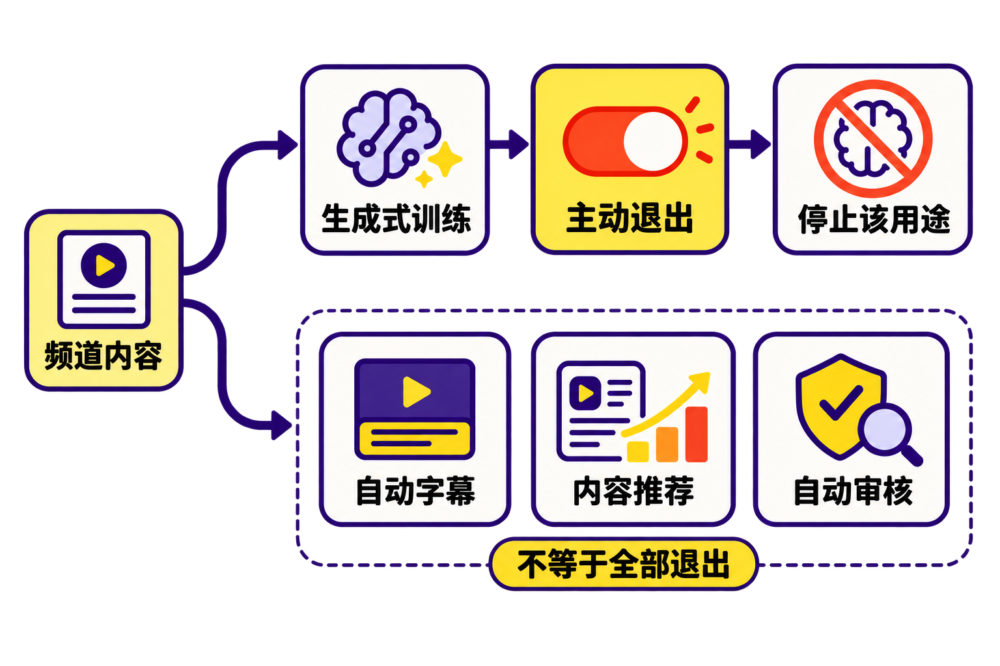

直播结束后，内容并不一定就此“下播”。

主播的画面、声音、回放，以及围绕直播产生的评论和互动，如今可能进入另一条用途完全不同的链路——用于改进亚马逊范围内的生成式AI内容模型。更具争议的是，这条链路不是等待创作者主动加入，而是默认开放，创作者必须自己找到设置并关闭。

Twitch已经增加退出选项，但这并没有平息质疑。相反，一个看似普通的开关，集中暴露了平台内容治理中的三重冲突：谁有权决定内容的新用途、默认设置是否能代表真实同意，以及退出一类AI训练究竟意味着什么。

## 发生了什么：默认允许，创作者主动退出

根据[Twitch官方账户设置文档](https://help.twitch.tv/s/article/twitch-account-settings?language=en_US)，平台新增了“Training for Generative AI”控制项，用来决定频道内容能否被用于亚马逊生成式AI内容模型的训练。Twitch Support也通过[官方公告](https://x.com/TwitchSupport/status/2087572924450455558)确认，用户可以通过这一设置阻止频道内容进入相关训练用途。

关键在于，这个选项默认开启。

[PC Gamer的报道](https://www.pcgamer.com/software/ai/twitch-under-fire-for-new-gen-ai-training-system-that-harvests-streamer-data-for-amazon-says-its-on-by-default-because-if-it-was-opt-in-nobody-would-opt-in/)称，可被涉及的频道内容包括直播、VOD回放、评论以及其他频道内容。另一家媒体[Windows Central](https://www.windowscentral.com/artificial-intelligence/if-it-was-opt-in-nobody-would-opt-in-cringe-twitch-cpo-admits-everyone-hates-its-ai-training-feature-doesnt-care)则将范围概括为主播的形象、内容、声音及其他互动。

需要退出的创作者，可进入“Settings”，打开“Security and Privacy”页面，再关闭“Training for Generative AI”。

这里需要明确区分两个事实：第一，Twitch提供了退出机制；第二，提供退出机制不等于平台在使用前获得了创作者的主动授权。前者是产品功能，后者才是本次争议真正指向的治理问题。

## 一句话点燃争议：如果主动加入，几乎没人会选

据[PC Gamer](https://www.pcgamer.com/software/ai/twitch-under-fire-for-new-gen-ai-training-system-that-harvests-streamer-data-for-amazon-says-its-on-by-default-because-if-it-was-opt-in-nobody-would-opt-in/)和[Windows Central](https://www.windowscentral.com/artificial-intelligence/if-it-was-opt-in-nobody-would-opt-in-cringe-twitch-cpo-admits-everyone-hates-its-ai-training-feature-doesnt-care)报道，Twitch首席产品官Mike Minton在直播中确认设置默认开启，并解释称，如果采取主动加入机制，几乎不会有人选择加入。

这句话之所以敏感，是因为它让“默认开启”的实际作用变得格外清楚。

**事实是**：平台采用“默认加入、主动退出”，而不是“默认不加入、主动授权”。

**可以据此作出的合理推断是**：默认值能够扩大可供训练的内容范围，因为并非每位创作者都会看到公告、理解设置或及时关闭开关。

**本文的观点是**：当平台已经预见到用户主动授权意愿很低，却仍通过默认值获得使用许可时，争议就不再只是设置是否方便，而是产品设计是否在替用户作出本应由用户本人完成的决定。

> “可以退出”听起来保留了选择权，但选择权的质量取决于三个前提：用户知道内容会被怎么使用；能够轻松找到入口；退出后的边界足够清楚。缺少其中任何一项，按钮存在并不自动等于充分知情。

## 被使用的不只是视频，而是完整的直播语境

与上传一张图片或输入一段文字不同，直播是一种持续生产的复合内容。

画面中可能有主播本人及其环境；声音包含语气、停顿和表达习惯；回放保留完整上下文；评论与聊天则记录观众如何回应内容。PC Gamer所列的直播、VOD、评论和其他频道内容，意味着争议对象并非单一文件，而可能是一整套相互关联的内容语境。

这会带来一个容易被忽略的问题：主播是频道的经营者和内容生产者，但聊天内容来自大量参与互动的观众。现有材料确认控制项由频道一侧管理，却没有进一步说明每一类参与者如何分别表达意愿，也没有披露具体训练数据的筛选、保留期限、模型范围或退出后的存量数据处置方式。因此，对这些问题不能擅自下结论。

不过，现有事实已经足以说明：平台把原本为观看、互动和社区交流而产生的内容，增加了生成式AI训练这一新用途。当内容用途发生扩展，用户是否得到醒目提示、是否需要重新授权，重要性会明显上升。

## 退出AI训练，不等于退出所有算法处理

这也是本次事件中最容易被标题简化、却最值得创作者注意的细节。

Twitch官方文档举例称，频道音频可能被用于改进语音转文字模型，进而改善Twitch及亚马逊其他业务的字幕能力。但[官方账户设置说明](https://help.twitch.tv/s/article/twitch-account-settings?language=en_US)同时表明，关闭生成式AI训练选项，并不等于退出Twitch和亚马逊依据隐私声明进行的所有其他AI支持用途。

PC Gamer进一步列举了自动字幕、推荐和AutoMod等功能：即使生成式AI训练开关被关闭，相关内容仍可能在这些AI或机器学习功能中被处理。

因此，不能把这个按钮理解成“禁止一切AI使用”。更准确的说法是：它控制的是频道内容能否用于特定的亚马逊生成式AI内容模型训练，而不是一个覆盖全部算法用途的总开关。

这种边界对普通用户并不直观。“生成式AI训练”“语音转文字”“内容推荐”“自动审核”在技术和产品上可能属于不同链路，但对创作者而言，它们都表现为平台在处理自己的内容。若设置页面没有把不同目的拆分清楚，用户就很容易高估一次退出所能覆盖的范围。

## 为什么“默认值”比按钮本身更重要

默认值从来不只是界面细节。它决定谁需要额外花时间、理解规则并承担漏操作的后果。

在主动加入模式下，平台要先解释用途，再等待用户表示同意；在主动退出模式下，内容先处于可用状态，用户则要自己发现变化、判断影响并完成操作。两者都有按钮，但责任分配完全不同。

从平台角度看，生成式AI训练需要足够丰富的内容材料，默认开启显然更有利于扩大参与规模。这是结合产品机制得出的推断，并非来源披露的具体商业目标。

从创作者角度看，直播内容既是作品，也是个人形象、职业资产和社区关系的载体。创作者即使接受推荐、字幕或审核，也未必因此接受内容被用于未来生成式模型。把不同目的打包在默认状态中，会削弱用户对每一种用途作出独立判断的能力。

本文认为，真正可持续的做法至少应满足三点：

1. 新用途出现时给予醒目通知；
2. 对生成式训练采用清晰、独立的选择；
3. 明确退出对未来数据与既有数据分别产生什么影响。

这些是基于本次事件提出的治理建议，不代表Twitch已经承诺实施。

## 创作者现在可以做什么

依据现有资料，最直接的操作是进入Twitch的“Settings → Security and Privacy”，检查“Training for Generative AI”当前状态；如果不希望频道内容参与相关训练，应将其关闭。

但操作不应止于按下按钮。创作者还需要理解：这一退出只针对相应的生成式AI训练用途，并不覆盖字幕、推荐、AutoMod等所有AI或机器学习功能。对于官方材料尚未说明的存量数据处理、退出生效时间及不同内容类型的具体边界，则应等待平台进一步披露，不能仅凭开关名称自行推定。

对于依赖平台经营的创作者来说，这次事件还有一个现实提醒：隐私和内容设置不是“一次配置、永久有效”。当平台增加新功能或扩展内容用途时，默认状态可能随产品更新而改变。定期检查公告与账户设置，正在成为数字创作的一项额外管理成本。

## 结语：争议的核心，是谁先替谁作了决定

Twitch没有完全取消创作者的选择：退出按钮确实存在，路径也已经公开。但争议仍然成立，因为平台先把“允许训练”设为默认，再要求不接受的人主动采取行动。

AI训练需要内容，平台需要推进产品，创作者也需要保护自己的作品、形象与社区关系。三者并非天然无法协调。真正决定信任的，是平台是否把用途讲清楚，是否让授权发生在使用之前，以及是否让拒绝与接受同样容易。

> 一个开关解决了操作问题，却没有自动解决同意问题。

Twitch此次风波最值得关注的，不只是哪些直播被用来训练AI，而是在平台时代，沉默究竟应不应该被解释为授权。

## 参考资料

1. [Twitch Help Portal：Twitch Account Settings](https://help.twitch.tv/s/article/twitch-account-settings?language=en_US)
2. [Twitch Support：Generative-AI training opt-out announcement](https://x.com/TwitchSupport/status/2087572924450455558)
3. [PC Gamer：Twitch under fire for new gen AI training system](https://www.pcgamer.com/software/ai/twitch-under-fire-for-new-gen-ai-training-system-that-harvests-streamer-data-for-amazon-says-its-on-by-default-because-if-it-was-opt-in-nobody-would-opt-in/)
4. [Windows Central：Twitch CPO discusses the default-on AI training setting](https://www.windowscentral.com/artificial-intelligence/if-it-was-opt-in-nobody-would-opt-in-cringe-twitch-cpo-admits-everyone-hates-its-ai-training-feature-doesnt-care)
