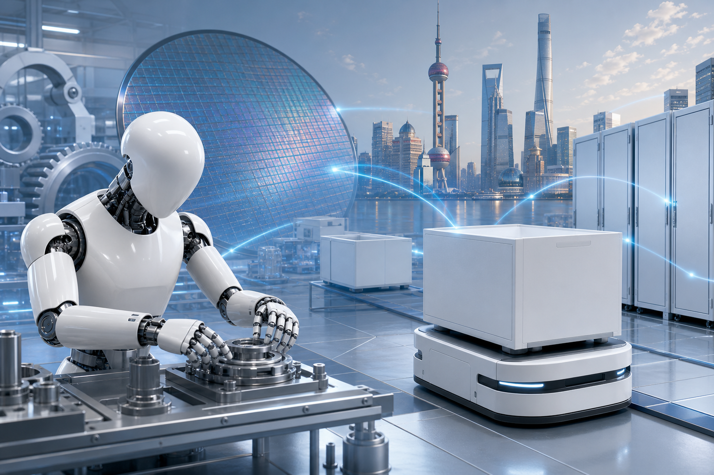

# 从“模型秀”到“生产力”：2026上海人工智能大会释放了什么信号？

当人工智能大会不再只比拼模型参数，而是开始讨论机器人能否进工厂、智能体能否独立完成任务、项目能否形成采购订单，行业真正关心的问题已经发生变化。

7月17日至20日，2026世界人工智能大会在上海世博、张江和西岸举行，主题为“智能伙伴 共创未来”。展览面积首次突破10万平方米，1100余家企业带来3000余项产品。闭幕数据显示，现场观众累计超过40万人次。[上海市政府会前资料](https://www.shanghai.gov.cn/nw12344/20260707/deee99228f02433e9b0fb8f9447e8b34.html)、[新华社闭幕报道](https://www.news.cn/politics/20260721/ccc49a6fe8ac445ca78fbe314ed945e1/c.html)

这些数字体现了大会规模，但更值得关注的是，技术展示、产业交易和全球治理三条线正在汇合。

## 信号一：AI竞争从“会回答”转向“会办事”

**事实：**大会现场的核心方向之一是智能体。相关产品不再满足于生成文字或回答问题，而是尝试跨应用调用工具、拆解任务并执行流程。具身智能的展示也从舞台表演转向工业装配、物流分拣和居家陪护等完整作业场景。[新华网科技观察](https://www.xinhuanet.com/20260719/429c6e1b749b470082a076fcf908d655/c.html)

同期发布的《全球人工智能创新指数报告2026》指出，大模型产业化重心正由通用模型转向垂直模型、由训练转向推理；企业应用也在从单点工具走向业务全流程重塑。[《全球人工智能创新指数报告2026》](https://www.xinhuanet.com/20260717/973a724632ca4342826b28e93eef8177/c.html)

**推断：**这意味着模型能力仍然重要，但它正在成为基础设施。企业真正愿意付费的，不只是一次更流畅的对话，而是能够接入业务系统、稳定完成任务并带来效率提升的解决方案。未来竞争将更多取决于流程理解、工具调用、行业数据和交付能力。

> **观点：**判断一家AI企业是否具有长期价值，可以少看一些发布会上的“惊艳演示”，多问三个问题：能否进入真实流程？能否持续稳定运行？能否算清投入产出账？

## 信号二：具身智能开始接受产业化检验

**事实：**2026年1至5月，中国工业企业购进具身智能机器人的金额同比增长2.3倍；相关报道预计，全年人形机器人整机产量有望突破10万台。[新华网科技观察](https://www.xinhuanet.com/20260719/429c6e1b749b470082a076fcf908d655/c.html)

在浦东，具身智能重点企业已超过100家，产业链覆盖芯片、模型、数据、核心零部件和整机。大会还展示了近存计算芯片、脑机接口、AI药物研发及集群互联等成果。[浦东新区政府大会报道](https://www.shanghai.gov.cn/nw15343/20260722/4514c99cfd364c3ba7d1b81790a09163.html)

**推断：**具身智能正在从“证明机器人能动起来”，进入“证明它能长期干活”的阶段。采购增长代表需求升温，但规模化仍取决于可靠性、成本、安全性，以及能否适应复杂环境。产量预期并不等同于商业模式已经成熟。

对上海而言，机会不只在制造一台人形机器人，更在于把芯片、模型、零部件、整机和工业场景组织成协同生态。这种产业链密度，可能比单一明星产品更能决定商业化速度。

## 信号三：大会开始用订单和投资衡量落地

**事实：**大会组织了177个重要采购团组，预计形成意向采购金额约203.6亿元，同比增长25%；上海集中签约32个人工智能重点项目，总投资额超过409亿元，覆盖基础设施、智能体应用、具身智能和科学智能等领域。[新华社闭幕报道](https://www.news.cn/politics/20260721/ccc49a6fe8ac445ca78fbe314ed945e1/c.html)

上海此前披露，2025年全市394家规模以上人工智能企业产业规模超过6370亿元，同比增长39.5%，智能算力规模突破16万P。大会召开前，当地已推动57个核心场景落地，形成162亿元意向合作。[上海市政府新闻发布会](https://www.shanghai.gov.cn/nw12344/20260707/deee99228f02433e9b0fb8f9447e8b34.html)

**推断：**上海的打法可以概括为“算力打底、场景牵引、资本承接”。政府与大型机构开放场景，企业完成验证，再通过采购、签约和产业集聚推动规模化。这解释了为什么大会越来越像产业交易平台，而不只是技术展会。

> **观点：**意向采购和项目总投资不能直接等同于已实现收入。后续更值得追踪的是项目开工率、采购兑现率，以及应用能否从示范点复制到更多客户。

## 信号四：AI竞争正在延伸至全球规则

**事实：**来自100多个国家和国际组织的代表及产学研嘉宾参会，约80个国家和国际组织参加人工智能全球治理高级别会议。29个国家签署《关于成立世界人工智能合作组织的协定》，成为创始成员国。[新华社外交部报道](https://www3.xinhuanet.com/20260720/b3a7808859734150a79e08ae9811d689/c.html)

大会主旨讲话强调开源人工智能和缩小技术获取差距，并提出面向金砖国家、东盟、拉美和非盟等开展合作与培训。路透社将其解读为中国扩大AI规则影响力的一部分，同时指出开放主张与国家安全限制之间可能存在张力。[路透社报道](https://www.investing.com/news/economy-news/chinas-xi-promotes-chinas-commitment-to-ai-access-in-speech-at-shanghai-conference-4797352)

**推断：**未来的AI竞争不仅是芯片、模型和应用竞争，也包括谁能提供更有吸引力的合作网络、能力建设方案与治理框架。全球南方能否低成本获得技术，将成为国际AI治理的重要议题。

## 结语：下一阶段，比的是交付能力

2026上海人工智能大会给出的主线已经相当清楚：智能体要走出聊天框，机器人要走进生产流程，模型要进入垂直行业，技术成果要接受订单和投资的检验；与此同时，AI也正在成为全球治理的新议题。

> **本文观点：**行业正在告别单纯依靠参数和演示制造轰动的阶段。下一轮真正拉开差距的，将是稳定交付、产业协同、场景复制和规则参与能力。上海的优势在于产业链完整、应用场景密集，但大会上的热度最终仍需由可持续收入和可复制项目来证明。

## 参考资料

1. [上海市政府：2026世界人工智能大会筹备进展及产业发展情况](https://www.shanghai.gov.cn/nw12344/20260707/deee99228f02433e9b0fb8f9447e8b34.html)
2. [路透社：Xi pitches China as leader of new global AI order](https://www.investing.com/news/economy-news/chinas-xi-promotes-chinas-commitment-to-ai-access-in-speech-at-shanghai-conference-4797352)
3. [新华网：《全球人工智能创新指数报告2026》发布](https://www.xinhuanet.com/20260717/973a724632ca4342826b28e93eef8177/c.html)
4. [新华网科技观察：从一场大会看AI产业发展新方向](https://www.xinhuanet.com/20260719/429c6e1b749b470082a076fcf908d655/c.html)
5. [新华社：外交部介绍2026世界人工智能大会成果和亮点](https://www3.xinhuanet.com/20260720/b3a7808859734150a79e08ae9811d689/c.html)
6. [新华社：2026世界人工智能大会闭幕](https://www.news.cn/politics/20260721/ccc49a6fe8ac445ca78fbe314ed945e1/c.html)
7. [浦东新区政府：2026世界人工智能大会开幕，浦东AI成果亮相](https://www.shanghai.gov.cn/nw15343/20260722/4514c99cfd364c3ba7d1b81790a09163.html)
