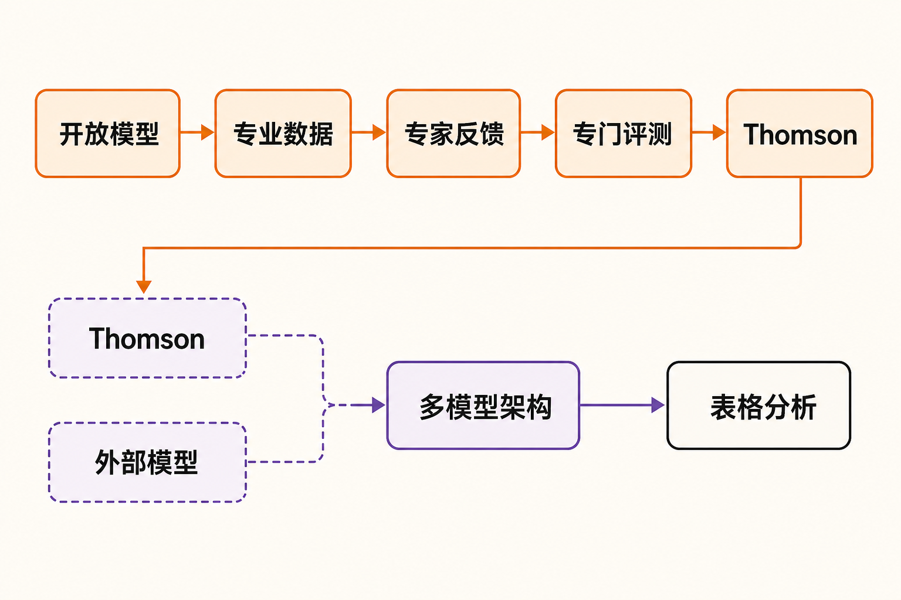

当通用大模型不断冲击更高参数规模和综合能力时，汤森路透选择了另一条路：不追求回答所有问题，而是让模型更懂法律、税务、会计和新闻等高价值专业场景。

8月24日，汤森路透正式发布首个内部开发、由公司自主控制的大语言模型Thomson。项目历时约两年，人才与算力投入合计约4000万美元。这不是一次简单的模型换壳，而是专业信息服务商对自身核心资产的一次重新包装：过去出售数据库、检索工具和工作流软件，现在则尝试把数据与专家判断直接“训练”进模型。

Thomson要挑战的，并非通用模型的全部能力，而是它们在高风险专业任务中的统治地位。

## 4000万美元，买到的首先是控制权

**事实：**据[汤森路透官方公告](https://www.thomsonreuters.com/en/press-releases/2026/august/thomson-reuters-leverages-its-world-class-data-assets-to-launch-its-own-frontier-model)，Thomson是该公司首个自研专有大语言模型。它以开放模型为基础，再通过中期训练、后期训练和专家反馈进行专业化改造。4000万美元覆盖人才和计算资源，并不意味着汤森路透从零训练了一个全新基础模型。

这一区别很重要。从零构建通用前沿模型，需要投入庞大的资金、算力和数据。以成熟开放模型为起点，则能把有限资源集中到专业语料处理、评测和产品适配上。第三方报道还称，最终版本的一次训练运行成本约45万美元；不过，这一数字来自媒体简报，并非完整成本拆解。

Thomson的价值也不只体现在模型能力上。拥有自主模型，意味着公司可以更直接地控制训练方式、部署位置、输出行为和信息隐私，也能降低对少数外部模型供应商的依赖。

**推断：**对汤森路透而言，4000万美元更像是购买“模型主权”的战略投入。它未必能换来一个综合能力超越所有通用前沿模型的系统，却能换来更稳定的产品路线、数据治理边界和成本调度空间。

## 真正的筹码，是几十年积累的专业数据

汤森路透的底牌不是参数规模，而是内容资产。训练材料包括Westlaw、Practical Law、Checkpoint和Reuters等业务积累的法律、实务、税务、会计及新闻内容；数百名领域专家还参与确定训练目标、提供问题样本，并对输出进行盲测评判。

研发团队介绍，其工作不只是把文档批量输入模型，还包括数据清理、建立一致性信号、收集专家反馈，以及在训练前搭建专门评测体系。目标是在增强专业能力的同时，尽量保留基础模型已有的通用能力。[官方技术文章](https://www.thomsonreuters.com/en-us/posts/innovation/how-we-built-thomson/)称，该项目源于汤森路透2024年收购的Safe Sign Technologies团队，并由公司与DatologyAI、Lambda、Together AI、帝国理工学院及相关联合实验室协作开发。

公开材料对不同研发阶段的底座有不同描述：官方技术文章提到帝国理工学院FAIR Lab开发的Snowdon模型；[LawSites的报道](https://www.lawnext.com/2026/08/thomson-reuters-launches-thomson-its-own-proprietary-llm-trained-on-westlaw-and-practical-law-content.html)则称近期研发阶段使用过Qwen 3.5。仅凭现有资料，不能据此断定最终生产版本只对应其中某一个底座，更合理的理解是研发过程可能经历了不同基础模型或迭代阶段。

一个更值得关注的数字是：目前训练所使用的汤森路透自有内容，还不到其专有内容总量的10%。

**推断：**这意味着Thomson 1.0更像起点，而非数据红利已经释放完毕。未来能否继续提升，关键不只是加入更多文档，还包括如何筛选高价值数据、处理时效和授权边界，并把专家判断转化为稳定训练信号。

## 第一站不是聊天框，而是表格分析

Thomson进入生产环境后的首个落点，是CoCounsel Legal中的Tabular Analysis功能。该功能面向法律文件的批量分析和结构化比较。Thomson将成为默认模型，但管理员仍可切换其他模型。

这一部署方式透露出两层信息。

第一，汤森路透选择了边界较清晰、容易评测的具体任务，而不是直接让新模型接管整套法律助手。表格分析有明确输入、结构化输出和可复核结果，更适合作为生产环境的第一块试验田。

第二，CoCounsel不会因此放弃多模型架构。[EXAME对汤森路透CTO Joel Hron的采访](https://exame.com/inteligencia-artificial/thomson-reuters-investe-us-40-milhoes-e-lanca-modelo-proprio-de-ia/)显示，Thomson是系统中新增加的组成部分，而非对第三方模型的全面替代。后续计划才包括扩展至更多法律和税务产品。公司还在与大型律所及企业讨论直接授权，并开发可提供API密钥的开发者门户。

**观点：**这是一种务实策略。专业软件真正需要的通常不是“唯一最强模型”，而是针对不同任务，在质量、时延、隐私和成本之间进行路由。自研模型让汤森路透多了一张关键底牌，却没有消除外部模型的价值。

## “专业模型更可靠”仍需打一个问号

汤森路透称，内部测试显示Thomson在专业任务上可以与领先模型竞争。但截至发布时，完整技术报告尚未公开，广泛的独立验证也仍然有限。[SiliconANGLE的报道](https://siliconangle.com/2026/08/24/thomson-reuters-launches-proprietary-ai-model-for-legal-work/)明确提醒，现阶段的领先表现主要来自公司内部评测。

更谨慎的信号来自汤森路透自己。CTO承认，公司不能保证Thomson在每个法律或税务问题上都比通用模型犯更少的错误。公司要求专业用户无例外地人工核验模型输出。此外，Thomson默认不会实时查询最新数据库，公司仍在评估未来加入实时检索能力。

这暴露了专业模型的三个现实限制：专业语料不能自动消除幻觉；训练时知识不等于实时信息；内部评测也不能代替真实用户与外部机构的检验。

汤森路透计划向学术界提供一个较小的开放权重版本，用于非商业研究和外部验证。如果落实，这将为研究者检查模型的专业能力、偏差与安全表现提供入口，但小型版本的评测结果能在多大程度上代表生产模型，仍要看后续披露。

## 专业数据公司正在变成模型公司

Thomson的产业意义，在于法律科技竞争的重心可能发生变化。过去，厂商主要在OpenAI、Anthropic和Google等供应商之间选择模型，再叠加检索、提示词和工作流；现在，拥有高质量专有数据的公司开始尝试训练并维护自己的模型。

[彭博法律的行业分析](https://news.bloomberglaw.com/legal-ops-and-tech/legal-tech-ai-firms-shift-away-from-anthropic-openai-reliance)指出，自有模型可能帮助法律科技公司控制推理成本、减少供应商依赖并改善利润率；相应地，模型安全、持续维护和更新责任也会转移到开发公司自身。

**观点：**这场竞争最终不会简化成“专业模型战胜通用模型”。更可能出现的格局是：通用模型提供广泛能力，专业模型承担高价值任务，企业通过检索、数据权限、专家复核和多模型路由把它们组合起来。真正的护城河不是单一模型，而是数据、评测、工作流和客户信任形成的闭环。

## 结语

Thomson 1.0展示了一条不同于参数竞赛的AI路线：以开放模型降低起步成本，以专有数据建立差异，再用行业专家和真实工作流校准输出。4000万美元并没有证明专业模型已经击败通用前沿模型，却证明传统专业信息巨头愿意亲自下场，争夺模型层的控制权。

接下来最值得观察的，不是它在内部榜单上领先多少，而是三个更实际的问题：真实用户是否获得可感知的质量提升；实时检索和人工复核能否形成可靠闭环；自研模型的长期维护成本，是否真的优于持续购买外部能力。

如果这些问题得到肯定答案，Thomson的意义将不止是一款法律AI模型，而可能成为专业数据公司重构自身商业模式的样本。

## 参考资料

1. [Thomson Reuters：Thomson发布公告](https://www.thomsonreuters.com/en/press-releases/2026/august/thomson-reuters-leverages-its-world-class-data-assets-to-launch-its-own-frontier-model)
2. [Thomson Reuters Institute：How we built Thomson](https://www.thomsonreuters.com/en-us/posts/innovation/how-we-built-thomson/)
3. [SiliconANGLE：Thomson Reuters launches proprietary AI model for legal work](https://siliconangle.com/2026/08/24/thomson-reuters-launches-proprietary-ai-model-for-legal-work/)
4. [LawSites：Thomson Reuters Launches Thomson](https://www.lawnext.com/2026/08/thomson-reuters-launches-thomson-its-own-proprietary-llm-trained-on-westlaw-and-practical-law-content.html)
5. [EXAME：Thomson Reuters investe US$ 40 milhões](https://exame.com/inteligencia-artificial/thomson-reuters-investe-us-40-milhoes-e-lanca-modelo-proprio-de-ia/)
6. [Artificial Lawyer：TR Launches Thomson 1.0](https://www.artificiallawyer.com/2026/08/24/tr-launches-thomson-1-0-its-own-llm/)
7. [Bloomberg Law：Legal Tech AI Firms Shift Away From Anthropic, OpenAI Reliance](https://news.bloomberglaw.com/legal-ops-and-tech/legal-tech-ai-firms-shift-away-from-anthropic-openai-reliance)
