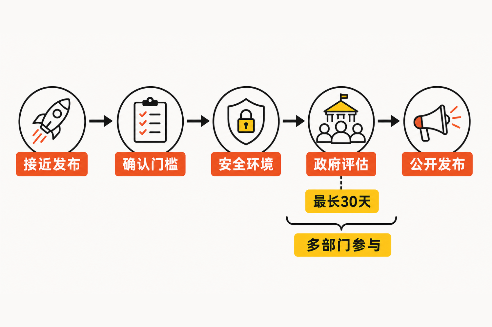

美国对前沿人工智能模型的治理，正在向发布前延伸。

据 Axios 援引多名听取白宫会议简报的人士报道，特朗普政府已经敲定一套前沿AI模型测试框架。其核心安排是：具备顶尖能力、可能带来国家安全风险的闭源模型，可以在公开发布前交由政府评估，审查期最长30天；开放权重模型则不在此次测试范围之内。[Axios：Inside Trump's AI framework](https://www.axios.com/2026/08/04/trump-ai-framework-open-models)

这不是面向所有模型的全面审批制度，也不是一张公开、固定的能力门槛表。它更像一条由企业自愿进入、政府多部门参与、围绕少数高风险模型设置的发布前检查通道。

真正值得关注的，不只是“政府要测模型”，而是框架画出的那条边界：为什么闭源模型进入审查，开放权重模型反而被排除？

## 一、谁需要接受测试？

按照 Axios 披露的最终框架，“受覆盖前沿模型”被限定为同时具备顶尖能力和国家安全风险的闭源模型。开放模型不纳入测试，框架还特别声明，其内容不应被解释为限制已经发布的开放模型。[Axios](https://www.axios.com/2026/08/04/trump-ai-framework-open-models)

这里有三个关键词。

第一是“前沿”。被关注的不是普通应用模型，而是能力处在领先位置的模型。

第二是“国家安全风险”。能力强并不自动等于被覆盖，还需要触及政府所关心的安全门槛。

第三是“闭源”。模型是否开放权重，成为划分适用范围的明确条件。

**事实层面**，现有资料没有公开具体能力阈值，也没有列出哪些公司或模型已经达到门槛。白宫此前发布的行政令要求美国国家安全局、网络安全和基础设施安全局、国家标准与技术研究院等部门建立保密的先进网络能力基准，用来判断模型是否属于“受覆盖前沿模型”。[白宫行政令](https://www.whitehouse.gov/presidential-actions/2026/06/promoting-advanced-artificial-intelligence-innovation-and-security/)

这意味着企业和公众可能知道审查机制的存在，却未必能够看到完整的判断标尺。

## 二、最长30天，政府怎么审？

根据白宫6月2日发布的行政令，开发商可以自愿与政府确认开发中的模型是否达到覆盖门槛。符合条件的模型，可在向其他可信合作伙伴发布前，向政府开放最长30天，以便政府开展访问和评估。[白宫行政令](https://www.whitehouse.gov/presidential-actions/2026/06/promoting-advanced-artificial-intelligence-innovation-and-security/)

Axios进一步披露，企业被鼓励提交接近公开发布阶段的模型，而不是仍在频繁变化的早期开发版本；模型需要存放在高安全环境中，并详细记录访问人员。审查也不是由单一机构包办，而是由多个行政部门的官员共同参与。[Axios](https://www.axios.com/2026/08/04/trump-ai-framework-open-models)

行政令还要求访问安排覆盖保密、网络安全、内部人员风险、知识产权保护和不披露等事项。这些条款回应了一个现实问题：政府若要测试最先进的闭源模型，本身就会接触企业最敏感的技术资产。

需要明确的是，这套机制被表述为“自愿合作框架”。行政令同时规定，不得据此建立强制许可、预先批准或发行许可制度。[白宫行政令](https://www.whitehouse.gov/presidential-actions/2026/06/promoting-advanced-artificial-intelligence-innovation-and-security/)

因此，把它直接称为“AI上市审批”并不准确。更严谨的说法是：政府正在建立一种发布前访问和评估机制，但现有材料尚未说明企业拒绝参与会有什么后果，也没有说明测试结果将如何影响发布日期。

## 三、为什么开放权重模型被排除？

**可以确认的事实**是，开放模型被排除在最终框架的测试范围之外；英伟达、Meta、微软和OpenAI等公司此前也公开支持保持开放权重模型可用。Anthropic没有参与相关公开信，并主张开放与闭源模型都应接受更严格的安全测试。[Fortune](https://fortune.com/2026/07/28/top-ai-companies-say-they-want-chinese-models-to-stay-available-is-it-genuine/)

至于排除开放权重模型的具体决策理由，现有资料没有给出完整的官方解释。以下只能作为基于材料的**推断**。

一方面，开放权重模型一旦发布，权重可以被下载、复制和再次部署，政府即使完成一次发布前测试，也很难持续控制后续修改与传播。另一方面，开放模型正在承载明显的产业竞争价值。Fortune报道指出，中国开放权重模型能力快速提升，是白宫和产业界讨论的重要背景；企业则担忧政府介入会增加模型发布的不确定性、时间和成本。[Fortune](https://fortune.com/2026/07/28/top-ai-companies-say-they-want-chinese-models-to-stay-available-is-it-genuine/)

由此推断，将开放权重模型排除，可能是在安全治理、美国AI生态扩散能力和企业发布效率之间所作的政策取舍，而不能简单理解为政府已经认定开放模型“风险更低”。Anthropic提出不同主张，本身就说明行业对风险边界并无共识。

## 四、这套框架解决了什么，又留下什么？

它首先为政府提前接触少数高能力模型提供了一条制度化通道。测试集中在接近发布的版本，能够减少政府评估对象与最终产品差异过大的问题；多部门参与，则有利于从不同国家安全维度观察模型能力。

但框架也留下了三项关键不确定性。

第一，门槛不透明。判断模型是否“顶尖”、是否构成国家安全风险的基准是保密的，外部难以预测哪些模型会被覆盖。

第二，自愿机制的约束力尚不清楚。行政令排除了强制许可制度，但现有资料没有交代参与测试能获得什么确定回报，或不参与会承担什么现实成本。

第三，开放权重形成治理空档。闭源模型进入发布前检查通道，并不意味着开放模型的安全问题消失，只是它们没有被纳入这一框架。

此前，特朗普政府还曾研究建立一个由行业参与、组织形式类似美国金融业监管局的独立AI监管机构，负责审查顶尖模型并向美国证券交易委员会报告。彭博报道发布时，这项构想仍在白宫幕僚长层面审议。[Bloomberg Law](https://news.bloomberglaw.com/business-and-practice/us-considers-creating-finra-like-watchdog-to-vet-top-ai-models)

**从政策演进角度推断**，这一构想反映出企业对临时性政府干预、流程不稳定和规则不可预测的担忧。不过，现有资料不能证明该独立机构方案已经被采用，也不能确认它与最终测试框架之间存在何种正式关系。

## 五、我们的判断：关键不在“测不测”，而在规则能否稳定

**本文观点**是，发布前测试并非天然意味着过度监管。对于可能影响国家安全的少数前沿模型，让政府在严格保密条件下提前识别风险，具有可理解的政策逻辑。

真正决定框架效果的，是三个更具体的问题：覆盖标准能否让企业形成稳定预期；30天访问是否会实质拖延产品发布；闭源与开放权重的分界能否与实际风险相匹配。

如果门槛长期不可预测，自愿机制可能演变成企业不得不猜测的隐性程序；如果开放权重模型能力继续提升，而治理始终只覆盖闭源模型，这条边界也可能很快面临重新讨论。

## 结语

白宫的新框架并没有建立一套覆盖所有AI模型的发布许可制度，却释放了一个清晰信号：对处在能力前沿、可能触及国家安全的闭源模型，美国政府希望在它们走向市场之前获得观察窗口。

与此同时，开放权重模型被排除，使这套机制从一开始就带着鲜明的产业选择。它降低了开放生态受到直接审查的压力，也把一部分风险留在框架之外。

接下来更值得观察的，不只是哪些模型会进入那最长30天的测试期，而是保密门槛、自愿参与和开放权重例外，最终能否组成一套可预测、可持续的治理规则。

## 参考资料

1. [Axios：Scoop: Inside Trump's AI framework](https://www.axios.com/2026/08/04/trump-ai-framework-open-models)，2026年8月4日。
2. [The White House：Promoting Advanced Artificial Intelligence Innovation and Security](https://www.whitehouse.gov/presidential-actions/2026/06/promoting-advanced-artificial-intelligence-innovation-and-security/)，2026年6月2日。
3. [Bloomberg Law / Bloomberg News：US Considers Creating Finra-Like Watchdog to Vet Top AI Models](https://news.bloomberglaw.com/business-and-practice/us-considers-creating-finra-like-watchdog-to-vet-top-ai-models)，2026年7月17日。
4. [Fortune：Top AI companies say they want Chinese models to stay available. Is it genuine?](https://fortune.com/2026/07/28/top-ai-companies-say-they-want-chinese-models-to-stay-available-is-it-genuine/)，2026年7月28日。
