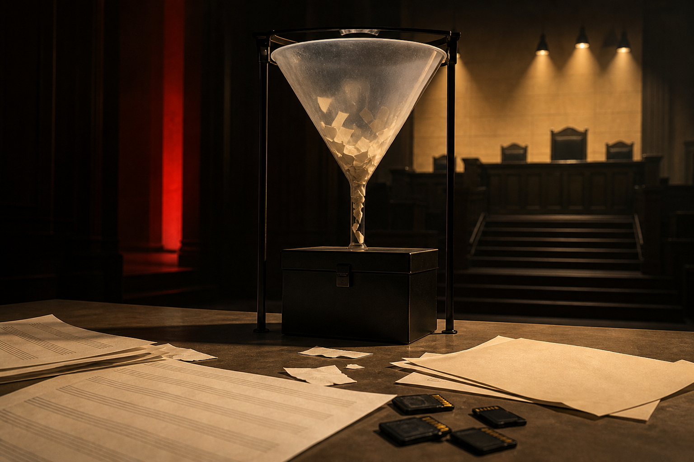
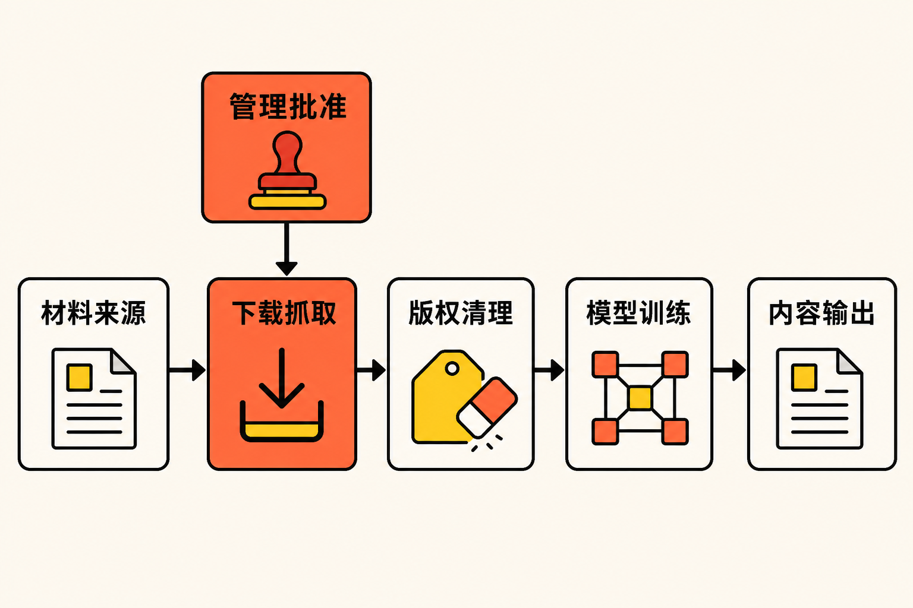

生成式AI的版权争议，正在从“模型学过什么”，进一步转向“训练材料究竟从哪里来、由谁决定取得”。

2026年8月28日，索尼音乐出版、华纳查普尔音乐及相关版权实体在美国加利福尼亚北区联邦地区法院起诉Anthropic。值得注意的是，被告席上不仅有公司，还包括联合创始人Dario Amodei与Benjamin Mann。[法院案卷显示，该案编号为5:2026-cv-09217，案由是依据美国版权法提出的侵权诉讼，原告要求陪审团审理](https://dockets.justia.com/docket/california/candce/5:2026cv09217/477477)。

这并不是一份已经获得法院确认的侵权结论。当前能够确定的事实是诉讼已经提交；有关盗版下载、抓取歌词和删除版权信息等内容，仍是原告在诉状中的指控，Anthropic已经明确否认并表示将积极抗辩。

## 一场规模更大的音乐版权诉讼

根据音乐产业媒体Music Business Worldwide的报道，这份诉状长48页，原告声称Anthropic取得并复制了数万首受版权保护的音乐作品，用于开发Claude。若法院最终接受原告关于作品数量、故意侵权和法定赔偿的主张，理论金额可能达到数十亿美元，但这绝不等于法院已经判定Anthropic需要支付这一数额。[报道同时指出，Universal、Concord、BMG和Round Hill此前也曾围绕音乐作品对Anthropic提起诉讼](https://www.musicbusinessworldwide.com/now-sony-music-publishing-and-warner-chappell-sue-anthropic-in-multi-billion-dollar-lawsuit-one-of-the-largest-and-most-blatant-ongoing-thefts-of-intellectual-property-in-history/)。

本案的覆盖范围尤其引人注目。Axios称，原告主张涉及数万首作品，而此前BMG相关案件涉及493首。诉状列举的作品包括《Ain't No Mountain High Enough》《Livin' On a Prayer》《Hallelujah》和《Paper Rings》等。

这里还需要区分音乐产业中的不同权利层次。一首歌可能同时涉及词曲作品与录音等版权，不同权利又可能由不同主体控制。[Axios对本案的梳理也特别指出，音乐作品存在词曲、录音等多层权利结构](https://www.axios.com/2026/08/29/anthropic-sony-warner-music-copyright)。本次出面起诉的核心主体是音乐出版商，争议重点因此落在歌词、曲谱及词曲作品等材料上，而不能简单理解为唱片公司只在追究“歌曲音频被拿去训练”。

## 争议核心不是“读过”，而是“怎样拿到”

围绕生成式AI的讨论经常集中在一个问题：模型使用受版权保护材料进行训练，是否可能构成合理使用？但从现有报道看，索尼与华纳在本案中选择了更具体的进攻路径——追查训练数据的取得方式。

原告指控Anthropic通过非法种子下载、网络抓取和其他下载方式收集受版权保护的材料，其中包括含有歌词和乐谱的盗版书籍。ITmedia依据诉状披露，原告称Benjamin Mann在2021年通过BitTorrent从LibGen取得超过500万本书，Anthropic员工又在2022年从PiLiMi取得超过200万本书；诉状还声称Amodei与Mann曾指示或批准相关下载行为。[这些数字和决策过程目前均属于原告指控，而非已经查明的法院事实](https://www.itmedia.co.jp/news/article/2608/31/2000000950/)。

原告还提出另一条数据来源：Anthropic被指从歌词服务抓取内容。更进一步，诉状称相关资料在清理过程中被移除了版权管理信息。原告据此不仅主张复制作品构成侵权，也对移除或篡改版权管理信息提出索赔。

按照诉请，故意侵犯每部作品的法定赔偿最高可达15万美元，移除或篡改版权管理信息每项最高可达2.5万美元。原告还要求销毁被指侵权的副本，并披露Claude训练数据的来源。[Xataka的案件梳理显示，诉状列出四项诉因，其中包括与种子传播有关的直接侵权、帮助侵权以及删除版权管理信息等主张](https://www.xataka.com/robotica-e-ia/sony-warner-demandan-a-anthropic-pago-1-500-millones-libros-pirateados-ahora-le-piden-150-000-dolares-cancion/amp)。

上述金额都是法律规定下的单项上限或原告主张的计算基础。最终是否成立、涉及多少作品、适用何种赔偿标准，仍取决于证据、法律抗辩以及法院裁判。

## 为什么把两名创始人一起告上法庭

本案最值得关注的变化，是诉讼对象从公司延伸到个人。

**事实层面**，法院案卷确认Dario Amodei和Benjamin Mann均被列为被告；原告则声称，两人参与了训练资料取得方式的决定或批准过程。[TechCrunch报道，诉讼指向Claude训练数据的获取，并确认Anthropic不同意出版商的主张、将全力应诉](https://techcrunch.com/2026/08/29/sony-music-warner-sue-anthropic-alleging-a-brazen-campaign-of-intellectual-property-theft/)。

**推断层面**，将创始人列为个人被告，可能服务于两个诉讼目标：一是把数据获取描述为管理层知情的公司决策，而非普通员工的孤立操作；二是迫使案件更深入地审查数据采购、下载批准和训练流程中的内部责任链。不过，创始人是否满足个人责任的法律条件，仍需法院依据其实际参与程度判断，不能因为被起诉就预设责任成立。

这一变化对AI公司的现实意义在于：训练数据合规可能不再只是法务团队负责审核合同的末端工作。如果数据来源、下载工具与管理层决策能够被连成一条证据链，数据工程记录、内部审批和责任分工都可能进入诉讼核心。

## 这场官司可能改变什么

首先，AI版权竞争可能从抽象的“训练是否合理使用”，转向更可核验的数据溯源。即使模型开发者主张训练用途具有转换性，原告仍可能追问：副本从何处取得？取得时是否合法？是否参与了种子传播？清理数据时是否删除了权利信息？

其次，音乐版权的复杂结构会放大合规难度。同一份训练材料可能同时触及歌词、词曲、乐谱或录音等不同权利。仅仅知道材料来自“音乐数据集”，并不能回答授权是否完整。

再次，披露训练数据来源可能成为比赔偿金额更具行业影响力的诉求。如果法院要求更深入的数据披露，外界将可能看到模型公司如何建立语料库、保存来源记录和处理版权元数据。当然，目前原告只是提出这一请求，法院是否支持尚无定论。

**本文观点是**：本案真正值得行业警惕的，不是“最高15万美元乘以数万首作品”这一醒目算式，而是训练数据治理开始被拆成一连串能够逐项审查的行为——下载、抓取、保存、清理、训练与输出。模型能力越强，数据来源不透明所积累的法律风险也可能越难被一句“用于训练”概括过去。

## 结语

索尼与华纳的诉讼把Claude训练数据争议推进到三个相互连接的战场：音乐作品的多层版权、训练语料的取得方式，以及创始人的个人责任。

目前，所有关键侵权内容仍是原告指控，Anthropic已经否认；案件最终结果要等待举证、抗辩和法院裁判。但无论结局如何，一个趋势已经变得清晰：生成式AI的版权审查正在从模型输出端一路向上追溯，直到数据来源和决策者本人。

对AI公司而言，“模型学了什么”仍然重要；但下一阶段更难回答的问题或许是：材料从哪里来，谁批准使用，又留下了怎样的记录。

## 参考资料

1. [Justia：Sony Music Publishing (US) LLC et al v. Anthropic PBC et al](https://dockets.justia.com/docket/california/candce/5:2026cv09217/477477)
2. [Music Business Worldwide：Sony Music Publishing and Warner Chappell sue Anthropic](https://www.musicbusinessworldwide.com/now-sony-music-publishing-and-warner-chappell-sue-anthropic-in-multi-billion-dollar-lawsuit-one-of-the-largest-and-most-blatant-ongoing-thefts-of-intellectual-property-in-history/)
3. [TechCrunch：Sony Music, Warner sue Anthropic](https://techcrunch.com/2026/08/29/sony-music-warner-sue-anthropic-alleging-a-brazen-campaign-of-intellectual-property-theft/)
4. [Axios：Sony, Warner sue Anthropic](https://www.axios.com/2026/08/29/anthropic-sony-warner-music-copyright)
5. [ITmedia NEWS：索尼音乐出版与华纳查普尔起诉Anthropic](https://www.itmedia.co.jp/news/article/2608/31/2000000950/)
6. [Xataka：Sony y Warner demandan a Anthropic](https://www.xataka.com/robotica-e-ia/sony-warner-demandan-anthropic-pago-1-500-millones-libros-pirateados-ahora-le-piden-150-000-dolares-cancion/amp)
