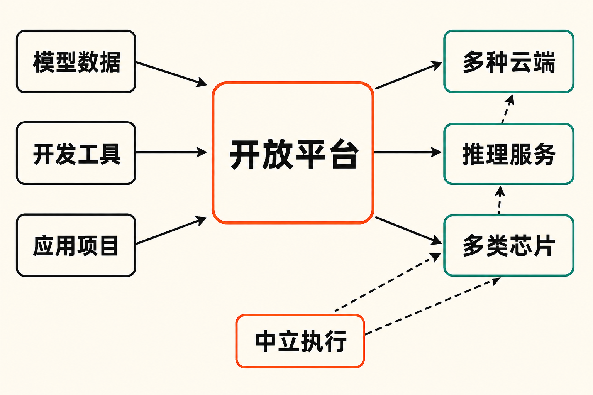

英伟达正在把AI竞争的边界，从芯片推向模型生态的入口。

当地时间9月2日，英伟达签署收购Hugging Face的最终协议，公布交易总值为129.303亿美元。需要首先说明的是，这笔交易**尚未完成**：按照英伟达提交的监管文件，交易预计在2027年上半年交割，仍需取得必要的监管批准并满足惯常条件。[英伟达公告](https://blogs.nvidia.com/blog/nvidia-to-acquire-hugging-face/)与[SEC文件](https://www.sec.gov/Archives/edgar/data/1045810/000104581026000078/nvda-20260902.htm)均披露了相关安排。

表面上看，这是芯片巨头收购一家开放AI平台；更深一层看，英伟达买下的是连接模型开发者、数据集、应用和算力服务商的关键入口。

但这也制造了交易中最重要的矛盾：Hugging Face的价值建立在开放选择之上，而它未来的所有者，恰好是全球AI算力市场中的重要供应商。

## 129.3亿美元究竟买了什么？

根据SEC文件，交易对价并非全部用于收购股份：约119亿美元将支付给Hugging Face股东，另有最高约10亿美元的股权留任计划。后者意味着，留住团队和持续运营平台也是交易设计的重要部分。[美联社的报道](https://apnews.com/article/nvidia-hugging-face-ai-d96d50e037a2ade479dcdf81cdf2afcf)同样确认，约129.3亿美元的总值中包括员工留任安排。

Hugging Face最直观的资产，是庞大的开发者网络和内容库。英伟达公布的数据称，平台拥有超过1800万名开发者、300万个模型、50万个数据集和100万个应用；Axios则称其覆盖20多万家企业。[Axios](https://www.axios.com/2026/09/03/nvidia-hugging-face-ai)将其视为开放模型生态的重要入口。

这些数字的意义，并不只是“内容很多”。开发者在这里寻找、上传、测试和分享模型、数据集及应用，平台因而处在技术供给与实际使用之间。模型在哪里被关注，哪些架构开始流行，开发者希望把它部署在哪种云和哪类硬件上，都可能在这一入口留下信号。

**事实层面**，路透社将Hugging Face描述为开发者协作、测试和分享AI工具的重要平台。[路透社报道](https://www.investing.com/news/stock-market-news/nvidia-to-buy-hugging-face-for-nearly-13-billion-in-big-bet-on-open-ai-models-4887750)也指出，开放权重模型的需求增长，部分来自企业降低专有AI服务部署成本的需要。

**据此可以作出的推断是**：英伟达获得的并不只是一个模型“仓库”，而是观察开放AI需求、连接开发工具与计算资源的前沿位置。入口的价值，在于它比单一芯片销售更接近开发者作出技术选择的时刻。

## 从卖算力，到进入模型分发链路

英伟达与Hugging Face此前并非陌生关系。TechCrunch披露，Hugging Face累计融资超过3.95亿美元；2023年的2.35亿美元融资对其估值为45亿美元，英伟达与谷歌、亚马逊、IBM等共同参投。[TechCrunch](https://techcrunch.com/2026/09/03/nvidia-confirms-it-will-buy-hugging-face-for-12-9-billion/)还提到，Hugging Face CEO Clément Delangue认为，扩大开放AI需要更多算力、支持、合作与曝光。

双方也已有实际生态合作。美联社称，英伟达已经在Hugging Face发布超过500个模型和250个开放数据集。这说明此次交易并非从零开始，而是把投资与平台合作进一步升级为所有权关系。

**事实是**，收购将让英伟达更深入地进入模型、数据集、工具和应用的协作与分发环节。

**推断是**，这可能构成一种纵向延伸：底层是计算平台，中间是开发和部署工具，上层则是开发者发现模型、选择方案的入口。英伟达因此有机会接触更广泛的开发者与企业客户，也可能更早识别模型和工具的使用趋势。路透社与Axios都提到这种趋势洞察和客户拓展价值。

这种布局也可以被理解为风险分散。路透社指出，英伟达的一些大型客户正在研发自有AI芯片；美联社援引的分析则把交易称为面对AI发展路径不确定性的一项战略对冲。

这里仍要区分事实与判断：客户自研芯片和分析人士的“对冲”说法有来源支持；但认为英伟达将由此稳固整个开放AI生态，仍然只是市场推断。平台影响力能否转化成商业协同，取决于开发者是否继续信任它，以及开放模型需求能否持续增长。

## 为什么英伟达反复承诺“硬件中立”？

英伟达宣布交易时，专门强调Hugging Face将继续支持不同的模型、框架、云服务、推理服务商和计算平台；用户通过平台开发或部署时，不会被强制使用英伟达算力。SEC文件进一步明确，用户可以继续自由上传和下载所选择的模型与数据集，平台也将继续支持其他芯片供应商。

换句话说，英伟达公开承诺保留三种选择权：

- 内容选择权：自由上传、下载模型和数据集；
- 工具与服务选择权：继续选择不同框架、云和推理服务商；
- 硬件选择权：继续使用英伟达之外的加速器和芯片供应商。

这些承诺不是附带表态，而是维持交易价值的核心条件。Hugging Face之所以成为开放模型枢纽，正是因为来自不同公司、技术路线和硬件体系的参与者能够在同一平台协作。如果所有权变化导致开发者担忧排序偏向、兼容性差异或商业导流，平台的网络效应就可能受损。

因此，**本文的观点是**：保持中立并非英伟达单方面让利，而是保护所购资产价值的必要机制。越是希望从生态入口中获得长期收益，就越需要让竞争者和开发者相信，这扇门不会只通向一种硬件。

## 真正需要观察的，不是承诺有没有，而是如何验证

公开声明解决了“说什么”的问题，却没有完全解决“如何执行”的问题。Axios提出的关键观察点是：英伟达未来是否会通过平台引导开发者采用自家产品。澎湃新闻也指出，交易可能面临竞争监管机构审查。[澎湃新闻](https://www.thepaper.cn/newsDetail_forward_34002370)梳理了交易、既往投资关系与开放承诺。

接下来至少有四个可观察维度。

第一，搜索、推荐和榜单是否公平。平台如果同时承担内容分发与商业转化功能，模型及工具的曝光规则就非常重要。

第二，多云与多加速器支持是否保持同等质量。真正的硬件中立，不只是“允许接入”，还包括文档、适配、性能优化和故障支持是否存在明显差异。

第三，开发者和企业数据如何使用。趋势洞察是平台的战略价值之一，但所有权变化后，生态参与者会更关注数据边界与商业竞争之间的关系。

第四，监管条件和最终交割结果。现在准确的表述是“英伟达已同意收购”，而不是“英伟达已经完成收购”。在2027年上半年预计交割之前，监管审查仍是现实变量。

上述四点中，交易时间和监管条件属于已披露事实；推荐公平、支持质量与数据边界，则是基于平台属性提出的观察框架，并非材料已经证实的问题。

## 对开发者和产业意味着什么？

短期内，公开材料传递出的信号是“延续”：平台继续开放，继续支持多云、多加速器以及不同模型和框架。第一财经也报道称，开发者无需使用英伟达计算资源，就能在Hugging Face上开发或部署。[第一财经](https://www.yicai.com/news/103347099.html)认为，大额收购反映了英伟达对AI软件和开放AI领域的重视。

中期影响则取决于资源投入与中立机制能否同时成立。更多基础设施和支持可能降低开放模型的开发、分享和部署门槛；但如果平台被市场视为英伟达硬件的导流渠道，其他芯片厂商、云服务商和开发者也可能重新评估参与方式。

对产业而言，这笔交易进一步说明，AI竞争不只发生在单颗芯片或单个模型之间。模型如何被发现、评估、复用和部署，同样决定技术能否形成规模。谁接近开发者工作流，谁就更接近下一轮需求的形成。

这是一种分析判断，而非交易公告给出的确定结论。英伟达能否把入口优势变成业务增长，同时不破坏入口本身的公信力，仍需用交割后的产品政策和实际运营来回答。

## 结语

129.3亿美元买到的，既是一座规模庞大的开放模型平台，也是一份更难管理的生态责任。

英伟达希望从AI算力底座继续向模型和工具的分发层延伸；Hugging Face则需要在新所有权之下证明，开放、多云和硬件中立不只是交易宣布时的措辞。

所以，这笔收购最值得关注的不是“芯片巨头又买了一家公司”，而是一个更长期的问题：当开放生态的关键入口归属于产业巨头，开放性还能否成为可持续、可验证的制度安排？答案不会写在收购价格里，而会体现在每一次推荐、适配和开发者选择中。

## 参考资料

1. [NVIDIA Blog：NVIDIA to Acquire Hugging Face](https://blogs.nvidia.com/blog/nvidia-to-acquire-hugging-face/)
2. [美国SEC：NVIDIA Corporation Form 8-K](https://www.sec.gov/Archives/edgar/data/1045810/000104581026000078/nvda-20260902.htm)
3. [Associated Press：Nvidia to spend $13 billion on Hugging Face](https://apnews.com/article/nvidia-hugging-face-ai-d96d50e037a2ade479dcdf81cdf2afcf)
4. [Reuters：Nvidia to buy Hugging Face for nearly $13 billion](https://www.investing.com/news/stock-market-news/nvidia-to-buy-hugging-face-for-nearly-13-billion-in-big-bet-on-open-ai-models-4887750)
5. [Axios：Nvidia aims to broaden its AI dominance with Hugging Face deal](https://www.axios.com/2026/09/03/nvidia-hugging-face-ai)
6. [TechCrunch：Nvidia confirms it will buy Hugging Face for $12.9 billion](https://techcrunch.com/2026/09/03/nvidia-confirms-it-will-buy-hugging-face-for-12-9-billion/)
7. [第一财经：英伟达豪掷129亿美元收购AI开源社区Hugging Face](https://www.yicai.com/news/103347099.html)
8. [澎湃新闻：英伟达129亿美元拿下Hugging Face](https://www.thepaper.cn/newsDetail_forward_34002370)
