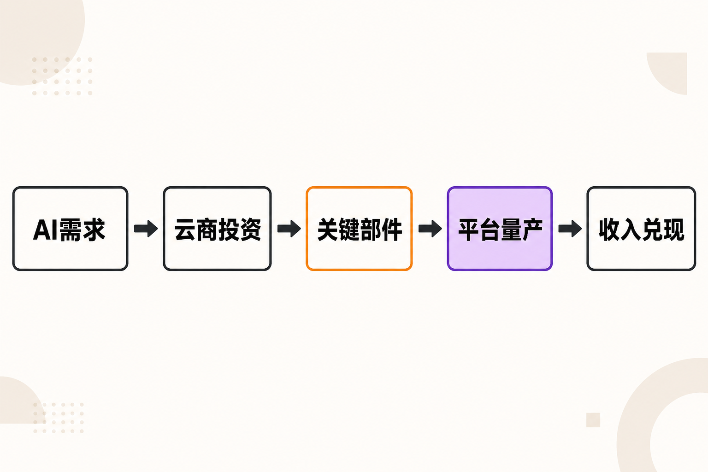

当地时间8月26日，英伟达交出了一份再次超越市场预期的财报。

截至2026年7月26日的2027财年第二季度，公司营收达到962.21亿美元，同比增长106%；GAAP净利润596.88亿美元，同比增长126%。这意味着，已经拥有巨大收入基数的英伟达，仍在以翻倍速度扩张。[英伟达官方财报](https://investor.nvidia.com/news/press-release-details/2026/NVIDIA-Announces-Financial-Results-for-Second-Quarter-Fiscal-2027/default.aspx)

但如果只把这份财报概括为“AI芯片继续热卖”，就会错过更重要的变化：市场对英伟达的疑问，正在从“AI需求是否真实”转向“如此庞大的需求能否被持续交付，以及这轮增长由谁买单”。

## 一、962亿美元背后，增长仍然高度集中

先看已经确认的事实。

英伟达本季营收环比增长18%，GAAP摊薄每股收益为2.46美元。数据中心业务收入达到890亿美元，同比增长117%、环比增长18%，约占公司总营收的92.5%。GAAP与非GAAP毛利率均为75.0%。[英伟达官方财报](https://investor.nvidia.com/news/press-release-details/2026/NVIDIA-Announces-Financial-Results-for-Second-Quarter-Fiscal-2027/default.aspx)

这不仅是“增长很快”，而且是增长继续向数据中心集中。

按照第一财经披露的业务构成，890亿美元数据中心收入中，超大规模云服务商贡献487亿美元，AI云、工业和企业客户合计贡献403亿美元；边缘计算收入为72亿美元，同比增长27%、环比增长13%。[第一财经](https://www.yicai.com/news/103335698.html)

与市场预期相比，这份成绩单也足够强劲。美联社援引的分析师平均预期为营收922.7亿美元，而实际结果高出约39.5亿美元；调整后每股收益为2.22美元，也高于FactSet统计的2.09美元共识。公司给出的下一季度营收指引约为1080亿美元，上下浮动2%，同样超过分析师预测的1048.6亿美元。[美联社](https://apnews.com/article/nvidia-artificial-intelligence-earnings-dc8d556e709b50915cca9217a60b1991)

**事实层面的结论是：**AI基础设施采购尚未显现出明显降温，英伟达也仍是其中最直接的受益者。

**进一步的推断是：**当数据中心收入占比超过九成时，英伟达与全球AI资本开支周期的绑定也变得更深。需求扩张会迅速推高收入；反过来，一旦主要云厂商调整投资节奏，波动也更容易传导至公司整体业绩。

## 二、新变量不是下一季，而是Vera Rubin

如果说962亿美元证明了当前需求，那么Vera Rubin开始量产，则关系到英伟达能否承接下一阶段需求。

据第一财经报道，Vera Rubin已经开始量产，英伟达预计该平台将占下一季度数据中心收入的约20%。这意味着，新产品并非停留在发布会或技术路线图上，而是已经进入收入兑现阶段。[第一财经](https://www.yicai.com/news/103335698.html)

这个比例值得重视。若公司下一季度约1080亿美元的收入目标兑现，且数据中心业务仍占主要部分，那么Rubin需要在一个季度内完成相当可观的出货和客户导入。

这里需要明确区分事实与判断：

- **事实：**Rubin已经量产，公司预计其约占下一季度数据中心收入的20%。
- **推断：**新平台快速形成收入，有助于延续产品迭代带来的升级采购，并降低单代产品周期切换时的增长断档风险。
- **尚不能确认的部分：**现有资料没有给出Rubin的具体出货量、平均售价或客户分布，因此不能据此推算其精确收入，更不能断言所有客户都会按计划完成部署。

对普通读者而言，理解这轮产品更替的关键，不是记住又一个芯片代号，而是看到英伟达的商业模式正在从“卖出一颗更快的芯片”，转向以更完整的平台更新推动数据中心持续升级。

## 三、真正的瓶颈，正在从订单转向供应链

这份财报最有意味的地方，是管理层一面给出激进增长展望，一面反复强调供应限制。

公司预计2027财年第三季度营收约1080亿美元。美联社还指出，这一指引未计入来自中国的数据中心计算业务收入。[英伟达官方财报](https://investor.nvidia.com/news/press-release-details/2026/NVIDIA-Announces-Financial-Results-for-Second-Quarter-Fiscal-2027/default.aspx)、[美联社](https://apnews.com/article/nvidia-artificial-intelligence-earnings-dc8d556e709b50915cca9217a60b1991)

更长周期上，公司预计2028财年营收增长约70%，并表示若不是供应受限，增长可能更高。[Axios](https://www.axios.com/2026/08/26/nvidia-earnings-jensen-huang-ai)

与此同时，与关键组件采购相关的承诺金额，已经由上一季度的1190亿美元升至2790亿美元，主要涉及存储器。[第一财经](https://www.yicai.com/news/103335698.html)

这三组信息放在一起，勾勒出一个清晰矛盾：订单需求依旧强劲，但把订单转换成收入，需要晶圆、先进封装、存储器以及整机系统等多环节协同。任何关键部件短缺，都可能限制最终交付。

**这是基于来源信息作出的推断：**采购承诺大幅增加，既是英伟达为未来产能提前锁定资源，也意味着公司承担了更大的供应链协调与需求预测责任。它本身不等于已经发生的成本，也不能直接等同于库存风险，但会提高判断未来真实需求的难度。

西班牙《国家报》还指出，数据中心存储芯片需求增长正在推高英伟达成本。[EL PAÍS](https://elpais.com/economia/2026-08-26/nvidia-logra-doblar-ingresos-y-beneficios-en-plena-resaca-bursatil-de-la-ia.html) 本季75%的毛利率依然强劲，但供应紧张与部件成本上升是否会继续影响盈利能力，值得在后续季度持续观察。

## 四、70%的长期增长展望，也带来一个新问题

与以往更聚焦下一季度不同，英伟达此次提前给出了更长期的增长展望。如此罕见的可见度，说明公司对客户订单和基础设施建设计划具有较强信心。

但资本市场关心的不只有“卖了多少芯片”，还包括客户的资金从哪里来，以及AI基础设施最终能否产生足够回报。

Axios报道提到，英伟达通过投资和信用支持参与部分AI基础设施建设，外界因此讨论“循环融资”问题；公司CFO承认有人会这样描述相关客户支持安排，但表示英伟达并不认同这一判断。[Axios](https://www.axios.com/2026/08/26/nvidia-earnings-jensen-huang-ai)

这里同样不宜越过证据边界。现有材料不足以证明英伟达的增长主要依靠此类安排，更不能据此断言收入质量存在问题。不过，它提出了一个合理的观察维度：当芯片供应商、云服务商和AI基础设施项目之间同时存在采购、投资与融资关系时，仅看订单总额，可能不足以判断最终需求的独立性和可持续性。

**本文观点：**未来几个季度，判断英伟达增长质量至少要同时看三件事——新平台收入兑现速度、供应限制是否缓解，以及主要客户能否把巨额AI投入转化为稳定现金流。相比单一季度的“超预期”，这三条线更能决定增长周期能走多远。

## 五、股东回报显示的另一种信号

在加大供应链投入的同时，英伟达也继续向股东返还现金。本季度，公司通过股份回购和现金股息返还约260亿美元，季度末剩余回购授权约990亿美元。[英伟达官方财报](https://investor.nvidia.com/news/press-release-details/2026/NVIDIA-Announces-Financial-Results-for-Second-Quarter-Fiscal-2027/default.aspx)

这一事实说明，公司当前仍具备同时推进业务扩张与大规模股东回报的能力。财报电话会后，英伟达盘后股价上涨约4.1%，反映市场对业绩和指引的即时反应总体积极。[美联社](https://apnews.com/article/nvidia-artificial-intelligence-earnings-dc8d556e709b50915cca9217a60b1991)

但短期股价表现并不等于长期判断。资本市场下一步需要验证的，不再只是英伟达能否超过分析师预测几个百分点，而是其接近千亿美元的季度收入规模，能否继续保持高增长和75%左右的毛利率。

## 结语：从需求证明，进入交付证明

英伟达这份财报给出的答案相当明确：截至目前，AI基础设施需求仍然强劲，数据中心收入继续翻倍，新一代Rubin平台也已进入量产和收入兑现阶段。

与此同时，问题也变得更具体。供应限制、2790亿美元关键组件采购承诺、客户AI投资回报，以及更复杂的产业融资关系，都在成为下一阶段的观察重点。

所以，这不是一个简单的“AI泡沫被证伪”或“高增长永不结束”的故事。更准确的说法是：英伟达已经完成了对AI需求的又一次证明，接下来要证明的，是供应链、客户资金和商业回报能否共同支撑更大的增长规模。

## 参考资料

1. [NVIDIA：2027财年第二季度业绩公告](https://investor.nvidia.com/news/press-release-details/2026/NVIDIA-Announces-Financial-Results-for-Second-Quarter-Fiscal-2027/default.aspx)
2. [Associated Press：AI芯片需求推动英伟达业绩超预期](https://apnews.com/article/nvidia-artificial-intelligence-earnings-dc8d556e709b50915cca9217a60b1991)
3. [Axios：英伟达预计2028财年营收增长约70%](https://www.axios.com/2026/08/26/nvidia-earnings-jensen-huang-ai)
4. [第一财经：业绩超预期，英伟达首次提前一年给出营收指引](https://www.yicai.com/news/103335698.html)
5. [36氪：营收翻倍、数据中心收入增长117%](https://www.36kr.com/p/3956971565677702)
6. [EL PAÍS：英伟达收入与利润翻倍](https://elpais.com/economia/2026-08-26/nvidia-logra-doblar-ingresos-y-beneficios-en-plena-resaca-bursatil-de-la-ia.html)
