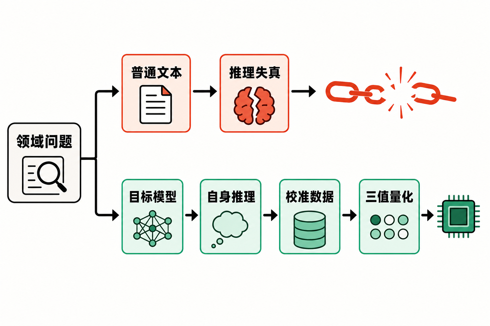

大模型量化一直面对一个棘手矛盾：权重位宽越低，存储和计算的潜在收益越大；但当模型需要完成数学证明、代码生成等长链条推理时，激进压缩又很容易破坏它的能力。

英特尔中国研究院团队近日提出ScaleQ-1.58，试图跨过这道门槛。论文给出的核心结果是：使用默认400万校准Token，便可将Qwen3、Qwen3 MoE及DeepSeek-R1蒸馏模型等转换为W1.58A16格式，实验模型规模从17亿参数一直覆盖到2350亿参数。[论文摘要与实验概览](https://arxiv.org/abs/2608.01078)

这里的“1.58比特”特指权重采用三值表示；“A16”则意味着激活仍保持16比特。因此，它并不是把模型中的所有数据都压缩到1.58比特，更准确的说法是“权重三值化”。

## 难点不只是量化，而是校准数据选错了

后训练量化的吸引力在于：它从一个已经训练好的高精度模型出发，通过校准和优化降低权重精度，不必重新执行完整的预训练流程。

但研究团队发现，传统校准语料对推理模型并不够用。论文实验显示，以C4或WikiText2等普通网页文本校准1.58比特Qwen3-4B后，模型在多数复杂推理任务上的准确率为零或接近零。[完整实验结果](https://arxiv.org/html/2608.01078v1)

这说明一个重要事实：语言分布相似，不等于模型内部的计算过程相似。网页文本可以覆盖一般语言表达，却未必能触发数学推导、代码规划和逐步纠错时使用的参数与激活模式。

为了验证这一点，研究者比较了几种校准数据。只使用领域问题与答案时，五项数学和编程任务的平均准确率为17.43%；加入DeepSeek-R1-671B生成的推理轨迹后，平均准确率升至20.06%；当推理轨迹和答案改由待量化的目标模型自己生成时，平均准确率达到45.60%。[AYOT对比实验](https://arxiv.org/html/2608.01078v1)

上述数字是论文报告的实验事实。由此可以作出一个合理推断：极低比特量化的关键瓶颈之一，可能不是校准文本“数量不够”，而是它没有唤起目标模型自身最具代表性的推理路径。

## AYOT：让模型“回看自己的思考”

ScaleQ-1.58由两部分组成：AYOT负责构造校准上下文，CAT-Q负责执行可微三值量化。

AYOT是“Attend to Your Own Thoughts”的缩写。它先向待量化的高精度模型提供领域问题，让模型自行生成推理轨迹和答案，再用这些内容进行校准。数学问题来自MetaMathQA，编程问题来自OpenCodeInstruct；论文称这些校准问题与五个测试集没有样本重叠。[方法与数据设置](https://arxiv.org/html/2608.01078v1)

这套设计与“找一个更强模型代写推理过程”存在本质差异。不同模型即使得出同一答案，也可能依赖不同的内部表示和计算路线。AYOT追求的不是文本层面最漂亮的解题过程，而是尽可能贴近目标模型自己的工作状态。

随后，CAT-Q利用这些上下文优化三值权重。最终格式为W1.58A16：权重映射至三个离散取值，激活保持16比特。可以把整个流程概括为四步：准备领域问题、由目标模型生成推理、构造校准数据、执行三值量化。

从编辑视角看，ScaleQ-1.58最值得关注的并非“模型会自我反思”这类拟人化叙事，而是一个更朴素的工程原则：要压缩哪一个模型，就让哪一个模型提供最贴近自身行为的校准信号。这是本文基于方法设计作出的观点，不是论文额外证明的普遍定律。

## 400万Token，换来了什么？

论文默认使用400万校准Token，并测试了25.6万至1600万Token的不同规模。实验观察到，随着校准Token增加，性能仍会继续提升。这意味着400万并非被证明的理论最优值，而是论文主要实验采用的成本与效果折中点。[规模实验](https://arxiv.org/html/2608.01078v1)

在四项数学与代码任务上，量化后的Qwen3-1.7B达到了BitNet b1.58 2B4T平均表现的90.52%以上；量化后的Qwen3-4B则比BitNet b1.58 2B4T高出8.97个百分点。论文同时称，其量化所需Token数量减少了100万倍。[论文报告结果](https://arxiv.org/abs/2608.01078)

这里必须注意比较边界：这些结果来自特定模型、任务与评测设置，不能直接推导为ScaleQ-1.58在所有场景中都优于从头训练的1.58比特模型。“100万倍”比较的是所需Token数量，也不等同于端到端训练成本、推理速度或能耗同样改善100万倍。

研究覆盖Qwen3稠密模型、Qwen3 MoE模型以及DeepSeek-R1-Distill-Llama-70B，参数规模横跨1.7B至235B。评测则包括Math-500、GSM8K、Omni-MATH、HumanEval+、MBPP+、ProofWriter，以及常识推理和语言建模任务。[评测范围](https://arxiv.org/html/2608.01078v1)

论文还报告，在一台配备8张A100 80GB GPU的服务器上，不同规模模型的处理时间约为4至240小时。这表明“少量Token”不等于“没有计算成本”：处理超大模型依旧需要高端硬件和较长时间。[论文概览](https://arxiv.org/abs/2608.01078)

## 它距离真正落地还有多远？

ScaleQ-1.58展示了后训练三值量化用于推理模型的可能性，但现阶段仍应将其视为研究成果，而不是已经完成全面生产验证的通用方案。

首先，W1.58A16降低的是权重精度，实际推理速度、显存收益和能耗表现还取决于硬件、算子及推理框架是否为三值计算做了专门优化。仅凭模型文件变小，不能自动断言真实业务吞吐量会按相同比例提高。

其次，AYOT需要高精度目标模型先生成自己的推理轨迹。这比重新预训练节省大量Token，却仍涉及数据生成、校准与量化计算。对于235B级模型，240小时的上限数据已经说明其工程门槛并不低。

再次，工具链仍在完善。英特尔中国AI团队维护的BitTern项目已经提供CAT-Q相关模型检查点、推理代码和评测代码，覆盖多种Qwen3及Llama2模型；但项目页面明确注明，训练代码等内容仍在准备发布。仓库采用Apache-2.0许可证。[BitTern项目页](https://github.com/IntelChina-AI/BitTern)

因此，关于其可复现性、跨领域稳定性以及部署收益，仍需等待更完整的代码、第三方复现和面向真实硬件的基准测试。这是依据当前公开材料作出的审慎判断。

## 结语

ScaleQ-1.58带来的启示，是把量化问题从“如何更精细地压缩权重”推进到“应该用什么数据告诉模型哪些能力不能丢”。当普通网页文本令复杂推理几乎失效，而模型自身的推理轨迹把平均准确率拉回45.60%时，校准数据与模型内部行为是否匹配，已经不再是一个次要细节。

400万Token也许不是最终答案，1.58比特更不是免费午餐。但这项研究提供了一条清晰路径：借助目标模型自己的推理过程，以远少于重新训练的校准数据，将既有推理模型带入三值权重世界。如果后续软硬件能够补齐高效执行与完整复现环节，它可能让极低比特模型从“必须从头训练”走向更灵活的“训练后转换”。

## 参考资料

1. [Attend to Your Own Thoughts：论文摘要页](https://arxiv.org/abs/2608.01078)
2. [Attend to Your Own Thoughts：论文HTML全文](https://arxiv.org/html/2608.01078v1)
3. [IntelChina-AI/BitTern项目仓库](https://github.com/IntelChina-AI/BitTern)
