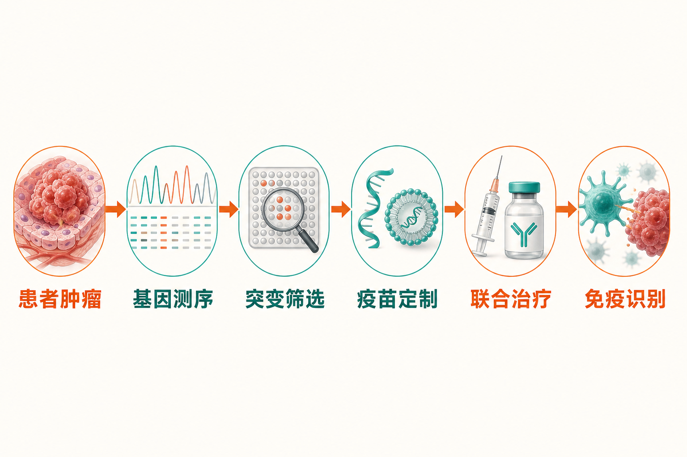

一项海外临床试验，让A股疫苗板块迅速升温。

8月19日，莫德纳与默沙东宣布，个体化mRNA新抗原疗法intismeran（V940/mRNA-4157）联合帕博利珠单抗，在完全切除后的IIB—IV期皮肤黑色素瘤患者中，同时达到III期试验的主要终点无复发生存期（RFS）和关键次要终点无远处转移生存期（DMFS）。与帕博利珠单抗单药相比，两项指标均取得具有统计学显著性和临床意义的改善。[莫德纳公司公告](https://news.modernatx.com/merck-and-moderna-announce-phase-3-interpath-001-trial-of-intismeran-plus-keytruda-met-endpoints-of-rfs-and-dmfs-in-melanoma)

这条新闻真正重要的地方，并非又多了一种“概念疫苗”，而是个体化mRNA肿瘤治疗首次获得关键III期阳性顶线结果。但对于A股投资者，必须把三件事分开：海外技术路线得到验证、国内企业具备相似布局，以及这些布局最终转化为利润。三者之间，还有很长的临床和商业化链条。

## 这不是传统意义上的防癌疫苗

**事实：**intismeran不是面向健康人群、用于预防癌症的通用疫苗，而是一种术后辅助治疗。其基本逻辑是对患者切除的肿瘤组织进行基因测序，寻找该患者特有的突变，再据此制作个体化mRNA疗法，训练免疫系统识别肿瘤细胞；治疗时还要联合默沙东的PD-1药物帕博利珠单抗，即Keytruda。

据公视新闻网梳理，个体化产品的制作约需六周，报道所述方案共接种九次。[公视新闻网](https://news.pts.org.tw/article/823369) 这意味着它与批量生产、统一接种的传统疫苗，在研发、制造和交付模式上均有明显差异。

III期INTerpath-001试验共纳入1137名患者，按2∶1随机接受联合治疗或帕博利珠单抗单药治疗。目前披露的是“顶线结果”，尚未经过同行评议，也没有在医学会议上正式发表。[The Pharmaceutical Journal](https://pharmaceutical-journal.com/article/news/personalised-cancer-vaccine-slows-melanoma-recurrence-suggest-topline-phase-iii-results)

**推断：**这一结果首先验证的是“肿瘤测序—新抗原识别—个体化mRNA设计—免疫检查点抑制剂联合治疗”这条完整技术路径，而不只是mRNA分子本身。市场因此重新评估的，也是一套平台向其他癌种迁移的可能性。

## 突破有多大，仍有几个问号

资本市场的反应十分强烈。Axios报道，消息公布当日，莫德纳收涨177%，默沙东收涨12.6%。[Axios](https://www.axios.com/2026/08/19/moderna-merck-mrna-cancer-vaccine) 这种幅度反映出市场此前对莫德纳非呼吸道mRNA业务的预期较低，而III期成功显著提升了平台估值。

但现阶段仍不能把“达到终点”直接翻译成“即将大规模上市”。

**事实：**两家公司尚未披露III期试验具体的风险下降幅度、无复发生存期的详细数据，也没有证明总生存期已经改善。研究仍将继续评估总生存期等次要终点，完整结果有待医学会议披露，随后还需与监管机构沟通申报。[美联社](https://apnews.com/article/moderna-mrna-merck-cancer-melanoma-intismeran-keytruda-2330dce708b0af215b68570b19d025df)

此前II期追踪结果显示，联合疗法使复发或死亡风险降低49%、远处转移风险降低59%，但这些数字属于早期试验，不能直接当作本次III期结果。[公视新闻网](https://news.pts.org.tw/article/823369)

**观点：**判断此次突破的最终含金量，应重点等待四项信息：III期风险降低的具体幅度、不同患者亚组的表现、总生存期趋势，以及监管机构对个体化生产流程的要求。在这些数据公布前，乐观预期有依据，但仍不是完整结论。

## A股已经如何反应

海外突破很快传导到国内市场。8月20日，A股生物医药板块集体走强，疫苗和细胞免疫方向领涨，多只疫苗主题ETF涨幅超过8%，疫苗ETF招商和疫苗ETF嘉实涨停。相关报道将莫德纳与默沙东的III期结果视为当日行情的直接催化因素。[中国证券报相关报道](https://stcn.com/article/detail/4095511.html)

**事实：**这是一轮已经发生的事件驱动行情。

**推断：**市场交易的不是莫德纳产品直接给A股公司贡献收入，而是三层预期：第一，mRNA用于肿瘤治疗的成药可能性上升；第二，国内相似管线的技术折价可能收窄；第三，测序、递送、原料、设备和委托生产等配套需求可能随产业扩张而增加。

需要特别强调的是，资料所列A股公司与莫德纳项目大多不存在直接权益关系。因此，“同一技术方向”不等于“共享同一产品收益”。

## 三条映射主线，含金量并不相同

### 第一条：人用mRNA肿瘤治疗平台

这是与新闻最接近、同时研发风险也最高的方向。

上海证券报报道，康希诺正在探索mRNA技术用于脑胶质瘤、横纹肌肉瘤及HPV治疗性疫苗，并涉及LNP技术授权；百克生物参股的传信生物，其mRNA肿瘤疫苗TMT101已经启动首次人体试验；悦康药业的通用型mRNA肿瘤疫苗YKYY031已经获批临床。[上海证券报](https://finance.eastmoney.com/a/202608213848247056.html)

证券时报·数据宝还提到，健友股份已搭建自复制mRNA肿瘤免疫平台，康希诺正推进胶质母细胞瘤、横纹肌肉瘤等候选产品。[证券时报·数据宝](https://finance.eastmoney.com/a/202608203847921515.html)

**推断：**这些企业可能获得技术平台估值和合作预期的提升，但各项目在个体化或通用型设计、适应证、递送系统和临床阶段上并不一致，不能简单横向对标intismeran。

### 第二条：测序、递送与生产服务

个体化癌症疗法首先要读取肿瘤突变，再筛选新抗原、设计mRNA，并借助LNP等系统完成递送。潜在产业链由上游的新抗原预测、基因测序、mRNA原料和LNP脂质，延伸到中游生产设备与CDMO，以及下游联合使用的PD-1治疗。[证券时报·数据宝](https://finance.eastmoney.com/a/202608203847921515.html)

**推断：**如果个体化mRNA疗法扩展至更多癌种，测序能力、算法筛选、递送材料和柔性制造的重要性会提高。相比押注单一候选药物，这些环节可能覆盖更多项目；但能否形成订单，仍取决于客户验证、专利合规、质量体系和规模化成本，不能仅凭“属于产业链”判断受益程度。

### 第三条：广义mRNA和疫苗概念

沃森生物的RSV和冻干带状疱疹mRNA疫苗已获批开展临床；瑞普生物布局的是动物用mRNA疫苗；华兰疫苗开展流感mRNA疫苗研发。[上海证券报](https://finance.eastmoney.com/a/202608213848247056.html) [证券时报·数据宝](https://finance.eastmoney.com/a/202608203847921515.html)

**事实：**这些项目或属于预防性疫苗，或面向动物，并非此次人用个体化癌症疗法的直接同类产品。

**观点：**它们可以说明企业具有mRNA研发活动，却不足以单独证明其能复制莫德纳的肿瘤新抗原平台。A股主题行情中最容易出现的误区，正是把“使用mRNA”当作技术、临床与商业价值完全相同。

## 行情能否从脉冲走向主线

短期看，III期阳性结果为沉寂较久的疫苗和创新药板块提供了高强度催化，相关技术平台可能继续获得关注。但持续性不能只看海外股价和A股涨停数量。

**观点：**后续应观察三类验证信号。其一，莫德纳公布的完整III期数据及监管进度；其二，国内企业自身临床入组、关键数据和技术授权，而非笼统的“已有布局”；其三，创新药商业化、海外授权及CXO盈利是否同步改善。基金机构也将这些因素视为国内生物医药中长期驱动力。[中国证券报相关报道](https://stcn.com/article/detail/4095511.html)

风险同样清晰：国内相关项目整体仍处于早期临床探索阶段；核心专利、LNP递送、个体化生产周期、质量控制、支付能力及产能体系尚待完善。即使海外产品最终获批，国内平台也仍需独立完成自己的临床验证。

## 结语

莫德纳与默沙东此次突破，给A股带来的最大变化，是让“mRNA治疗癌症”从具有想象力的早期路线，向得到关键临床验证的平台迈进一步。它足以提升相关技术的关注度，却不能替任何一家国内公司完成临床试验，更不会立刻变成利润表上的收入。

对这轮行情，最合适的理解不是“所有疫苗股都迎来业绩拐点”，而是资本市场开始重新定价肿瘤mRNA平台及其配套产业链。真正能够穿越主题波动的企业，仍须用自主技术、临床数据、知识产权和商业化能力证明自己。

### 参考资料

- [莫德纳：INTerpath-001 III期试验公告](https://news.modernatx.com/merck-and-moderna-announce-phase-3-interpath-001-trial-of-intismeran-plus-keytruda-met-endpoints-of-rfs-and-dmfs-in-melanoma)
- [美联社：莫德纳实验性mRNA癌症疗法通过关键试验](https://apnews.com/article/moderna-mrna-merck-cancer-melanoma-intismeran-keytruda-2330dce708b0af215b68570b19d025df)
- [Axios：莫德纳与默沙东股价因mRNA癌症疫苗大涨](https://www.axios.com/2026/08/19/moderna-merck-mrna-cancer-vaccine)
- [The Pharmaceutical Journal：个体化癌症疫苗III期顶线结果](https://pharmaceutical-journal.com/article/news/personalised-cancer-vaccine-slows-melanoma-recurrence-suggest-topline-phase-iii-results)
- [公视新闻网：莫德纳携手默沙东，mRNA癌症疫苗临床试验达标](https://news.pts.org.tw/article/823369)
- [上海证券报：国内上市公司mRNA技术及疫苗布局](https://finance.eastmoney.com/a/202608213848247056.html)
- [中国证券报相关报道：创新药行情点火，生物医药ETF领涨](https://stcn.com/article/detail/4095511.html)
- [证券时报·数据宝：mRNA癌症疫苗突破及A股产业链梳理](https://finance.eastmoney.com/a/202608203847921515.html)
