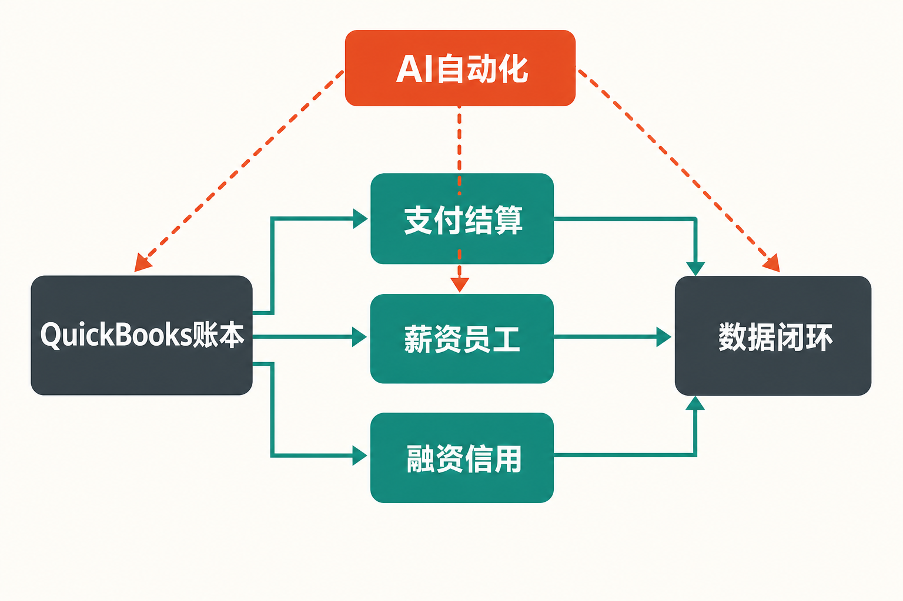

Intuit交出了一份增长与疑问同时放大的年度成绩单。

据公司FY2026业绩公告，截至2026年7月31日的全年营收为214亿美元，同比增长14%；管理层定义的“Big Bets”业务组合增长34%，占全年营收30%。需要先澄清：34%不是Intuit集团营收增速，也不是纯AI收入增速，而是若干战略业务的合计增长。

真正值得研究的问题因此不是“AI有没有带来增长”，而是：当TurboTax申报量下降、QuickBooks增长包含提价因素、资金服务又扩大信用风险时，AI能否把既有数据和工作流转化为更持久的生态壁垒？

## 一、公司与报告资料卡

- 公司：Intuit Inc.
- 证券市场：本次来源材料未载明，本文不作补充
- 核心产品：QuickBooks、TurboTax、Credit Karma、Mailchimp等
- 报告期：截至2026年7月31日的FY2026
- 财务口径：美元；GAAP与非GAAP数据分别讨论
- 数据核实日期：2026年8月28日
- 资料边界：公司业绩公告、SEC Form 10-Q及公司产品公告

这是科技投资研究，而非荐股判断。下文把公司披露称为“事实”，由事实延伸出的经营含义称为“推断”，价值判断则明确标注为“观点”。

## 二、商业模式：软件入口正在变成经营操作系统

Intuit过去最容易理解的两条主线，一条是面向中小企业的QuickBooks，另一条是面向个人纳税人的TurboTax。如今，其收入逻辑已不只是销售会计或报税软件，而是围绕财务数据叠加支付、薪资、融资、营销和专家服务。

据公司FY2026业绩公告，Global Business Solutions全年营收129亿美元，同比增长16%；Consumer营收86亿美元，同比增长11%。其中，属于Global Business Solutions内部口径的Online Ecosystem收入99亿美元，同比增长19%，不能再与集团分部收入简单相加。（来源：Intuit FY2026业绩公告，披露于2026-08-25）

QuickBooks的商业模式可概括为“订阅入口＋交易服务＋增值模块”。客户先用会计账本，再接入支付、应付账款、薪资、融资和员工管理。TurboTax则由低接触度的自助报税，向TurboTax Live所代表的软件加人工专家服务升级。

这种模式的优势是，同一个客户采用的模块越多，数据连接越深，迁移成本和单客收入就可能越高。但这是基于产品结构的推断，不等于公司已经披露了更高留存率或更好的单位经济性；本次材料没有提供足以验证这两项结论的数据。

## 三、增长驱动：客户增长、提价和产品升级必须拆开看

据公司FY2026业绩公告，QuickBooks Online Accounting全年收入增长23%，第四季度增长20%。公司将第四季度增长归因于有效价格提高、客户增长和产品组合变化。换言之，QuickBooks的增长质量不能只用收入增速判断，还要观察客户数量与高端版本渗透率。

产品周期正在从“记录发生了什么”转向“协助完成下一步操作”。公司2026年8月产品公告显示，Intuit Intelligence Chat利用客户自身业务数据提供建议，并且只有在用户确认后才执行动作；Books Upkeep持续处理高置信度交易，把例外留给人工判断。Intuit Enterprise Suite则增加多实体、多币种和行业工作流，显示公司正由小企业市场向中端企业上移。

这套路径的潜在壁垒不是聊天界面本身，而是会计数据、权限控制、支付动作和审计流程的结合。不过，相关公告没有披露订单、收入、留存率或利润贡献，部分功能仍处于测试阶段，公司也提示AI可能出错。因此，“产品方向合理”是有依据的推断，“商业化已经成功”则尚无证据。

另一个扩张方向是员工与资金流。QuickBooks Workforce把招聘、工时、薪资、福利和合规嵌入QuickBooks。公司称既有QuickBooks Payroll覆盖1800万名美国劳动者，但没有披露其中多少能够转化为Workforce付费用户。2026年7月发布的商业信用卡则把支出控制、收据匹配和账务同步连接起来，却同样未披露发卡量、活跃率或坏账率。

TurboTax呈现出更典型的“量减价升”。据公司FY2026业绩公告，TurboTax全年收入53亿美元，同比增长7%；TurboTax Live增长37%，占TurboTax收入53%。同期美国TurboTax总量由3990万降至3900万，下降2%，其中桌面版下降7%、在线版下降2%。这说明高价值专家服务和客单价提升抵消了申报量压力，但尚不能证明整体客户基础恢复增长。

## 四、财务质量：利润扩张真实，现金流仍需还原

据公司FY2026业绩公告，全年GAAP营业利润59亿美元，同比增长20%；非GAAP营业利润89亿美元，同比增长18%。GAAP稀释每股收益为16.46美元，非GAAP为24.27美元，两者均增长20%。营收增长14%而两种口径的营业利润增速更快，说明全年层面存在经营杠杆。

但第三财季曾出现不同信号。截至2026年4月30日的季度，GAAP营收85.58亿美元，同比增长10%；GAAP营业利润40.20亿美元、非GAAP营业利润46.80亿美元，二者均增长8%，低于当季营收增速。税季高度集中使单季比较容易受产品组合和费用确认影响，因此应以全年与跨期趋势共同判断。（来源：Intuit FY2026第三季度业绩公告，披露于2026-05-20）

现金流表面上很强。公司FY2026经营现金流为88.38亿美元，高于FY2025的62.07亿美元；资本性支出为2.21亿美元，高于上年的1.24亿美元。按“经营现金流减资本开支”的简化方法，自由现金流约86.17亿美元。

然而，这一数字不能直接等同于经济利润。全年经营现金流包含12.79亿美元递延税项和20.56亿美元股权薪酬等非现金调整。公司全年还回购约55亿美元，使稀释加权平均股数下降2%；回购确实压过了股权薪酬造成的稀释，但同时消耗了大量现金。截至2026年7月31日，公司现金及投资约72亿美元，债务约77亿美元。

口径变化也需要警惕。公司表示，自2026年8月1日起不再从非GAAP指标中剔除股权薪酬，因此FY2027非GAAP指引与历史数据定义不同。后续若直接比较非GAAP利润增速，可能把会计口径变化误判为经营改善。

## 五、壁垒在哪里，又会遇到谁？

QuickBooks最有价值的壁垒可能由三层组成：第一层是长期积累的账务与交易数据；第二层是会计、支付、薪资、融资和员工管理之间的工作流；第三层是会计师、企业主与员工共同参与形成的关系网络。AI若嵌入这三层，价值在于减少人工步骤，而不只是生成一段回答。

TurboTax的壁垒则来自税务流程、用户历史数据、品牌认知以及Live专家服务。可是，FY2026申报量下降表明，这些优势没有自动转化为总量增长。政府进入报税服务、报税中断以及AI建议质量，均被公司列入风险因素。

竞争边界也在扩大。QuickBooks向中端企业上移，会更直接面对ERP和财务自动化厂商；进入Workforce后，要与专业薪资、HRIS及HCM供应商争夺预算；切入商业信用卡与融资，又增加了支付网络、金融机构及资金管理产品的竞争与依赖。本文的观点是：生态扩张可以增厚迁移成本，却也会把原本的软件竞争升级为软件、服务、合规与资产负债表能力的综合竞争。

## 六、估值不看目标价，要看三组情景变量

本文不提供目标价。影响估值的核心，是市场愿意把Intuit视为高增长AI平台，还是增速趋缓的成熟软件与金融服务组合。

**积极情景：** QuickBooks客户增长与高端产品迁移同时持续，Intuit Enterprise Suite在中端市场形成付费采用；TurboTax Live渗透提高且总申报量企稳；AI提高自动化率，又没有显著推高服务和合规成本。此时应重点观察收入增长是否仍能快于费用增长。

**基准情景：** 提价、组合升级与专家服务继续支持收入，但客户和申报量增长偏弱；AI改善产品体验，却尚未形成可单独识别的收入贡献。FY2027公司给出的营收指引为232.79亿至235.12亿美元，同比增长9%至10%，已低于FY2026的14%。

**压力情景：** TurboTax量继续下降，Mailchimp疲弱，QuickBooks客户增长不足以抵消提价放缓；同时信贷损失、AI投入与重组执行成本上升。公司FY2027指引中，TurboTax仅增长2%至3%，Mailchimp为下降1%至持平，说明FY2026的34%“Big Bets”增速不宜机械外推。（来源：Intuit FY2026业绩公告，披露于2026-08-25）

## 七、至少要盯住的五项下行风险

**第一，增长过度依赖提价和结构升级。** 需要持续跟踪QuickBooks客户增长、在线会计收入增速以及高端产品渗透；若收入增长仍快但客户量转弱，增长的可持续性就要重新评估。

**第二，TurboTax量价背离。** 重点跟踪美国总申报量、在线申报量、电子申报份额、TurboTax Live客户增长及其收入占比。Live增长不能长期掩盖入口流量流失。

**第三，信贷风险随生态同步扩大。** 截至2026年4月30日的九个月，公司贷款投资发放及购买额由上年同期28.73亿美元升至49.30亿美元；商业贷款信用损失准备计提1.48亿美元、核销1.28亿美元，均同比增加。后续应跟踪贷款发放、信用损失准备、核销额和融资合作方变化。（来源：Intuit FY2026第三季度Form 10-Q，披露于2026-05-20）

**第四，AI准确性、隐私和执行风险。** 财税错误的成本可能高于普通生成式AI场景。应观察自动化功能的正式上线范围、人工确认机制、事故披露、客户投诉与支持成本，而不是只看发布数量。

**第五，重组可能伤及执行。** 公司在FY2026第三财季宣布削减17%的全职员工，预计主要在第四财季确认3亿至3.4亿美元重组费用。裁员可能提高成本效率，也可能影响研发、客户服务与新产品交付，后续应跟踪营业利润率、研发投入和产品推出节奏。

## 结语：壁垒正在加宽，但还没有得到最终验证

事实层面，Intuit FY2026实现了14%的集团营收增长和20%的GAAP营业利润增长；QuickBooks Online Accounting、TurboTax Live等高价值业务表现突出。与此同时，TurboTax申报量下降、QuickBooks增长包含提价、资金服务提高信贷敞口，FY2027公司指引也显示集团增速可能放缓。

由此可以作出的中性判断是：Intuit的AI“大赌注”正在把QuickBooks和TurboTax从工具升级为数据与工作流平台，生态壁垒存在增厚的可能；但真正的验证标准不是34%这一组合口径，而是客户数量、留存与交叉销售能否改善，AI自动化能否转化为可持续利润，以及金融服务风险是否得到控制。

本文仅供信息交流，不构成投资建议。资本市场有风险，任何投资决策均应基于独立研究与自身风险承受能力。

## 参考资料

1. Intuit Inc.：《Intuit Reports Fourth Quarter and Full Year Fiscal 2026 Results; Sets Fiscal 2027 Guidance》（FY2026，披露于2026-08-25）

   https://investors.intuit.com/sec-filings/all-sec-filings/content/0000896878-26-000029/fy26q4earningspressrelease.htm

2. U.S. Securities and Exchange Commission / Intuit Inc.：《Intuit Inc. Form 10-Q for the Quarterly Period Ended April 30, 2026》（披露于2026-05-20）

   https://www.sec.gov/Archives/edgar/data/896878/000089687826000025/intu-20260430.htm

3. Intuit Inc. / U.S. Securities and Exchange Commission：《Intuit Reports Strong Third-Quarter Results and Raises Full-Year Revenue Guidance》（FY2026第三季度，披露于2026-05-20）

   https://www.sec.gov/Archives/edgar/data/896878/000089687826000024/fy26q3earningspressrelease.htm

4. Intuit Inc.：《Intuit Advances Its Mid-Market Platform With Conversational AI, Enterprise Scale, and Deep Industry Workflows for CFOs and Accounting Firms》（发布于2026-08-12）

   https://investors.intuit.com/news-events/press-releases/detail/1319/intuit-advances-its-mid-market-platform-with-conversational-ai-enterprise-scale-and-deep-industry-workflows-for-cfos-and-accounting-firms

5. Intuit Inc.：《Intuit Unveils QuickBooks Workforce, Radically Transforming Human Capital Management for Small and Mid-Market Businesses》（发布于2026-05-06）

   https://investors.intuit.com/news-events/press-releases/detail/1310/intuit-unveils-quickbooks-workforce-radically-transforming-human-capital-management-for-small-and-mid-market-businesses

6. Intuit Inc.：《Intuit Launches Business Credit Card That Brings Spend Management, Rewards, and Insights Together in QuickBooks》（发布于2026-07-22）

   https://investors.intuit.com/news-events/press-releases/detail/1316/intuit-launches-business-credit-card-that-brings-spend-management-rewards-and-insights-together-in-quickbooks
