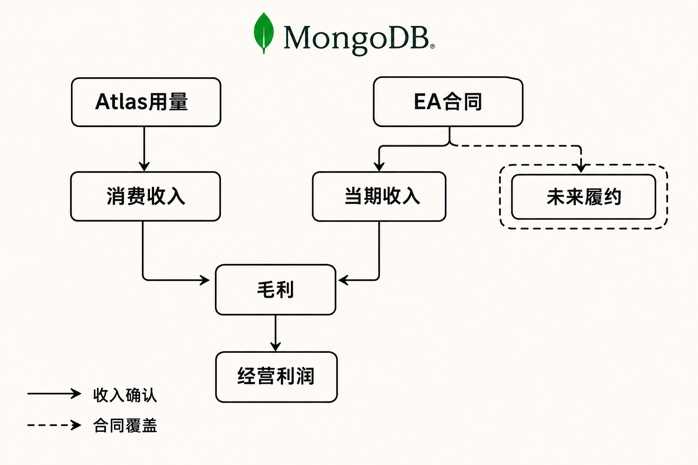

MongoDB交出了一份“收入、订单、利润同时改善”的季度成绩单。

据公司FY2027第二季度业绩公告，截至2026年7月31日的季度总营收为7.718亿美元，同比增长30%；剩余履约义务（RPO）同比增长91%至15.192亿美元；GAAP营业利润则从上年同期亏损6529万美元转为盈利2840万美元。

但核心问题不能只看表面的三个高增长数字：Atlas收入仍保持约29%的增速，整体营收加速在相当程度上来自Enterprise Advanced（EA）及其他订阅业务；与此同时，公司第三季度收入指引隐含的同比增速又回落至约20%—21%。因此，本季更像一次“增长质量测试”——快速扩张的合同覆盖度，能否逐步转化为可重复的收入、现金流与股东口径利润？

## 公司与报告资料卡

- 公司：MongoDB, Inc.
- 证券市场：美国证券市场；本次来源材料未列明具体交易所，本文不作外推
- 报告期：FY2027第二季度，截至2026年7月31日
- 财年规则：财年截至每年1月31日
- 币种：美元
- 财务性质：季度数据未经审计
- 数据核实日期：2026年9月4日

## 商业模式：同是订阅，收入确认逻辑并不相同

MongoDB第二季度订阅收入为7.471亿美元，同比增长31%，占7.718亿美元总营收约96.8%；服务收入为2463万美元。订阅显然是商业模式的主体，但其中至少有两种不同的经济逻辑。

Atlas是托管式云数据库，收入主要随客户实际用量产生。客户应用访问量、数据规模及搜索、向量检索等功能采用增加，才会逐渐反映为收入。EA主要服务本地、私有云及混合部署客户，期限许可证中的一部分收入可以在合同开始时确认。因此，一笔多年期EA合同可能同时显著推高RPO，并将部分许可证收入前置到当季；它与Atlas持续消费并非同一种增长。（来源：MongoDB Form 10-Q，披露于2026-09-01）

这一区别决定了分析框架：Atlas更接近消费趋势，EA当季收入更容易受合同签署时间影响，RPO则反映未来合同覆盖度。三者相互关联，却不能直接画等号。

## 增长驱动：Atlas稳定，EA推动总收入加速

公司FY2027第一季度总营收为6.876亿美元，同比增长25%；第二季度升至7.718亿美元，同比增长30%，环比增加约8420万美元。实际收入还比公司5月给出的第二季度指引上限高约3780万美元，说明当季业务表现明显好于原先假设。

不过，跨期比较显示增长结构比总数更重要。第一季度Atlas收入增速超过29%，第二季度约为29%；第一季度EA及其他收入增长超过13%，第二季度则约增36%。据公司电话会管理层表述，Atlas已连续第五个季度保持约29%的增速，本季同比新增收入约1.27亿美元。由此推断，本季总收入从25%加速至30%，主要不是Atlas增速突然跃升，而是Atlas稳定扩张与EA合同收入集中确认共同作用。

存量客户扩张也在改善。公司披露的净ARR扩张率为122%，高于上年同期的119%和上一季度的121%；截至期末，客户超过70,600家，其中年化经常性收入至少10万美元的客户为2,999家。需要明确的是，净ARR扩张率不是GAAP收入，大客户数量也没有被进一步拆分为AI客户及其收入贡献。

## AI数据平台：需求信号已经出现，收入证据仍不充分

MongoDB在本季度密集补齐AI数据链路。5月发布的能力覆盖自动嵌入、持久化代理记忆、实时运营数据和MongoDB 8.3；6月又将Search与Vector Search作为EA附加组件正式推出，并发布Hybrid Search和Voyage Context 4。产品策略是把数据库、全文搜索、向量检索、嵌入、重排序和代理记忆放进同一平台，同时覆盖Atlas、EA和Community Edition。

这套组合的潜在价值，是减少企业拼接多种数据库与检索工具的复杂度，并让受监管客户在本地或混合环境中部署AI检索。公司称，EA Search正式发布前已有20多家大型银行和金融机构参与评估。但“参与评估”不是签约金额，更不是确认收入；自动嵌入和Atlas Native Reranking当时仍处于公开预览，也不能与已正式可用的产品采用混为一谈。（来源：MongoDB产品公告，披露于2026-06-30）

管理层还承认，Voyage带来的不少客户此前并非MongoDB客户，但从Voyage向Atlas交叉销售仍处早期。因此，AI客户数量、向量搜索采用及MCP连接集群增加，目前更适合被视为先行需求指标，而不是已被验证的重大收入来源。这是本文的判断，不是公司已经实现规模化AI变现的事实。

## 财务质量：利润转正，但口径差距仍大

第二季度GAAP毛利润为5.698亿美元，毛利率约73.8%，上年同期约为71.0%。尽管订阅成本中的第三方云基础设施费用增加3140万美元，Atlas规模化效率及收入组合仍帮助毛利率改善。这说明消费增长暂未被云成本完全吞噬，但Atlas占比继续上升，理论上仍可能因托管成本对毛利率构成压力。

利润表的改善更明显：第二季度GAAP营业利润为2840万美元，营业利润率约3.7%；GAAP净利润为4090万美元，稀释后每股0.50美元。相比之下，公司非GAAP营业利润为1.859亿美元，营业利润率24%；非GAAP净利润为1.626亿美元，稀释后每股1.90美元。

两种营业利润相差约1.575亿美元，其中1.534亿美元股票薪酬是最主要调整项。因此，24%的非GAAP营业利润率可以反映剔除部分非现金项目后的经营效率，却不能直接视为股东口径的可持续利润率。公司FY2027全年指引也保留了这一矛盾：非GAAP营业利润预计为6.163亿至6.363亿美元，GAAP营业结果仍预计亏损2800万至800万美元。

现金流表现较强。公司第二季度经营现金流为1.419亿美元；扣除250万美元资本开支及180万美元融资租赁本金后，公司定义的自由现金流为1.376亿美元，上年同期为6990万美元。轻资本开支有利于现金转换，但六个月经营现金流3.435亿美元中包含2.868亿美元股票薪酬，而同期GAAP净利润为4537万美元。换言之，现金流改善是真实的，评价其质量时也必须同时考虑股权稀释。

此外，公司截至期末持有约24亿美元现金、现金等价物、短期投资和受限制现金，流动性压力有限；但累计亏损仍为18.665亿美元，单季GAAP盈利尚不足以建立长期盈利记录。

## RPO增长91%，为什么不能直接称为“订单兑现”？

截至第二季度末，MongoDB的RPO为15.192亿美元，同比增长91%；预计一年内确认的cRPO为7.973亿美元，同比增长73%。这表明合同覆盖度增强，为后续收入提供了更高可见性。

反例在于，RPO包含未赚取收入、多年合同未来付款和部分尚未履行的订单；Atlas消费、EA合同签署与许可证收入确认又有不同节奏。截至期末，公司流动与非流动递延收入分别为3.395亿和1.082亿美元，递延收入也不能与RPO或新签订单互换使用。

因此，RPO高增是积极事实；它将以何种速度变成收入、以何种产品组合形成毛利、最终能否变成GAAP利润，则仍是待验证的推断。

## 壁垒与竞争：统一平台与部署广度是机会，也是执行题

MongoDB试图建立的壁垒，是统一开发者数据模型、搜索、向量检索、实时数据与AI模型能力，并覆盖AWS、Microsoft Azure、Google Cloud、本地及混合环境。对于不愿将敏感数据完全迁往公有云的金融等客户，EA与Atlas之间的一致能力具有差异化意义。

但来源材料没有提供可量化的市场份额或逐一列名的竞争对手数据，本文不作主观排名。公司10-Q明确提示的竞争压力包括数据库市场竞争、免费用户难以转为付费客户、第三方云基础设施依赖、销售人员产能及AI产品执行。平台功能更完整不必然形成定价权，尤其当搜索节点成本优化25%—40%以上时，客户采用可能提高，但相同工作负载的短期用量收入也可能下降。

## 估值敏感因素：不看目标价，看三个变量组合

本文不提供目标价。估值更可能围绕以下情景重新定价：

- 乐观情景：Atlas维持接近当前的消费增速，RPO逐步转为cRPO和收入，AI检索提高产品附加率，同时云成本效率继续改善，GAAP与非GAAP利润差距收窄。
- 中性情景：Atlas保持稳定，EA因合同节奏带来季度波动，AI仍以试验和早期交叉销售为主；收入增长放缓，但现金流与利润率温和改善。
- 压力情景：第三季度约20%—21%的指引增速成为更长期趋势，Atlas消费受宏观环境影响，EA前置确认后的基数抬高，股票薪酬及AI投入令GAAP盈利再次承压。

Quartz报道显示，公司发布超预期业绩后，股价次日盘前仍一度下跌约14%。这只是市场对增长斜率高度敏感的外部观察，并不能单独证明基本面恶化。

## 下行风险与跟踪清单

至少有五项风险值得持续跟踪：

1. Atlas消费减速：观察Atlas收入增速、同比新增收入金额及净ARR扩张率。
2. EA确认节奏反转：比较EA收入增速、EA ARR增速、RPO与cRPO的后续变化。
3. AI商业化不及预期：跟踪预览功能转正式可用、Voyage向Atlas交叉销售及付费采用披露。
4. 利润质量不足：持续比较GAAP与非GAAP营业利润率、股票薪酬占收入比例及稀释影响。
5. 云成本和产品组合压力：观察GAAP毛利率、第三方基础设施成本及Atlas占比变化。

## 结语：订单是起点，持续利润才是终点

MongoDB FY2027第二季度的确定性事实是：营收增速升至30%，RPO大幅增长，毛利率改善，单季GAAP营业利润转正，自由现金流接近翻倍。需要保持克制的地方也同样清楚：Atlas没有与整体收入同步加速，EA期限许可证放大了季度表现，AI交叉销售仍处早期，股票薪酬继续造成显著的利润口径差异。

中性地看，这份财报证明MongoDB已具备“增长同时改善利润”的能力，但尚未证明本季组合可以稳定重复。未来几个季度真正重要的，不是某个AI功能发布了多少，而是RPO能否兑现为高质量收入、Atlas消费能否维持、GAAP利润能否在控制稀释的同时持续转正。

本文仅供信息交流，不构成投资建议。科技公司经营与证券价格均存在不确定性，读者应基于自身风险承受能力独立判断。

## 参考资料

1. 美国证券交易委员会（SEC）／MongoDB, Inc.：《MongoDB, Inc. Quarterly Report on Form 10-Q》（截至2026年7月31日，披露于2026-09-01）

   https://www.sec.gov/Archives/edgar/data/1441816/000162828026059830/mdb-20260731.htm

2. MongoDB, Inc. Investor Relations：《MongoDB, Inc. Announces Second Quarter Fiscal 2027 Financial Results》（披露于2026-09-01）

   https://investors.mongodb.com/news-releases/news-release-details/mongodb-inc-announces-second-quarter-fiscal-2027-financial

3. Platform Aeronaut Transcripts：《MongoDB FY2027第二季度业绩电话会文字记录》（2026-09-01）

   https://transcripts.platformaeronaut.com/transcripts/MDB-2Q27-transcript

4. MongoDB, Inc. Investor Relations：《MongoDB, Inc. Announces First Quarter Fiscal 2027 Financial Results》（披露于2026-05-28）

   https://investors.mongodb.com/news-releases/news-release-details/mongodb-inc-announces-first-quarter-fiscal-2027-financial

5. MongoDB, Inc.：《MongoDB Delivers Accurate AI Retrieval Wherever Enterprise Data Lives》（披露于2026-06-30）

   https://investors.mongodb.com/news-releases/news-release-details/mongodb-delivers-accurate-ai-retrieval-wherever-enterprise-data

6. MongoDB, Inc.：《MongoDB Makes Enterprise AI Production Ready》（披露于2026-05-07）

   https://investors.mongodb.com/news-releases/news-release-details/mongodb-makes-enterprise-ai-production-ready

7. Quartz：《MongoDB stock sank after beating earnings but signaling slower growth ahead》（更新于2026-09-02）

   https://qz.com/mongodb-stock-earnings-atlas-growth-090226
