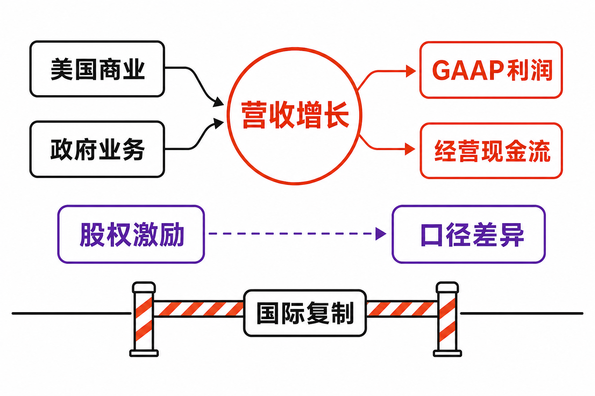

Palantir交出了一组罕见的“增长与利润率同时上升”数据。

据公司《截至2026年3月31日季度的Form 10-Q》披露，Palantir 2026年第一季度实现GAAP营收16.326亿美元，同比增长85%；其中美国商业收入由上年同期2.55亿美元增至5.95亿美元，同比增长133%。同期GAAP营业利润率约46%，公司定义的调整后营业利润率则达到60%。

但在业绩发布后，El País报道其股价盘中一度下跌超过7%。这构成了本季最值得研究的矛盾：当增长已经如此突出，市场为何仍不满足？问题或许不在于Palantir有没有增长，而在于这种增长能否持续、能否走出美国，以及能否覆盖高估值、股权激励和治理结构所要求的风险补偿。

## 公司与报告资料卡

- **公司**：Palantir Technologies Inc.（证券代码PLTR）
- **证券市场**：美国公开证券市场；本次来源材料未单列交易所名称
- **报告期**：截至2026年3月31日的三个月
- **报告币种**：美元
- **会计口径**：GAAP与公司定义的非GAAP指标并列分析
- **数据核实日期**：2026年8月10日
- **研究边界**：公司没有单独披露AIP收入，本文不能将美国商业收入133%的全部增幅直接归属于AIP

## 商业模式：政府业务守底盘，商业业务拉增速

Palantir的收入可从客户类型分为政府与商业两部分。据公司一季报披露，2026年第一季度商业收入为7.74亿美元，同比增长95%；政府收入约8.58亿美元。美国政府收入为6.87亿美元，同比增长84%，说明政府业务不仅是历史底盘，本季也处于高增长状态。（来源：公司2026年一季报，披露于2026-05-05）

商业业务的核心经营逻辑则是把数据、权限和业务对象组织起来，再将人工智能模型嵌入实际工作流。管理层在业务更新材料中将AIP与Ontology的权限治理、业务执行和成本控制能力作为产品差异点。不过，这是公司对产品价值的解释，并非经审计的AIP收入拆分。

收入增长也不完全依靠新客户。据公司一季报披露，商业收入同比增加约3.77亿美元，其中约3.52亿美元来自2025年末已经存在的商业客户。由此可以推断，客户扩张销售、使用范围扩大或单客贡献提升，是本季商业增长的主体，而不是简单增加客户数量。

## 增长驱动：AIP进入扩张期，但美国与海外出现温差

公司在《Q1 2026 Business Update》中称，AIP继续推动美国商业业务动能。美国商业客户数同比增长42%至615家，而美国商业收入同比增长133%。收入增速显著快于客户数增速，与既有客户贡献大部分增量相互印证，说明产品进入客户后继续扩张的能力，可能比初次获客更重要。（来源：Palantir《Q1 2026 Business Update》，2026-05-04）

另一个证据是净美元留存率。据管理层在2026年第一季度业绩电话会披露，该指标达到150%，环比提高1100个基点，主要受既有客户扩张以及一年前新增客户进入统计窗口推动。但净留存率不包括过去12个月新客户收入，不能直接与85%的总营收增速比较。

增长的反面是地域集中。电话会披露，2026年第一季度国际商业收入仅为1.79亿美元，同比增长26%、环比增长5%；美国商业收入则占全球商业收入约77%。这意味着目前得到验证的是“AIP在美国商业市场的快速扩张”，而不是已经完成全球复制。

合同指标也需谨慎解读。据公司业绩公告披露，本季美国商业TCV为11.76亿美元，同比增长45%，低于美国商业收入133%的增速；公司RPO为45亿美元，其中约39%预计在未来12个月确认。TCV会受签约节奏影响，RPO只包含不可取消的未确认合同收入，而RDV还可能包含便利终止条款和未行权选择权，三者不能互相替代，更不能直接视作未来营收。

## 财务质量：利润和现金流很强，但口径差异不能略过

从GAAP报表看，Palantir本季营收16.326亿美元，毛利润14.168亿美元，毛利率约87%；GAAP营业利润7.54亿美元，营业利润率约46%。这说明规模扩张已经转化为明显的经营杠杆，而不是只增收入、不增利润。（来源：公司2026年一季报，披露于2026-05-05）

非GAAP口径更加亮眼，但不能混用。公司披露的调整后营业利润为9.835亿美元、利润率60%，较GAAP营业利润高约2.30亿美元。差额主要包括2.016亿美元股权激励费用和2796万美元相关雇主税。换言之，60%反映剔除相关项目后的经营表现，46%才包含股权激励会计费用。

现金流同样充裕。据一季报披露，本季GAAP经营现金流为8.992亿美元，购置物业及设备支出740万美元；用经营现金流减去这项资本开支，基础自由现金流约8.92亿美元。公司披露的调整后自由现金流为9.25亿美元，还调整了股权激励相关雇主税，因此不能把它等同于GAAP现金流。

资产负债表提供了缓冲：截至2026年3月31日，公司现金、现金等价物及短期美国国债合计80亿美元，无未偿债务，并拥有5亿美元未提取循环信贷额度。但现金充足只能降低融资与偿债风险，不能自动证明股票估值合理。

股权激励仍是不可忽视的股东成本。本季股权激励费用2.016亿美元，同比增长30%，约相当于营收的12.3%；季末还有8.17亿美元未确认RSU费用，预计在加权平均三年内确认。费用占收入比例若随规模扩大而下降，将支持经营杠杆；若新增授予持续增加，则会继续影响GAAP利润与潜在稀释。

## 壁垒与竞争：价值在工作流，而非模型本身

管理层的竞争论点是：基础模型能力可能趋同、单位token成本可能下降，但企业仍需要权限、治理、业务语义和执行层。AIP与Ontology若能把模型稳定嵌入生产流程，其壁垒就不是“拥有某个模型”，而是客户已经部署的数据关系、权限体系和工作流。

这一逻辑有客户采用和高净留存率作为旁证，但没有AIP独立收入或客户级收入披露，因而尚不能量化壁垒强度。Cinco Días援引Bloomberg Intelligence的观点认为，Anthropic、OpenAI等基础模型供应商可能帮助企业直接部署大模型，对Palantir商业业务构成替代或议价压力。这是竞争情景，不是已经发生的经营结果；本季133%的美国商业增速至少表明，短期需求尚未明显受压。

潜在竞争者还包括客户自建方案及其他数据平台。真正需要验证的并非模型演示效果，而是Palantir能否持续缩短部署周期、扩大生产级工作流，并让客户在更换平台时承担较高的业务迁移成本。

## 估值敏感因素：高增长需要多长时间才够？

Axios Markets援引S&P Capital IQ数据称，截至2026年5月26日，Palantir过去12个月市销率约63倍。该数字是随股价和收入变化的时点快照，却足以说明市场已经计入很高的长期增长预期，而不是只为一个季度的超预期付费。

因此，不给目标价也可以建立三个观察情景：

- **延续情景**：美国商业收入保持高速扩张，国际商业增速逐步接近美国，净留存率保持强劲，GAAP利润率继续改善。高估值可获得更强的基本面支撑，但仍需时间消化。
- **分化情景**：美国业务继续增长，国际商业长期停留在较低增速，政府和头部客户贡献上升。公司利润可能仍高，但地域及客户集中会限制估值扩张。
- **降速情景**：TCV、RPO与收入转化走弱，模型供应商或客户自建压低议价能力，同时人员投入与股权激励上升。此时营收增速和利润率可能同时低于市场隐含预期，估值收缩会放大价格波动。

管理层已将2026财年营收指引上调至76.50亿—76.62亿美元，约同比增长71%；美国商业收入指引提高至超过32.24亿美元，至少增长120%。这些是前瞻判断而非已实现业绩，其兑现程度将成为估值能否被经营结果消化的核心变量。（来源：公司2026年第一季度业绩公告，2026-05-04）

## 三类下行风险与跟踪指标

**第一，美国增长难以跨区域复制。** 美国客户已贡献季度收入的79%，国际商业增速明显落后。应持续跟踪国际商业收入同比及环比增速、美国收入占比，以及海外客户扩张情况。

**第二，合同动能未能顺利转化为收入。** 本季美国商业TCV增速低于当期收入增速，但单季合同数据可能波动。应联动观察TCV、RPO、合同负债和未来12个月RPO确认比例，避免用单一“订单”指标推断趋势。

**第三，股权激励和费用增长侵蚀股东收益。** 应跟踪SBC绝对额及占营收比例、GAAP与调整后营业利润率差距、稀释股数，以及8.17亿美元未确认RSU费用的确认节奏。

**第四，客户集中与平台竞争。** 过去12个月前20大客户平均收入为1.08亿美元，同比增长55%。大客户扩张能提升效率，也会增加集中风险。应关注净美元留存率、前20大客户贡献、客户总数，以及AIP是否产生更多可持续的生产级工作流。

**第五，治理权与经济权益不对称。** 公司2026年代理声明显示，A类股每股一票、B类股每股十票，F类股份由创始人投票信托持有；在董事选举提案中，F类约占27.7%的投票权。该结构不会直接减少现金流，却会削弱普通A类股东对重大事项的影响。

## 结语

Palantir 2026年第一季度的增长、GAAP利润率与现金流均有扎实报表支持，美国商业业务也确实进入了强劲扩张阶段。但“AIP推动”目前主要来自管理层归因，公司尚未披露可审计的AIP独立收入；美国与国际商业市场的巨大增速差，又说明产品周期尚未完成全球验证。

中性地看，Palantir当前的核心研究问题已经从“能否盈利”转向“超高速增长能持续多久、能否跨区域复制，以及GAAP利润和每股价值能否同步改善”。估值是否被消化，不取决于某一个季度的133%，而取决于合同转化、国际复制、利润率、股权稀释与治理风险在未来多个报告期如何共同变化。

**本文仅供信息交流，不构成投资建议。市场有风险，投资决策应结合个人风险承受能力并独立判断。**

## 参考资料

1. U.S. Securities and Exchange Commission / Palantir Technologies Inc.：《Palantir Technologies Inc. Quarterly Report for the Quarter Ended March 31, 2026 (Form 10-Q)》（披露于2026-05-05）  
https://www.sec.gov/Archives/edgar/data/1321655/000132165526000028/pltr-20260331.htm

2. Palantir Technologies Inc. / U.S. Securities and Exchange Commission：《Palantir Reports Q1 2026 U.S. Comm Revenue Growth of 133% Y/Y and Revenue Growth of 85% Y/Y; Raises FY 2026 Revenue Guidance to 71% Y/Y Growth》（披露于2026-05-04）  
https://www.sec.gov/Archives/edgar/data/1321655/000132165526000026/a2026q1ex991pressrelease.htm

3. Palantir Technologies Inc.：《Palantir - Q1 2026 Business Update》（发布于2026-05-04）  
https://investors.palantir.com/files/Palantir%20-%20Q1%202026%20Business%20Update.pdf

4. The Motley Fool：《Palantir (PLTR) Q1 2026 Earnings Transcript》（发布于2026-05-04）  
https://www.fool.com/earnings/call-transcripts/2026/05/04/palantir-pltr-q1-2026-earnings-transcript/

5. U.S. Securities and Exchange Commission / Palantir Technologies Inc.：《Palantir Technologies Inc. 2026 Proxy Statement》（披露于2026-04-24）  
https://www.sec.gov/Archives/edgar/data/1321655/000132165526000019/pltr-20260423.htm

6. Constellation Research：《Palantir's US commercial, government deals surge in Q1》（发布于2026-05-04）  
https://www.constellationr.com/insights/news/palantirs-us-commercial-government-deals-surge-q1

7. Axios Markets：《Strong earnings, with a catch》（发布于2026-05-26）  
https://www.axios.com/newsletters/axios-markets-b51bd77a-fc94-4451-abf1-69df5a0cd882

8. El País：《Palantir bate su récord de ingresos con el respaldo de Trump pero no logra recuperar el apoyo inversor》（发布于2026-05-05）  
https://elpais.com/economia/2026-05-05/la-polemica-palantir-bate-su-record-de-ingresos-con-el-respaldo-de-trump-pero-no-logra-recuperar-el-apoyo-inversor.html

9. Cinco Días / El País：《Donald Trump acude en ayuda de Palantir tras su desplome en Bolsa por la amenaza de la IA de Anthropic》（发布于2026-04-10）  
https://cincodias.elpais.com/companias/2026-04-10/la-ia-de-anthropic-tambien-devora-a-palantir-sus-acciones-se-desploman-en-bolsa.html
