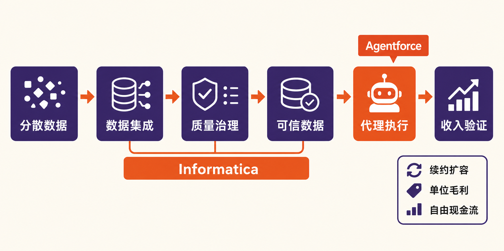

Salesforce交出了一组看似强劲、却需要拆开观察的数字。

据公司《Salesforce Delivers Record Second Quarter Fiscal 2027 Results》披露，截至2026年7月31日的FY2027第二季度，公司总营收为113.45亿美元，同比增长10.8%；Agentforce ARR超过15亿美元，同比增长逾240%。但同一份公告显示，Informatica当季贡献4.56亿美元营收，约占集团营收4.0%。

因此，核心问题不是“并表能否拉高增长”——答案已经是肯定的；而是Informatica能否帮助Agentforce跨过数据准备、治理和生产部署的门槛，并把并表收入转化为可持续的有机增长、GAAP利润与现金流。

## 公司与报告资料卡

- 公司：Salesforce, Inc.
- 证券市场：本次来源材料未明确披露，故不作外推
- 报告期：FY2027第二季度，截至2026年7月31日
- 财务口径：美国GAAP及公司调整后的非GAAP指标
- 币种：美元
- 数据核实日期：2026年8月28日
- 并表起点：Salesforce于2025年11月18日完成Informatica收购，此后将其纳入合并报表

FY2026只包含Informatica约两个半月的经营结果。Salesforce在FY2026年报中披露，Informatica与Regrello合计贡献不足当年集团营收和营业费用的1%。FY2027因而是观察Informatica较完整并表贡献、整合成本与利润稀释的首个财年。（来源：Salesforce FY2026 Form 10-K，披露于2026-03-02）

## 商业模式：订阅仍是基本盘，AI正在改变计费对象

Salesforce的收入仍主要来自企业软件订阅与支持。FY2027第二季度，公司订阅与支持收入为108.20亿美元，同比增长11.7%，占总营收约95.4%；专业服务及其他收入为5.25亿美元，同比下降约3.8%。这意味着当前增长仍由经常性订阅业务承担，而不是依靠服务收入扩张。

Agentforce试图在传统“按席位订阅”之上增加代理执行和消费型收入。公司披露，第二季度Agentic Work Units为32亿，环比增长97%，累计达到70亿。事实层面，这说明生产环境中的代理任务量正在上升；但公司没有同步披露单次任务价格、推理成本、毛利率和付费转化率，所以使用量不能直接等同于收入，更不能直接等同于利润。

Informatica的角色则处于更底层：数据目录、集成、质量、治理、隐私、元数据和主数据管理。Salesforce收购公告提出，要用这些能力为Agentforce建立统一、可信的数据基础。这是管理层的战略逻辑，而不是已经兑现的协同结果。

## 增长驱动：240%的ARR，需要先校准口径

截至FY2027第二季度末，Salesforce披露Agentforce ARR超过15亿美元，同比增长逾240%；Agentforce与Data 360合计ARR接近39亿美元，同比增长逾210%。ARR是报告期末有效订阅协议的年化经常性价值，不是当季确认收入、订单金额或现金收入。

更重要的是，公司从本季度起把Slackbot和Headless 360纳入Agentforce ARR。由此可以作出的审慎判断是：15亿美元反映了AI产品组合快速扩张，但240%以上的增速并非完全同口径，不能全部归因于原有Agentforce产品的内生增长。

管理层在FY2027第二季度电话会上表示，Agentforce One Edition和Agentforce for Apps订单环比翻倍，Slackbot用户环比增长逾150%；同时称Slack、Agentforce和Data 360推动cRPO超过预期。这些是积极信号，但电话会没有披露相关客户数、平均合同金额、续约率或单位经济性，持续性仍待验证。

更有含金量的领先指标是合同负债侧。公司第二季度cRPO为335亿美元，按报告口径及恒定汇率均同比增长14%；总RPO为663亿美元，同比增长11%。cRPO并非收入或现金流，但它代表未来12个月预计确认的合同义务，为后续收入提供了一定可见度。

## Informatica并表：增长已经发生，质量尚未证明

Informatica在第二季度贡献4.56亿美元总营收，其中订阅与支持收入4.40亿美元。以公司披露数据作机械计算，剔除这部分后，Salesforce存量业务营收约为108.89亿美元，同比增速约6.3%，明显低于合并口径的10.8%。

这只是研究推算，不是公司正式披露的有机增速，因为它没有调整汇率、采购会计、交叉销售和其他收购影响。但它揭示了一个事实：本季度约11%的合并增长中，约4个百分点来自Informatica，并表是增长加速的重要来源。

全年指引也有相似结构。Salesforce把FY2027营收指引提高至461亿—464亿美元，同比增长11%—12%，其中Informatica预计贡献略高于3个百分点。公司解释，指引上调2亿美元包含约1亿美元有机改善和Contentful、Fin预计贡献的2亿美元，同时被约1亿美元汇率逆风抵销。整体指引上调因而不能全部记在Agentforce或Informatica名下。

## 财务质量：利润高增，不等于主营利润同步高增

FY2027第二季度，Salesforce的GAAP营业利润率为20.5%，低于上年同期的22.8%；非GAAP营业利润率为34.1%，与上年同期34.3%大体持平。并表后，调整口径利润率保持稳定，GAAP口径却出现下滑，说明无形资产摊销、股权激励和整合成本等项目不可忽视。

公司当季GAAP净利润为35.26亿美元，同比增长86.8%，GAAP稀释每股收益为4.29美元；非GAAP净利润为48.44亿美元，非GAAP稀释每股收益为5.90美元。不过，季度战略投资净收益达到26.13亿美元，显著抬高GAAP税前利润。净利润增速远高于营收增速，并不能被解释为主营经营效率同幅改善。（来源：Salesforce FY2027第二季度业绩公告，披露于2026-08-26）

现金流表现确有改善。公司第二季度GAAP经营现金流为12.69亿美元，同比增长71%；资本开支为1.71亿美元；据此计算的公司非GAAP自由现金流为10.98亿美元，同比增长81%。这里需要把三层指标分开：经营现金流是GAAP指标，自由现金流为公司调整指标，资本开支则是两者之间的扣减项。

但公司仍维持FY2027全年经营现金流及自由现金流仅增长约4%—5%的指引。由此推断，第二季度81%的自由现金流增长受到季节性、回款、开票和递延收入变动影响，不宜线性外推全年。

资产负债表同样构成检验。公司截至2026年4月30日拥有592.91亿美元商誉和66.50亿美元收购形成的可识别无形资产净额，并预计FY2027剩余九个月产生13.56亿美元相关摊销。公司还在2026年3月发行本金35亿美元、票息4.50%的2028年票据，以及本金42.5亿美元、票息4.65%的2029年票据。并购回报必须覆盖摊销、整合和利息成本，而不只是增加收入。

## 壁垒与竞争：数据层可能是护城河，也可能是整合负担

Salesforce的潜在壁垒，是把客户关系管理、协作工具、数据平台和AI代理连接成一套企业工作流。Informatica若能统一分散在本地、混合云和多种应用中的数据，并提高数据质量与治理能力，就可能降低Agentforce从试点进入生产环境的障碍，进而支持交叉销售和更高使用量。

反例是，产品组合越广，集成难度和销售复杂度越高。管理层也承认，期限许可收入仍面临逆风，集成与分析业务存在波动。因此，Informatica带来的数据能力能否抵销传统产品波动，仍没有分产品利润和续约数据作为证明。

本次来源材料没有提供可核实的具体竞争对手名单，本文不据常识补写公司名称。就竞争维度而言，Salesforce面对的是企业应用平台、数据集成与治理工具、云数据平台以及AI代理平台之间的多层竞争。决定壁垒强弱的不会只是功能数量，而是客户能否以较低成本把可信数据接入代理，并持续产生可计费的生产任务。

外部证据也提示这一点。TechRadar Pro援引TD Cowen渠道调查称，约三分之一受访反馈观察到强劲即时兴趣，56%预计未来兴趣增加但认为项目仍需成熟，11%未见明显即时兴趣。该调查属于外部观点，其样本和方法不能替代公司财务披露；但数据准备度与代理成熟度，确实是后续需要核验的商业化约束。

## 估值敏感因素：不预测价格，只观察三种经营情景

**改善情景：** Agentforce的使用量继续扩张，Slackbot与Headless产品形成新增需求，Informatica提高数据接入和治理效率。此时应看到同口径有机收入加速、cRPO保持较快增长、交叉销售增加，同时GAAP与非GAAP利润率差距逐步收窄。

**基准情景：** Informatica稳定贡献并表收入，Agentforce ARR保持增长，但大型项目仍处于试点和部署期。集团营收获得支撑，传统业务增长仍较温和，现金流和利润率改善慢于ARR。估值将更敏感于cRPO、有机增速和自由现金流兑现，而不是单一AI指标。

**承压情景：** ARR增长主要来自统计范围扩大、打包销售或新品初始签约，实际使用、续约和扩容不及预期；同时整合成本、摊销与利息压力持续。在这种情况下，并表能够增加会计收入，却未必增加单位资本回报，商誉和无形资产风险也会上升。

## 下行风险与跟踪清单

第一，**增长口径风险**。Agentforce ARR新增Slackbot和Headless 360，需跟踪未来是否披露同口径ARR、生产客户数量、续费率和每客户收入。

第二，**并购整合风险**。截至FY2027第一季度，公司过去12个月约8%的客户流失率明确排除了Informatica，现有指标不能验证其留存质量。应持续跟踪Informatica续约、交叉销售、分产品增长及整合费用。

第三，**利润质量风险**。战略投资收益可能造成净利润波动，收购无形资产摊销则压低GAAP利润。需要比较GAAP与非GAAP营业利润率、摊销费用、股权激励和投资损益。

第四，**现金流与资本配置风险**。单季现金流易受季节性影响，应观察全年经营现金流和自由现金流能否达到4%—5%增长指引，以及资本开支、利息成本和后续收购支出。

第五，**产品落地与监管风险**。若数据质量、安全、隐私或AI监管提高部署成本，代理可能长期停留在试点阶段。关键指标是Agentic Work Units、付费转化、生产部署占比、单位推理成本与毛利率。

## 结语：并表通过了“规模测试”，尚未通过“质量测试”

Salesforce FY2027第二季度证明了两件事：Agentforce相关合同价值和使用量正在快速增长，Informatica也确实提升了集团合并收入增速。但现有材料还不能证明240%以上的Agentforce ARR增长完全来自同口径内生需求，也不能证明Informatica已经改善了客户留存、GAAP利润率或资本回报。

接下来，比“AI ARR再创新高”更重要的是三个问题：剔除并购后的有机增长能否加速，代理使用能否转化为可盈利收入，以及并购摊销和融资成本之后的自由现金流能否改善。只有这三条同时成立，Informatica才不只是报表中的增长增量，而会成为Agentforce商业化的可信数据底座。

本文仅供信息交流，不构成投资建议。

## 参考资料

1. Salesforce Investor Relations：《Salesforce Delivers Record Second Quarter Fiscal 2027 Results》（FY2027第二季度，披露于2026-08-26）  
https://investor.salesforce.com/news/news-details/2026/Salesforce-Delivers-Record-Second-Quarter-Fiscal-2027-Results/default.aspx

2. U.S. Securities and Exchange Commission：Salesforce, Inc.《Form 10-Q for the Quarterly Period Ended April 30, 2026》（披露于2026-05-28）  
https://www.sec.gov/Archives/edgar/data/1108524/000110852426000127/crm-20260430.htm

3. U.S. Securities and Exchange Commission：Salesforce, Inc.《Annual Report on Form 10-K for the Fiscal Year Ended January 31, 2026》（披露于2026-03-02）  
https://www.sec.gov/Archives/edgar/data/1108524/000110852426000060/crm-20260131.htm

4. Salesforce Investor Relations：《Salesforce Completes Acquisition of Informatica》（披露于2025-11-18）  
https://investor.salesforce.com/news/news-details/2025/Salesforce-Completes-Acquisition-of-Informatica/default.aspx

5. EarningsCalls.dev：《Salesforce, Inc. Q2 FY2027 Earnings Call Transcript》（电话会日期2026-08-26）  
https://earningscalls.dev/transcripts/salesforce-inc_crm_earnings_call_transcript_2026-08-26

6. TechRadar Pro：《Salesforce AI agent platform hasn't delivered meaningful growth two years after launch, customers report finds》（披露于2026-08-25）  
https://www.techradar.com/pro/salesforce-ai-agent-platform-hasnt-delivered-meaningful-growth-two-years-after-launch-customers-report-finds

7. Cinco Días / El País：《Salesforce eleva un 87% el beneficio en el segundo trimestre y mejora previsiones》（披露于2026-08-27）  
https://cincodias.elpais.com/companias/2026-08-27/salesforce-eleva-un-87-el-beneficio-en-el-segundo-trimestre-y-mejora-previsiones.html
