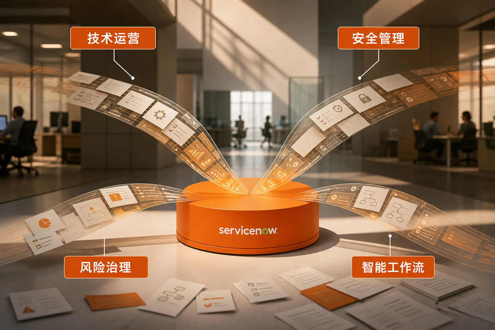
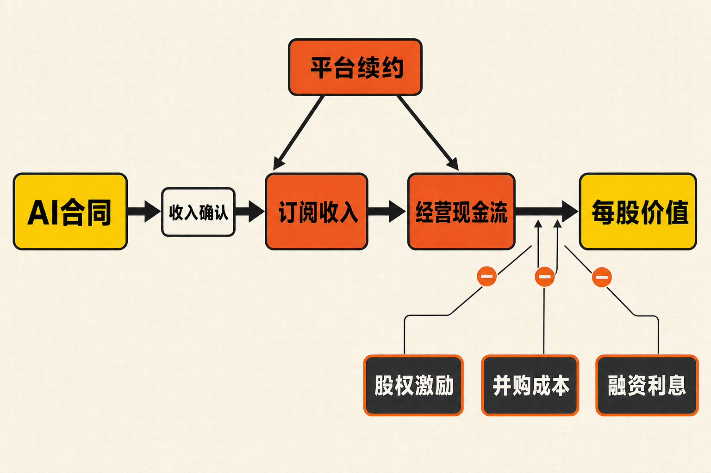

AI产品年化合同价值突破10亿美元，是ServiceNow在2026年第二季度交出的一项重要产品周期指标。但同一份成绩单还显示：名义口径cRPO增速较第一季度放缓，GAAP营业利润率降至4%，单季股权激励费用相当于总收入的约16.4%，收购Armis则显著增加了债务和整合压力。

真正值得研究的，不是“AI是否增长”，而是三个更难的问题：AI合同能否转化为收入和现金流？多产品平台能否守住续约率并扩大客单价？这种增长最终由股东获得，还是被股权激励、并购成本和融资费用持续分走？

## 公司与报告资料卡

- 公司：ServiceNow, Inc.
- 证券市场：美国证券市场
- 报告期：截至2026年6月30日的第二季度，未经审计
- 披露币种：美元
- 主要业务：面向企业的数字工作流、IT管理、安全与风险以及AI平台服务
- 数据核实日期：2026年8月14日
- 口径说明：ACV为年化合同价值；cRPO为预计未来12个月确认的剩余履约义务；两者均不等于当季收入或现金流

## 一、商业模式：订阅收入是基本盘，平台扩张决定上限

据ServiceNow《2026年第二季度财务业绩》披露，公司当季GAAP总收入为39.87亿美元，同比增长24%；其中GAAP订阅收入为38.77亿美元，同比增长24.5%，占总收入约97%。这说明公司商业模式仍以企业订阅为绝对核心，其他收入在整体结构中的比重很小。（来源：ServiceNow 2026年第二季度财务业绩，披露于2026-07-22）

这类模式的价值并不只来自一次软件销售，而来自客户续约、增加席位和工作流，并把更多部门接入同一平台。管理层在第二季度电话会上称，续约率为98%；前20大交易中有18笔包含至少八种产品，ITSM、ITOM以及安全与风险产品分别出现在15笔、18笔和16笔交易中。

上述事实支持一种经营推断：ServiceNow正在从单一IT服务管理工具，转向承载数据、治理、安全和跨部门流程的平台。产品组合越深，迁移时需要重建的流程、权限和数据关系越多，转换成本可能越高。但公司没有披露各产品的独立收入、毛利率或留存率，因此“多产品成交”尚不能直接证明每一条产品线都形成了同等强度的壁垒。

## 二、增长驱动：AI迈过10亿美元，仍需完成收入转化

根据公司第二季度业绩公告及电话会材料，ServiceNow的AI产品ACV已突破10亿美元，AI净新增ACV环比增长超过40%；投入生产的智能体AI客户数在九个月内增至原来的9倍。包含五种及以上ServiceNow AI产品的交易数量同比增至5.5倍，百万美元以上AI交易数量约增至原来的3倍。

这些数据说明AI已经不只是展示功能，而开始进入企业合同。不过，ACV是合同价值的年化度量，不是当季已确认收入，更不是已经收到的现金。管理层提出2026年底AI ACV超过15亿美元，也属于前瞻性目标，不能直接外推为同期收入或利润增长。

大客户扩张提供了另一组证据。公司第二季度完成123笔净新增ACV超过100万美元的交易，同比增长近40%；年ACV超过500万美元的客户达到658家，同比增长约23%，也高于第一季度末的630家。这表明平台扩张仍在继续，但披露资料没有拆分Armis并表带来的客户贡献，因而无法精确还原有机增长。

产品周期的第二条主线是安全。ServiceNow向美国证券交易委员会提交的文件显示，公司于2026年4月20日以约78亿美元现金收购Armis，希望把联网设备安全、主动网络安全和漏洞响应能力接入自身安全工作流。若Armis能与CMDB、AI Control Tower及安全和风险产品实现交叉销售，平台覆盖面和转换成本可能进一步上升；这是基于产品组合的推断，并非收购完成本身已经证明的结果。

## 三、cRPO真的失速了吗？答案比表面数字复杂

截至2026年6月30日，ServiceNow的GAAP cRPO为132.0亿美元，同比增长21%；固定汇率cRPO为132.8亿美元，同比增长21.5%。相比之下，第一季度GAAP cRPO同比增长22.5%，固定汇率增速为21%。换言之，名义增速顺序下降1.5个百分点，但固定汇率增速反而提高0.5个百分点。（来源：ServiceNow 2026年第一、第二季度财务业绩）

因此，将第二季度概括为“cRPO全面放缓”并不准确。更谨慎的结论是：汇率影响了名义增速，而固定汇率需求暂未显示同等幅度的降温。但反例同样重要——公司第一季度曾预计Armis将为第二季度cRPO增速贡献约125个基点，且部分Armis合同因包含便利终止条款，不能全部计入cRPO。现有披露不足以精确剥离收购后的有机增速。

此外，美国联邦客户需求使一部分本地部署订阅收入从第三季度提前到第二季度，既抬高了当季表现，也给下一季度制造了时点压力。公司给出的2026年第三季度订阅收入指引为39.75亿至39.80亿美元，低于路透社报道所引述的当时市场平均预期约40亿美元。公司还估计，美元走强将给第三季度cRPO带来约3500万美元的同比逆风。

## 四、财务质量：高调整后利润率背后的真实成本

第二季度，ServiceNow实现GAAP营业利润1.62亿美元，GAAP营业利润率为4%，而上年同期分别为3.58亿美元和11%。同期非GAAP营业利润为11.73亿美元，非GAAP营业利润率为29.5%。两种口径之间超过10亿美元的差额，不能被简单视作无关噪音。

据公司披露，主要调整项包括6.55亿美元股权激励、2.19亿美元所购无形资产摊销、7500万美元并购相关成本以及6200万美元遣散成本。其中股权激励虽然属于非现金费用，却会稀释现有股东权益；无形资产摊销和并购支出则反映收购战略的实际经济代价。

现金流也需要分层观察。公司第二季度经营现金流为5.87亿美元，低于上年同期的7.16亿美元。公司列示的非GAAP自由现金流为6.34亿美元，但这一数字包含对并购相关现金成本的调整，不能直接当作未经调整的现金创造能力。

拉长到2026年上半年，公司经营现金流为22.57亿美元，上年同期为23.93亿美元；资本开支由3.95亿美元降至2.55亿美元。资本开支下降缓冲了现金流压力，但同期业务合并净现金支出达到87.76亿美元。由此看，近期财务风险的主要来源不是日常资本开支，而是并购形成的现金消耗、债务与整合成本。（来源：ServiceNow 2026年第二季度财务业绩，披露于2026-07-22）

## 五、壁垒与竞争：优势来自组织嵌入，而非一个AI模型

ServiceNow宣称的差异化基础包括CMDB、AI Control Tower、跨部门工作流，以及连接不同云、模型和数据源的能力。其潜在壁垒并非单个模型参数，而是企业长期配置的流程、数据关系、权限治理和实施体系。

这能解释为何98%的续约率、多产品大单和大客户数量增长比单项AI演示更重要。若客户已在同一平台管理IT运营、安全、风险和其他工作流，新AI功能可以沿现有数据与权限体系分发，降低采购和部署摩擦。

但竞争反例也很明确。路透社报道指出，市场担忧AI原生工具可能替代部分传统SaaS功能。潜在竞争不只来自同类企业软件平台，也来自AI原生工具、云平台、客户自建工作流和单点安全产品。若模型能力逐渐标准化，客户可能重新比较平台溢价与自建成本。管理层称尚未观察到AI和硬件支出改变销售周期，但这只是管理层观察，仍需后续数据验证。

## 六、估值敏感因素：不报目标价，只看四组变量

估值讨论宜采用情景而非单点预测。

乐观情景下，AI ACV较快转为订阅收入，核心平台保持两成左右的固定汇率增长，Armis成功交叉销售，续约率稳定，股权激励占收入比例持续下降。此时增长质量改善，市场可能更愿意给予平台型软件估值。

中性情景下，AI合同增长较快但收入确认滞后，Armis贡献收入同时拖累利润率，cRPO维持增长却逐步降速。公司仍具平台优势，但估值将更多取决于现金流兑现，而不是合同故事。

承压情景下，剔除汇率和收购后有机增长弱于表面数字，客户采用AI却压缩其他软件预算，股权激励长期维持高位，债务融资成本上升。即使名义收入仍增长，股东可获得的每股经济价值也可能受到挤压。

公司将2026年订阅收入指引上调至157.60亿至157.80亿美元，并预计全年GAAP营业利润率10%、非GAAP营业利润率31.5%、股权激励约占总收入15%、非GAAP自由现金流率35%。真正影响估值的不是其中某一个数字，而是GAAP与非GAAP差距能否收窄。

管理层在2026年金融分析师日提出，到2030年订阅收入超过300亿美元、AI约占ACV的30%，并在2029年把股权激励降至收入的10%以下。这些只能作为情景输入，不能视作已经实现的经营事实。

## 七、下行风险与跟踪清单

第一，有机增长低于披露总增速的风险。Armis预计为部分增长指标贡献约125个基点，汇率和收入前置又影响季度可比性。需跟踪固定汇率cRPO、剔除并购后的订阅增速，以及净新增ACV。

第二，AI商业化不及合同热度的风险。ACV突破10亿美元不等于收入和现金流已经兑现。需跟踪AI ACV转化、AI产品续约、投入生产的客户数，以及百万美元AI交易能否持续增长。

第三，利润质量和稀释风险。第二季度股权激励约占总收入16.4%，高于公司2029年低于10%的目标。需跟踪GAAP营业利润率、股权激励占收入比例、稀释后股本和回购能否抵消稀释。

第四，并购和融资风险。监管文件显示，用于Armis收购的40亿美元无担保定期贷款于2026年10月16日到期，利率与SOFR及信用评级挂钩；第二季度末长期债务净额为54.35亿美元，而2025年末为14.91亿美元。需跟踪再融资安排、利息费用、Armis客户留存及利润率恢复进度。

第五，平台被拆分或替代的风险。若客户转向AI原生单点工具、云平台或自建工作流，多产品捆绑未必长期等于定价权。需持续观察续约率、前20大交易的产品数量、安全产品渗透以及竞争者定价。

## 结语：十亿美元是起点，不是答案

ServiceNow第二季度展示了平台扩张的强证据：订阅收入保持两成以上增长，AI ACV突破10亿美元，大客户数量和多产品交易继续增加。与此同时，名义cRPO增速、GAAP利润率、经营现金流、股权激励和Armis融资又提醒投资者，这不是一条没有代价的增长曲线。

综合现有材料，平台壁垒有能力缓冲竞争，却尚不足以证明它能完全抵消有机增速、利润质量和资本配置风险。未来几个季度更关键的验证，不是AI合同还能增加多少，而是这些合同能否变成可持续收入、未经大幅调整的现金流，以及更高的每股经济价值。

本文仅供信息交流，不构成投资建议。市场有风险，投资决策应结合个人风险承受能力并独立判断。

## 参考资料

1. ServiceNow Investor Relations：《ServiceNow Reports Second Quarter 2026 Financial Results》（披露于2026-07-22）

   https://investor.servicenow.com/news/news-details/2026/ServiceNow-Reports-Second-Quarter-2026-Financial-Results/default.aspx

2. ServiceNow Investor Relations：《ServiceNow Reports First Quarter 2026 Financial Results》（披露于2026-04-22）

   https://investor.servicenow.com/news/news-details/2026/ServiceNow-Reports-First-Quarter-2026-Financial-Results/default.aspx

3. Reuters：《ServiceNow raises annual subscription revenue forecast again on AI-driven demand》（发布于2026-07-22）

   https://www.investing.com/news/stock-market-news/servicenow-raises-annual-subscription-revenue-forecast-again-on-aidriven-demand-4806945

4. Benzinga：《Full Transcript: ServiceNow Q2 2026 Earnings Call》（发布于2026-07-22）

   https://www.benzinga.com/news/26/07/60627210/full-transcript-servicenow-q2-2026-earnings-call

5. U.S. Securities and Exchange Commission / ServiceNow, Inc.：《Form 8-K: Entry into a Material Definitive Agreement》（披露于2026-04-17）

   https://www.sec.gov/Archives/edgar/data/1373715/000137371526000054/now-20260417.htm

6. U.S. Securities and Exchange Commission / ServiceNow, Inc.：《ServiceNow Prospectus Supplement: Senior Notes Offering and Armis Acquisition Disclosure》（披露于2026-05-13）

   https://www.sec.gov/Archives/edgar/data/1373715/000119312526221929/d33584d424b2.htm

7. ServiceNow Investor Relations：《2026 Financial Analyst Day》（发布于2026-05-04）

   https://investor.servicenow.com/events-and-presentations/financial-analyst-day/default.aspx
