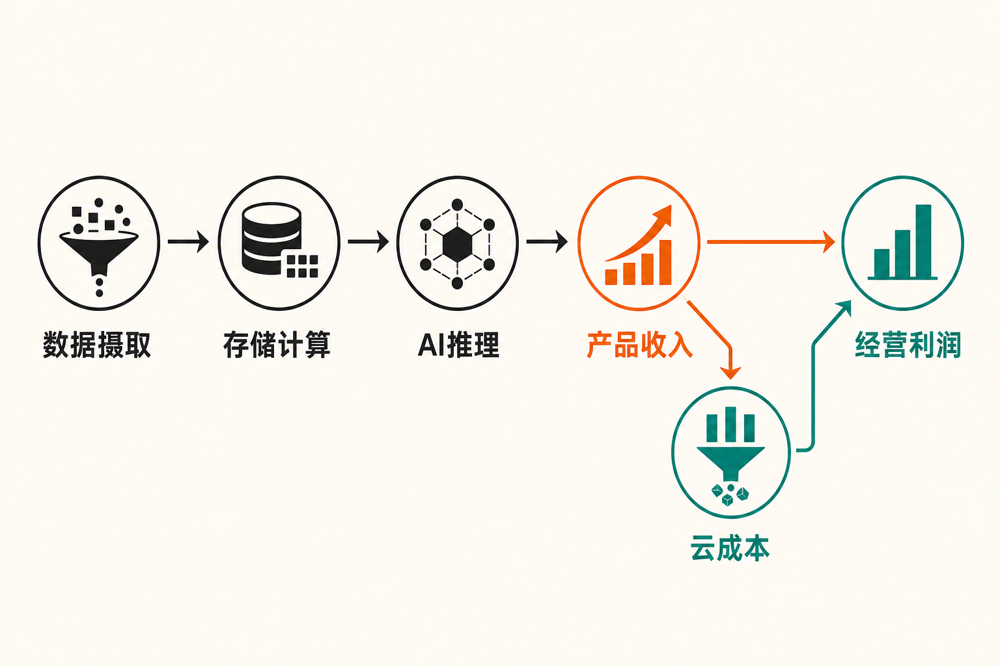

Snowflake的FY2027第二季度已经在2026年7月31日结束，但正式业绩要到9月2日美股收盘后才会公布。因此，眼下能够严谨讨论的不是“Q2交出了怎样的成绩单”，而是：在上季度产品收入增长加速、AI产品密集发布之后，公司能否把更多平台消费转化为可持续利润，并让市场给予的高预期得到财务数据支持？

这个问题的矛盾很清楚。据Snowflake投资者关系页面披露，FY2027第一季度产品收入同比增长34%，管理层给出的第二季度产品收入指引却是同比增长约30%；与此同时，第一季度非GAAP经营利润率达到12%，但GAAP口径仍亏损2.956亿美元。增长正在加速，利润却仍然高度依赖调整口径——这正是第二季度最需要核验的地方。（来源：Snowflake FY2027第一季度业绩公告，披露于2026-05-27）

## 公司与报告期资料卡

- **公司主体：** Snowflake Inc.
- **证券市场：** 美国公开市场；本期资料未明确列示交易所名称，电话会文件使用“SNOW-US”标识
- **研究性质：** FY2027第二季度财报前瞻，并非已公布的季度业绩复盘
- **第二季度报告期：** 截至2026年7月31日
- **计划披露日期：** 2026年9月2日美股收盘后
- **财务币种：** 美元
- **最近一期实际财务数据：** 截至2026年4月30日的FY2027第一季度未经审计数据
- **数据核实日期：** 2026年8月31日

Snowflake在8月3日的公告中称客户数已超过13,900家，但公告没有披露第二季度收入、利润或现金流。因而下文凡涉及Q2的数据，均明确标为管理层指引或待验证变量，不能视作已实现结果。（来源：Snowflake第二季度业绩发布日期公告，披露于2026-08-03）

## 商业模式：收入取决于消费，而不只是签约

Snowflake的核心收入来自客户在数据平台上的实际使用。根据公司FY2027第一季度Form 10-Q，产品收入为13.343亿美元，上年同期为9.968亿美元；总收入为13.910亿美元，上年同期为10.421亿美元。产品收入约占总收入96%，专业服务及其他收入规模较小。

这种模式与按席位收取固定订阅费的软件不同：客户摄取、存储、分析和处理的数据越多，平台消费通常越高。公司称，既有客户的容量协议贡献了第一季度约97%的收入，增长主要由已有客户增加平台消费推动。经营上的好处是，Snowflake可以随着客户工作负载扩大而持续增收；反面则是，客户一旦优化查询、控制预算或推迟项目，收入确认也可能较快受到影响。（来源：Snowflake FY2027第一季度Form 10-Q，提交于2026-05-29）

截至2026年4月30日，公司净收入留存率为126%，意味着可比客户群的消费仍在扩大；过去12个月产品收入超过100万美元的客户为779家，同比增长29%，这些客户贡献约68%的产品收入。没有单一客户占收入10%以上，降低了单一客户集中度，但大客户群体一旦同步压缩云支出，仍会形成明显压力。

同期剩余履约义务，即RPO，为92.1亿美元，同比增长38%，其中约一半预计在未来12个月确认。不过，RPO包含递延收入和未来可开票合同额，不等于当期收入，也不包括没有最低采购承诺的按需安排。**本文的判断是**：RPO提供了需求可见度，却不能替代对实际消费速度的观察。

## 增长驱动：从数据仓库延伸到企业AI控制层

第一季度产品收入增速由上一季度的30%升至34%。管理层在5月27日电话会上将加速归因于核心数据平台和AI收入共同增长，并称Snowflake Intelligence与CoCo属于采用速度最快的新产品。不过，公司没有披露AI收入金额、占产品收入的比例或独立毛利率，因此能够确认的是“AI采用与消费增长同时出现”，而不是“AI已经贡献了多少增量利润”。

产品周期正在继续扩展。6月发布的CoCo原名Cortex Code，定位是在受治理的数据环境中协助开发应用、部署AI并自动化工作流；Datastream则是一项兼容Apache Kafka的全托管流数据服务。若客户把实时数据摄取、存储、计算和AI推理都放在同一平台，Snowflake理论上可以获得更多可计费工作负载。

但这些产品处于不同成熟阶段，部分功能仅为公开或私有预览。Fanatics、Thomson Reuters和WHOOP等案例能够证明已有企业使用，却不能据此推算整体渗透率、续费率或投资回报。**合理推断是**，新品先改善平台覆盖范围，再逐步影响消费；把发布公告直接等同于规模化收入，则缺乏证据。（来源：Snowflake CoCo与Datastream产品公告，披露于2026-06-02）

7月发布的Cortex AI Gateway进一步把访问控制、审计、模型路由和成本管理纳入Snowflake。它既可能增强平台黏性，也暴露了企业采用AI时的现实约束：客户不仅关心模型效果，也担心令牌费用失控。Gateway当时仍计划进入公开预览，且没有披露价格、付费客户数或收入贡献，所以它更适合作为下一阶段产品周期的领先信号，而非第二季度利润已经兑现的证据。

## 财务质量：收入增长与利润增长不是一回事

Snowflake FY2027第一季度总收入同比增长33%，GAAP产品毛利率为71%，与上年同期持平。第三方云基础设施成本同比增加8,600万美元，主要由平台消费增加造成；采购折扣抵消了部分尚未规模化的新产品成本。这意味着，AI带来的高频推理即使推高收入，也只有在单位算力成本、模型调用效率和采购折扣同步改善时，才能沉淀为更高利润。

利润口径的差异尤其重要。公司披露，第一季度非GAAP经营利润率为12%，同比扩大逾300个基点；管理层将其归因于收入增长和克制招聘。但SEC文件显示，同期归属于普通股股东的GAAP净亏损仍为2.956亿美元，稀释后每股亏损0.86美元，只是较上年同期4.301亿美元的亏损有所收窄。

主要差异之一是股权激励。第一季度股权激励费用为4.025亿美元，相当于当季收入的29%，甚至高于GAAP净亏损。截至2026年4月30日，尚未确认的未归属奖励成本约38亿美元，预计在加权平均2.9年内确认。**本文观点是**：非GAAP利润率可以观察主营业务的经营杠杆，但若忽略长期股权激励及潜在摊薄，就会高估利润向股东回报转化的速度。（来源：Snowflake FY2027第一季度Form 10-Q，提交于2026-05-29）

现金流同样需要拆开看。第一季度GAAP经营现金流为2.432亿美元；公司定义的非GAAP自由现金流为2.328亿美元，即经营现金流减去1,045万美元资本开支。正自由现金流是真实的流动性优势，但经营现金流包含5.690亿美元非现金调整，因此不能由此推断GAAP利润已经转正。

## 壁垒与竞争：统一平台能否抵消算力商品化

从现有资料看，Snowflake试图建立的壁垒不是某个单一模型，而是受治理数据、实时摄取、计算、应用开发、AI代理和成本控制的一体化平台。客户把更多数据和工作流留在同一治理边界内，迁移与重新整合的成本可能上升；消费型计费又让平台能够分享客户工作负载扩张。

不过，本期资料没有提供具名竞争对手的同期收入、留存率或毛利率，不能做可靠的量化同业排名。竞争压力可从两个方向理解：一是其他数据与云平台争夺相同工作负载；二是模型和计算能力逐渐标准化后，客户可能更关注价格、开放性与跨平台迁移能力。Gateway支持第一方及第三方代理，说明Snowflake希望成为中立控制层；但这也意味着其必须证明，统一治理带来的价值足以覆盖平台费用。

供应商关系同样具有两面性。公司在2026年4月修订云基础设施协议，承诺截至2031年3月31日五年累计最低支出60亿美元，每年最低支出约9亿至12.5亿美元。管理层称协议带来更低的基础设施及带宽成本，这可能支撑毛利率；如果实际消费不及预期，最低采购承诺又会成为固定负担。

## 高估值由什么支撑：不算目标价，只看变量

现有材料没有提供可核验的市值或估值倍数，因此本文不计算目标价，也不把“高估值”包装成精确结论。可以确认的是，Axios援引FactSet称，Snowflake发布第一季度业绩后，股价单日上涨近37%，为上市以来最佳单日表现。这说明市场定价对产品收入增速、AI叙事和指引变化高度敏感，但股价反应并不等于内在价值已经得到验证。（来源：Axios《As software stocks struggle, Snowflake shows a way out》，披露于2026-05-29）

可以用三个不设目标价的情景观察估值敏感度：

- **积极情景：** Q2产品收入达到或超过14.15亿至14.20亿美元指引，核心平台与AI共同增长；产品毛利率稳定，非GAAP经营利润率达到或高于12.5%，同时GAAP亏损和股权激励占收入比例继续下降。
- **中性情景：** 产品收入约达指引，但AI收入仍缺少独立披露，毛利率改善有限。增长叙事延续，利润兑现速度仍需更多季度验证。
- **压力情景：** 消费增速低于约30%的指引，或AI工作负载推高基础设施成本，使收入增长没有转化为毛利和现金流改善。高预期可能放大估值波动。

公司对FY2027全年的指引是产品收入58.4亿美元、同比增长31%，非GAAP经营利润率13.5%，调整后自由现金流率23%。这些都是管理层预测，不是已实现业绩。Observe收购预计为全年产品收入增速贡献约1个百分点，判断有机增长时还需剔除并购因素。

## 下行风险与后续跟踪清单

第一，**消费增长回落风险**。Q2产品收入同比增速指引约30%，低于Q1的34%。应持续跟踪实际产品收入、净收入留存率、百万美元客户数，以及RPO向收入转化的速度。

第二，**AI收入增长但单位经济性恶化**。应观察GAAP产品毛利率、第三方云成本增幅，以及管理层是否开始披露AI收入、推理成本和AI产品毛利。

第三，**调整后利润与股东利润长期分离**。应跟踪GAAP经营亏损、GAAP净亏损、股权激励金额及其占收入比例，而不能只看非GAAP经营利润率。

第四，**云采购承诺与需求错配**。五年60亿美元最低支出可以换取折扣，也可能在消费不达预期时形成压力。需要同时观察实际平台消费、采购承诺履行情况和毛利率变化。

第五，**新品商业化慢于发布节奏**。CoCo、Gateway和动态模型路由仍有预览功能。8月公布的内部测试显示，特定dbt任务令牌效率最高提升3倍，另一测试提高25%，但结果未经独立验证，也发生在Q2结束后，不能用于证明Q2贡献。后续应跟踪正式可用时间、付费客户数、实际用量和客户留存。（来源：Snowflake动态模型路由公告，披露于2026-08-18）

## 结语：第二季度要验证的不是AI热度，而是利润传导

截至2026年8月31日，Snowflake已经证明其核心平台消费仍在扩张，也展示了从数据平台延伸到企业AI开发和控制层的产品路线。但它尚未用公开数据证明AI收入的绝对规模、单位毛利或对自由现金流的净贡献。

因此，FY2027第二季度真正重要的不是再增加多少AI产品名称，而是三组关系能否同步改善：产品收入增长能否维持，GAAP毛利能否抵御推理成本压力，以及非GAAP经营杠杆能否逐步转化为更低的GAAP亏损和更可持续的股东回报。在这些指标得到连续验证之前，对Snowflake的评价更适合保持中性：增长证据正在增强，利润质量仍待证明，高预期也意味着更高的兑现门槛。

**本文仅供信息交流，不构成投资建议。市场有风险，投资决策应基于个人风险承受能力及独立研究。**

## 参考资料

1. Snowflake Inc.：《Snowflake to Announce Financial Results for the Second Quarter of Fiscal 2027 on September 2, 2026》（2026-08-03）  
https://www.snowflake.com/en/news/press-releases/snowflake-to-announce-financial-results-for-the-second-quarter-of-fiscal-2027/

2. Snowflake Investor Relations：《Snowflake Reports Financial Results for the First Quarter of Fiscal 2027》（FY2027第一季度，2026-05-27）  
https://investors.snowflake.com/financials/quarterly-results/default.aspx

3. Snowflake Inc. / U.S. Securities and Exchange Commission：《Snowflake Inc. Quarterly Report on Form 10-Q for the Quarterly Period Ended April 30, 2026》（2026-05-29）  
https://www.sec.gov/Archives/edgar/data/1640147/000164014726000030/snow-20260430.htm

4. Snowflake Investor Relations / FactSet CallStreet：《Snowflake, Inc. Q1 2027 Earnings Call — Corrected Transcript》（2026-05-27）  
https://s26.q4cdn.com/463892824/files/doc_financials/2027/q1/CORRECTED-TRANSCRIPT_-Snowflake-Inc-SNOW-US-Q1-2027-Earnings-Call-27-May-2026-5_00-PM-ET.pdf

5. Snowflake Inc.：《Snowflake CoCo Redefines Enterprise AI Development as the Coding Agent Built for Faster, Easier, and More Powerful Innovation Anywhere》（2026-06-02）  
https://www.snowflake.com/en/news/press-releases/snowflake-coco-redefines-enterprise-ai-development-as-the-coding-agent-built-for-faster-easier-and-more-powerful-innovation-anywhere/

6. Snowflake Inc.：《Snowflake Advances the Trusted Agentic Enterprise Era with Unified Monitoring and Cost Management》（2026-07-28）  
https://www.snowflake.com/en/news/press-releases/snowflake-advances-the-trusted-agentic-enterprise-era-with-unified-monitoring-and-cost-management/

7. Snowflake Inc.：《Snowflake Unlocks Better AI Economics with Dynamic Model Routing, Delivering More Value to Customers》（2026-08-18）  
https://www.snowflake.com/en/news/press-releases/snowflake-unlocks-better-ai-economics-dynamic-model-routing/

8. Axios：《As software stocks struggle, Snowflake shows a way out》（2026-05-29）  
https://www.axios.com/2026/05/29/salesforce-snowflake-software-stocks
