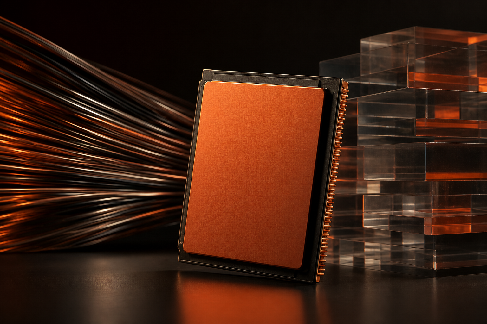
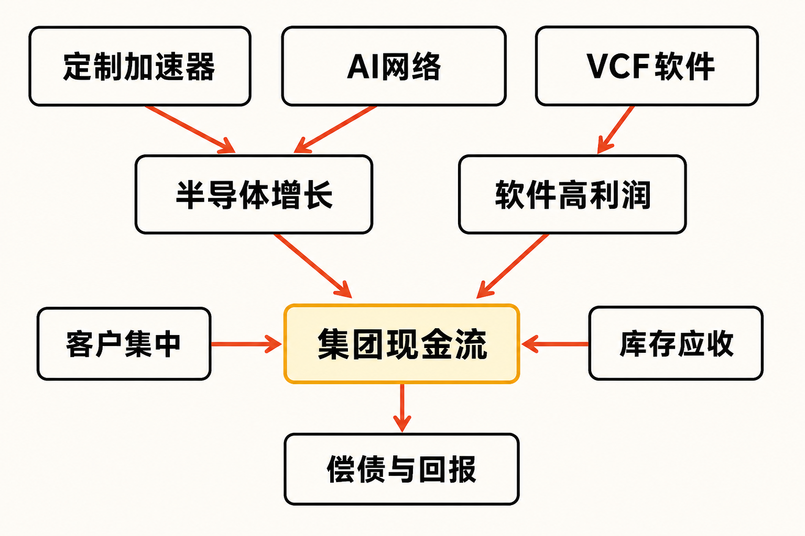

博通交出了一份增长与风险同时放大的财报。

据公司 FY2026 第二季度业绩公告，报告期截至 2026 年 5 月 3 日，博通季度净营收达到 221.87 亿美元，同比增长 48%；其中 AI 半导体收入为 108 亿美元，同比增长 143%。与此同时，公司自由现金流达到 102.62 亿美元，相当于季度营收的 46%。（来源：博通 FY2026 Q2 业绩公告，披露于 2026-06-03）

真正需要研究的并不是“AI 有没有增长”，而是三个更困难的问题：这种增长能否按计划交付，少数大客户是否会放大波动，以及 VMware 带来的高利润软件业务能否继续为债务和估值提供缓冲。

## 公司与报告资料卡

- **公司：**Broadcom Inc.（博通）
- **证券市场：**美国证券市场，代码 AVGO
- **报告期：**FY2026 第二季度，截至 2026 年 5 月 3 日
- **财务口径：**未经审计 GAAP；同时披露部分非 GAAP 指标
- **币种：**美元，报表单位为百万美元
- **数据核实日期：**2026 年 8 月 15 日

需要说明的是，本文所说的“VMware 现金流”并非一项独立披露指标。博通只公布基础设施软件分部的收入和利润，没有披露 VMware 单体现金流。因此，把集团自由现金流全部归功于 VMware，并没有来源依据。

## 两台增长引擎：AI 半导体与基础设施软件

博通当前商业模式可以概括为两部分。

第一部分是半导体解决方案，包括定制 AI 加速器、AI 网络产品以及其他芯片业务。FY2026 第二季度，该分部收入为 150.09 亿美元，同比增长 79%，占集团收入 68%；上年同期占比为 56%。公司把增长主要归因于定制 AI 加速器和 AI 网络需求。

第二部分是以 VMware Cloud Foundation（VCF）为重要组成的基础设施软件。该分部当季收入为 71.78 亿美元，同比增长 9%，占集团收入 32%。博通在 10-Q 中将增长主要归因于 VCF 需求。（来源：博通 FY2026 Q2 Form 10-Q，披露于 2026-06-10）

两者的作用并不相同：AI 芯片贡献高增速，软件则提供更高的利润率。根据电话会中的管理层非 GAAP 口径，软件毛利率约为 93%、营业利润率约为 79%；半导体毛利率约为 70%、营业利润率约为 62%。这是博通当前财务模型的核心——用高利润软件为高速扩张但产品周期更强的半导体业务提供缓冲。

## 增长驱动：订单很强，但订单不是收入

当季 108 亿美元 AI 半导体收入中，管理层称约 40% 来自 AI 网络产品，其余主要与定制加速器相关。电话会文字记录还显示，当季 AI 半导体 bookings 超过 300 亿美元，约为当季出货收入的 2.8 倍。

这是需求可见度增强的证据，但必须区分事实与推断：bookings 不是 GAAP 收入，也不必然等于不可撤销的积压订单。客户部署延期、项目调整、供应限制或者验收节奏变化，都可能影响订单转化。

管理层预计 FY2026 全年 AI 半导体收入为 560 亿美元、同比增长约 180%，并重申 FY2027 超过 1000 亿美元的目标；公司对 FY2026 第三季度的指引则是总收入约 294 亿美元，其中 AI 半导体收入约 160 亿美元、同比增长超过 200%。这些都是截至 2026 年 6 月 3 日的前瞻判断，并非已实现业绩。（来源：博通 FY2026 Q2 电话会文字记录，2026-06-03）

软件侧也进入新的产品周期。博通于 2026 年 5 月发布 VCF 9.1，将其定位为面向生产级 AI、现代应用和传统工作负载的统一私有云平台，并支持 AMD、Intel 和 NVIDIA 的异构计算基础设施。事实是产品覆盖范围扩大；本文的推断是，如果企业 AI 推理更多落在私有云，VCF 的平台价值和迁移成本可能提高。但公告没有提供付费客户数、续约率或合同金额，商业成效仍待验证。

## 财务质量：现金流强，不等于没有代价

利润方面，博通 FY2026 第二季度 GAAP 净利润为 93.10 亿美元，同比增长 88%；非 GAAP 净利润为 120.74 亿美元，同比增长 55%。两者不能混用，差异包含 19.67 亿美元收购相关无形资产摊销、20.92 亿美元股权激励及税务调整。

公司当季 GAAP 营业利润为 107.88 亿美元，而调整后 EBITDA 为 152.44 亿美元，占收入 69%。后者排除了股权激励、收购摊销等项目，更适合观察经营趋势，却不能替代 GAAP 利润或可分配现金。

现金流方面，当季经营活动现金流为 104.93 亿美元，资本开支为 2.31 亿美元。公司定义的自由现金流为 102.62 亿美元，即经营现金流减固定资产购置；该指标没有扣除股息、股票回购或偿债支出。

资产负债表仍需单独审视。截至 2026 年 5 月 3 日，公司未偿债务本金为 667.20 亿美元，现金及现金等价物为 196.28 亿美元，据此计算的净债务约为 470.92 亿美元；当季利息费用为 7.76 亿美元。上半财年公司产生 187.53 亿美元经营现金流，同时回购股票 84.50 亿美元、支付股息 61.78 亿美元并偿还债务 49 亿美元。本文观点是，博通具备较强的偿债资源，但现金究竟优先用于降杠杆还是股东回报，仍会影响估值中的风险折价。

另一个会计细节来自软件收入。FY2026 第二季度，软件安排中的前置许可证收入为 19.64 亿美元，并计入产品收入；上年同期可比数字为 18.03 亿美元。部分合同价值可以在控制权转移时一次确认，因此基础设施软件的 GAAP 收入、ARR 与当期订阅现金回收并不是同一个概念。

## 壁垒与竞争：协同存在，集中度也在上升

博通的壁垒来自定制加速器、AI 网络与企业基础设施软件的组合：前者嵌入超大规模客户的长期项目，后者依托企业虚拟化和私有云工作负载。VCF 对多家 CPU、GPU 供应商的支持，也降低了软件平台与单一硬件生态绑定的风险。

但现有资料不足以支持具体市场份额或全面的同业财务比较。可确认的竞争压力包括：AI 客户自主研发或调整芯片方案，以及企业迁移到替代虚拟化和云平台。管理层列举的核心 AI 客户只有六家，说明项目深度可能构成壁垒，客户数量有限却同时构成脆弱点。

10-Q 显示，单一半导体分销客户的直接销售占当季及上半财年净营收 42%，上年同期为 29%；经所有渠道计算，前五大终端客户约占净营收 45%，上年同期为 40%。前一个数字衡量渠道集中度，后一个衡量终端需求集中度，两者不能相加。

## 高估值看什么：三个情景，不给目标价

**兑现情景：**如果第三季度约 160 亿美元 AI 收入指引顺利实现，库存转化为出货和现金，同时 VCF 的 ARR 与收入保持增长，那么 AI 规模效应和软件高利润率可以共同支撑现金创造能力。

**分化情景：**如果 AI 收入增长仍快，但半导体占比持续上升，软件增速停留在较低水平，综合毛利率可能受到产品组合影响。FY2026 第二季度 GAAP 毛利率为 69%，仅比上年同期高 1 个百分点，已经体现规模收益与产品组合之间的拉扯。

**压力情景：**如果大客户推迟部署、订单转化不及预期，库存和应收账款将成为现金流压力。公司库存从 2025 年 11 月 2 日的 22.70 亿美元升至 2026 年 5 月 3 日的 43.28 亿美元，应收账款同期由 71.45 亿美元升至 108.30 亿美元。管理层称备货是为下半年 AI 增长，但这需要后续收入和回款验证。

TechRadar Pro 记录，博通市值从 2026 年 6 月 2 日约 2.28 万亿美元降至 6 月 9 日前后约 1.88 万亿美元，并称两个交易日跌幅约 19%。这是特定时点的市场观察，不证明公司必然高估；它说明市场对远期 AI 增长的预期差，可能比单季度现金流更能驱动估值波动。

## 至少要持续跟踪的五项风险

1. **客户集中风险：**跟踪单一分销客户收入占比、前五大终端客户占比，以及六个核心 AI 客户的项目进度。
2. **订单转化风险：**比较 AI bookings、实际出货收入、库存天数和应收账款增速，观察备货是否转化为现金。
3. **软件增长质量风险：**同时跟踪基础设施软件 GAAP 收入、ARR、前置许可证收入、续约率和客户数量，避免只看单一口径。
4. **杠杆与资本配置风险：**跟踪净债务、利息费用、偿债额，以及回购和分红占自由现金流的比例。
5. **客户与监管风险：**CISPE 于 2026 年 3 月称已就 VMware 云服务商项目终止、捆绑、预付款及最低承诺等安排向欧盟方面提交竞争投诉。该内容是利益相关行业组织的指控，不是监管裁决；后续应观察欧盟行动、博通回应以及欧洲渠道和客户留存情况。

## 结语

博通 FY2026 第二季度证明了定制 AI 加速器与 AI 网络正在形成强劲收入周期，集团也产生了可观的现实现金流。VMware 所在的软件业务凭借较高利润率，确实为集团盈利和偿债能力提供了缓冲，但现有披露不能证明 VMware 单独创造了集团全部自由现金流。

中性地看，高估值能否延续，取决于一组可以验证的变量：AI 订单能否按时转化、客户集中度是否下降、库存与应收账款能否回落、VCF 增长是否来自可持续续约，以及自由现金流能否兼顾降杠杆与股东回报。增长已经发生，质量仍需连续几个季度验证。

**本文仅供信息交流，不构成投资建议。证券价格可能大幅波动，读者应根据自身情况独立判断并承担风险。**

## 参考资料

1. Broadcom Inc.／美国证券交易委员会：《Broadcom Inc. Announces Second Quarter Fiscal Year 2026 Financial Results and Quarterly Dividend》（2026-06-03）

   https://www.sec.gov/Archives/edgar/data/1730168/000173016826000051/avgo-05032026x8kxex99.htm

2. Broadcom Inc.／美国证券交易委员会：《Broadcom Inc. Quarterly Report on Form 10-Q for the Fiscal Quarter Ended May 3, 2026》（2026-06-10）

   https://www.sec.gov/Archives/edgar/data/1730168/000173016826000054/avgo-20260503.htm

3. The Motley Fool：《Broadcom (AVGO) Q2 2026 Earnings Call Transcript》（2026-06-03）

   https://www.fool.com/earnings/call-transcripts/2026/06/03/broadcom-avgo-q2-2026-earnings-transcript/

4. Broadcom Inc.：《Broadcom Announces VMware Cloud Foundation 9.1, Enabling Secure and Cost-Effective Infrastructure for Production AI》（2026-05-05）

   https://www.broadcom.com/company/news/product-releases/64326

5. Cloud Infrastructure Service Providers in Europe：《CISPE Files Competition Complaint Against Broadcom, Urges Immediate EU Action》（2026-03-19）

   https://www.cispe.cloud/cispe-files-competition-complaint-against-broadcom

6. TechRadar Pro：《Nvidia next? Broadcom's value dropped by more than $440 billion as it posts disappointing forward outlook, prompting fears of AI bubble burst》（2026-06-09）

   https://www.techradar.com/pro/nvidia-next-broadcoms-value-dropped-by-more-than-usd440-billion-as-it-posts-disappointing-forward-outlook-prompting-fears-of-ai-bubble-burst）
