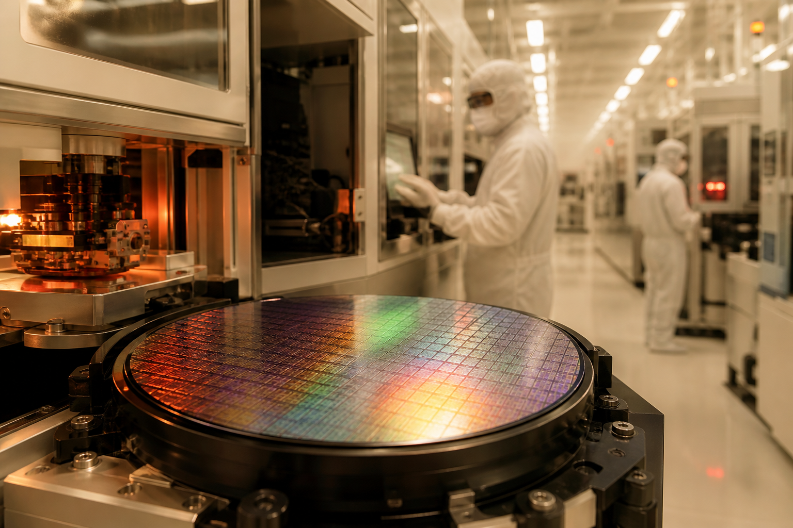
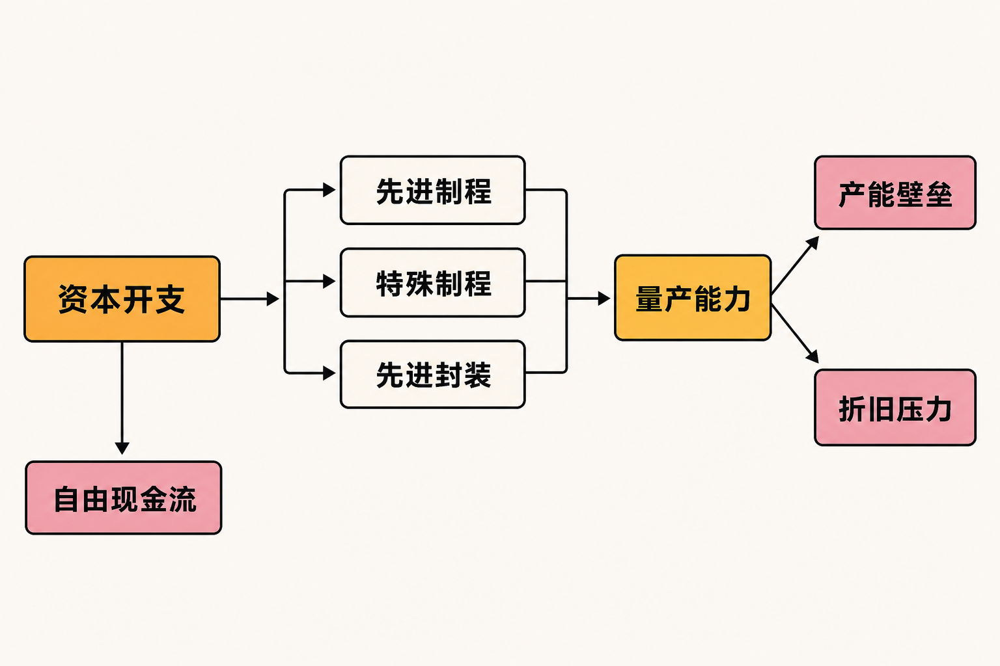

台积电2026年第二季度交出了一组看似没有悬念的增长数字：按未经审计TIFRS合并口径，公司实现营收1.270381万亿元新台币，同比增长36.0%；归属于母公司股东的净利润为7065.62亿元，同比增长77.4%。但真正值得研究的并非利润纪录，而是公司把2026年资本预算从原先的520亿至560亿美元，上调到600亿至640亿美元。

核心问题由此产生：当AI需求和2纳米周期推动收入增长后，这笔相当于620亿美元中点的投入，究竟会先转化为更难复制的产能壁垒，还是先表现为自由现金流减少、折旧增加和毛利率承压？

## 公司与报告资料卡

- **公司：**台湾积体电路制造股份有限公司（TSMC）
- **证券市场：**纽约证券交易所美国存托凭证；公司同时在台湾证券市场挂牌
- **报告期：**截至2026年6月30日的三个月及六个月
- **主要币种：**新台币；美元收入及资本预算另行列示
- **财务口径：**未经审计TIFRS合并财务报表；本文计算的简化自由现金流属于研究口径，不是公司披露的GAAP或非GAAP指标
- **数据核实日期：**2026年8月12日

## 商业模式：卖的不只是晶圆，也是量产确定性

台积电的核心模式是专业晶圆代工：客户负责芯片设计，公司提供制程开发、晶圆制造，并通过先进封装、测试、光罩等环节延伸服务。其收入最终取决于客户投片规模、制程组合、晶圆出货、价格与产能利用率。

2026年第二季度，7纳米及更先进制程合计贡献77%的晶圆收入，其中3纳米占30%、5纳米占33%、7纳米占11%，刚进入商业爬坡期的2纳米仅占3%。这意味着当前收入底盘仍由3纳米和5纳米支撑；2纳米的战略重要性已经显现，但尚未成为主要收入来源。（来源：台积电2026年第二季度业绩公告，披露于2026-07-16）

平台分类也需要谨慎解读。公司披露，高性能计算平台第二季度收入环比增长20%，占总收入66%，智能手机占22%。HPC包含AI相关需求，但并不等于“纯AI收入”，因此不能把66%全部归因于AI。

## 增长驱动：旧节点兑现利润，新节点提前占用资源

第二季度美元收入为402.0亿美元，同比增长33.7%、环比增长12.0%；按新台币计算的同比增幅则为36.0%。两种增速差异含有汇率影响，不宜混用。6月单月合并收入达到4426.80亿元新台币，同比增长67.9%；上半年累计收入为2.404484万亿元，同比增长35.6%，显示季度末需求仍强，但月度收入本身不是订单或现金回款。

增长动力来自先进制程需求、晶圆出货及较高利用率。Visible Alpha在《TSMC postQ: AI drives beat, outlook raised; higher capex weighs on sentiment》中估算，第二季度晶圆出货量较共识高4.8%，产能利用率约96.6%，而平均售价低于预期。该结论属于机构模型，但它提示：近期盈利超预期可能更多来自产量和利用率，而不只是价格提升。

另一方面，2纳米收入占比仅3%，库存天数却环比增加7天至87天。公司将这一变化主要归因于N2爬坡。换言之，新节点在大规模贡献收入之前，已经开始占用库存、设备和营运资金。这正是半导体产品周期的典型错位：成本与现金先发生，规模效益后兑现。

## 财务质量：利润很强，现金流却要看资本形成期

第二季度毛利率为67.7%，较第一季度的66.2%提高1.5个百分点；营业利益率为60.3%，净利率为55.6%。管理层将毛利率环比改善主要归因于成本改善和较高产能利用率，海外晶圆厂成本则是抵消因素。

净利润增速明显高于营收，也不能全部理解为主营业务经营杠杆。当季其他利得及损失为674.30亿元新台币，第一季度仅为10.03亿元；其中出售及按市值计量Vanguard持股产生约630亿元收益，对每股收益贡献2.24元新台币。剔除思路不是否定利润，而是区分晶圆制造的经常性盈利与非营业项目。

现金流提供了另一层观察。公司未经审计财务报表显示，第二季度经营活动现金流为7833.65亿元新台币，购置不动产、厂房及设备流出4960.02亿元。按“经营现金流减购置厂房设备”的简化研究口径计算，自由现金流约为2873.63亿元；上半年相同口径约为6355.76亿元。这个数值并非公司单独披露的指标，而且未涵盖所有可能的自由现金流调整。（来源：台积电2026年第二季度未经审计财务报表，披露于2026-07-16）

第二季度资本支出约为157亿美元，而折旧摊销为1985.38亿元新台币。资本投入明显高于当期折旧，说明产能基础正在扩张，也意味着未来折旧负担可能继续上升。截至6月底，公司现金及现金等价物为3.134218万亿元新台币，现金加有价金融工具约3.518万亿元，因而当前投入并未造成明显流动性紧张；真正的变量是下半年付款节奏和未来数年的持续投入。

## 600亿至640亿美元买到了什么？

根据第二季度业绩电话会材料，2026年资本预算的70%至80%用于先进制程，约10%用于特殊制程，约10%至20%用于先进封装、测试、光罩及其他项目。机械套用预算上下限，可推算先进制程投入约420亿至512亿美元，特殊制程约60亿至64亿美元，其余项目约60亿至128亿美元；这些只是区间测算，不是公司给出的逐项精确预算。

这笔投入构筑壁垒的逻辑有三层：领先节点需要长期研发和设备协作；量产需要持续积累良率经验；晶圆制造与先进封装协同，又会提高客户迁移成本。管理层称，从技术开发、产能准备到大规模量产需要五年以上，并会参考客户及其终端客户的多年路线图规划产能。因此，竞争不是单座工厂或单代设备的比较，而是资金、工艺、良率、交付和客户信任的复合竞争。

公司2025年度Form 20-F并未在本次资料摘要中逐一列出竞争公司名称，因此本文不凭空补充名单。可确认的竞争范围包括其他专业晶圆代工企业，以及拥有自有制造能力、同时承接外部订单的整合器件制造商。台积电的领先制程与规模构成优势，但监管文件也没有保证2纳米或海外新厂必然达到预定良率、利用率和资本回报。

## 毛利率的短期反例：收入增长不等于单位盈利同步增长

公司给出的第三季度美元收入指引为446亿至458亿美元，中点较第二季度约增长12%；毛利率指引却为65%至67%，中点较第二季度下降1.7个百分点。管理层预计，2纳米快速爬坡将在2026年下半年稀释毛利率约3至4个百分点；海外晶圆厂在早期阶段预计稀释2至3个百分点，后期可能扩大到3至4个百分点。

这些影响可能重叠，公司没有提供可以直接相加的净影响。合理的研究判断是：高利用率、成本改善和有利制程组合可以对冲部分压力，但若利用率下降，新节点初期成本、海外高成本产能与新增折旧可能同时放大毛利率波动。这是推断，不是公司利润预测。

## 估值敏感因素：不看目标价，看三组变量

在不设目标价的前提下，可以用三种经营情景理解估值敏感性。

**偏强情景：**AI及代理型AI需求延续，2纳米投片和先进封装同步提升，新产能维持高利用率。收入增长、良率改善和规模效益逐步覆盖折旧，自由现金流在资本形成期后恢复。

**中性情景：**收入保持增长，但2纳米和海外厂的初期成本先行，毛利率较第二季度高位回落；经营现金流仍为正，却有更大比例被资本开支吸收。此时估值更依赖市场对未来回报周期的耐心。

**偏弱情景：**客户需求预测过度乐观，AI基础设施建设降速或库存累积，新产能利用率低于计划。专用资产的折旧、维护及海外成本较难同步下降，自由现金流和资本回报率都会承压。

关键变量不是“资本开支越高越好”或“现金流减少必然不好”，而是新增资本能否转化为合格产能，并在折旧压力全面体现前获得足够客户投片。

## 至少要跟踪的四项下行风险

第一，**AI需求和客户集中风险**。主要客户削减采购、调整外包政策或受到出口管制，都可能影响收入与产能利用率。应持续跟踪HPC平台增速、客户投片信号和月度收入，但不能将HPC全部视为AI。

第二，**2纳米量产风险**。若良率改善或客户导入慢于计划，初期成本会延长。需要观察2纳米晶圆收入占比、库存天数、毛利率指引及管理层对爬坡进度的描述。

第三，**海外扩产成本风险**。美国累计2650亿美元投资承诺跨越多年，不能与2026年资本预算直接相加。应跟踪海外厂投产时间、利用率以及公司披露的毛利率稀释幅度。

第四，**现金流与资本错配风险**。未来三年资本投入可能显著高于过去三年。需要同时观察经营现金流、购置厂房设备现金流、折旧摊销和现金储备，避免只看利润表。

## 结语：壁垒和压力，本来就是同一笔钱的两面

台积电第二季度的事实是：先进制程需求强、利用率高、利润率处于高位，经营现金流足以覆盖当季厂房设备投入；与此同时，2纳米已开始占用库存和资本，第三季度毛利率指引回落，全年资本预算也升至600亿至640亿美元。

本文观点是，高资本开支正在强化台积电的制程、规模和客户协同壁垒，但不能据此预设投资必然获得高回报。接下来的验证重点，应从“投入了多少”转向“2纳米良率与收入占比提升多快、先进封装能否协同放量、海外产能利用率如何，以及自由现金流何时重新扩张”。

**本文仅供信息交流，不构成投资建议。科技产业及证券市场存在不确定性，读者应独立判断并自行承担相关风险。**

## 参考资料

1. 台湾积体电路制造股份有限公司投资者关系：《TSMC 2026 Q2 Quarterly Results》（2026年第二季度，披露于2026-07-16）  
https://investor.tsmc.com/english/quarterly-results/2026/q2

2. 台湾积体电路制造股份有限公司／美国证券交易委员会：《TSMC Reports Second Quarter EPS of NT$27.25（Form 6-K Exhibit 99.1）》（2026年第二季度，披露于2026-07-16）  
https://www.sec.gov/Archives/edgar/data/1046179/000104617926000451/a2q26e_withguidancexfinal.htm

3. 台湾积体电路制造股份有限公司：《2026Q2 Financial Statements（Unaudited）》（截至2026-06-30的三个月及六个月）  
https://investor.tsmc.com/english/encrypt/files/encrypt_file/reports/2026-07/114aaca0fea2050e96b91fffbab9ed04ba09cd92/FS.pdf

4. 台湾积体电路制造股份有限公司／LSEG StreetEvents：《Q2 2026 Taiwan Semiconductor Manufacturing Co Ltd Earnings Call（Edited Transcript）》（披露于2026-07-16）  
https://investor.tsmc.com/english/encrypt/files/encrypt_file/reports/2026-07/547d1696765e05ce3adb81c108ce1c8c1682b80c/TSMC%2020Q26%20Transcript.pdf

5. 台湾积体电路制造股份有限公司／美国证券交易委员会：《TSMC June 2026 Revenue Report（Form 6-K）》（2026年6月及上半年，披露于2026-07-13）  
https://www.sec.gov/Archives/edgar/data/1046179/000104617926000447/tsm-revenue20260713.htm

6. 台湾积体电路制造股份有限公司／美国证券交易委员会：《Form 20-F for the fiscal year ended December 31, 2025》（申报于2026-04-16）  
https://www.sec.gov/Archives/edgar/data/1046179/000162828026025362/0001628280-26-025362-index.htm

7. Visible Alpha／S&P Global Market Intelligence：《TSMC postQ: AI drives beat, outlook raised; higher capex weighs on sentiment》（发布于2026-07-21）  
https://www.spglobal.com/market-intelligence/en/news-insights/research/2026/07/tsmc-postq-ai-drives-beat-outlook-raised-higher-capex-weighs-on-sentiment

8. Reuters（经MarketScreener发布）：《TSMC to invest another $100 billion in US as Q2 profit blows past forecasts》（发布于2026-07-16）  
https://www.marketscreener.com/news/tsmc-s-second-quarter-profit-seen-hitting-record-on-ai-boom-ce7f5ed2dc8bff22

9. Associated Press：《Taiwan's TSMC pledges another $100 billion to expand its US chipmaking capacity》（发布于2026-07-16）  
https://apnews.com/article/taiwan-tsmc-chipmaking-ai-arizona-fab-ba05b1b952257d371acb9d070e7914ff
