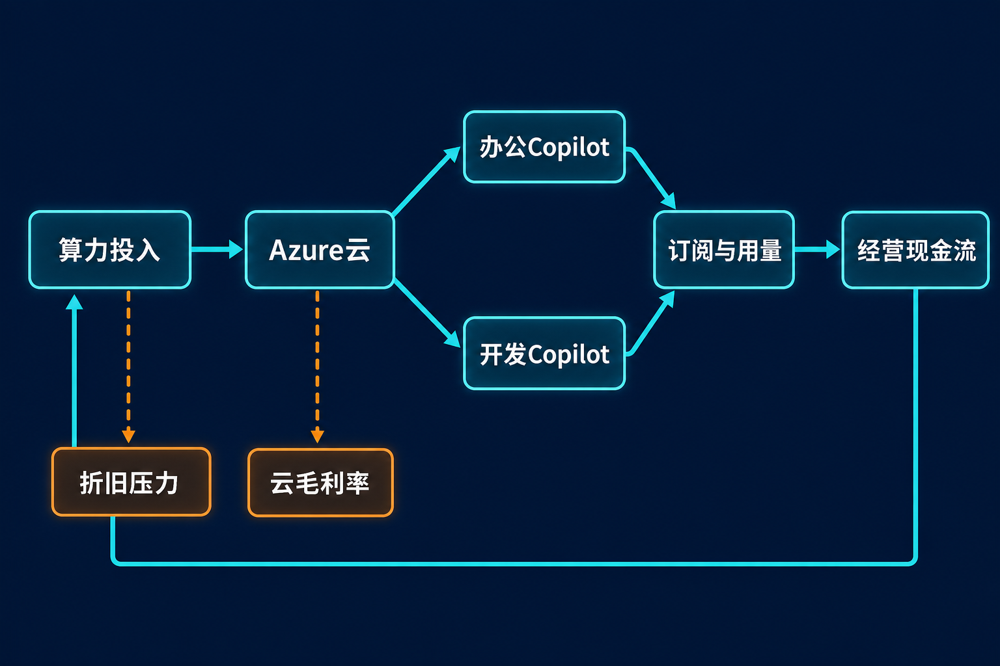

微软最新季度呈现出一组值得追问的数字：Azure及其他云服务收入同比增长43%，Microsoft 365 Copilot付费席位超过3000万；与此同时，季度资本开支达到410亿美元，同比增长约70%，远快于18%的总营收增速。[微软业绩公告](https://www.microsoft.com/en-us/investor/earnings/fy-2026-q4/press-release-webcast)｜[Axios](https://www.axios.com/2026/07/29/meta-microsoft-earnings-reports-ai)

核心问题因此不再是“AI有没有需求”，而是：**Azure与Copilot加速变现的速度，能否追上算力投入、折旧与云毛利压力？**

> 需要先说明，本文中的“事实”均来自微软披露及列明的媒体资料；“推断”是基于这些事实的分析，不等同于公司指引；“观点”则是研究框架下的判断。

## 一、公司与报告资料卡

| 项目 | 信息 |
|---|---|
| 公司 | 微软（Microsoft） |
| 证券市场 | 美国证券市场 |
| 报告期 | FY2026第四季度及全年，截至2026年6月30日 |
| 币种 | 美元 |
| 季度报表口径 | 未经审计 |
| 数据核实日期 | 2026年7月31日 |
| 主要观察对象 | Azure、Microsoft Cloud、Microsoft 365 Copilot、GitHub Copilot、资本开支与自由现金流 |

## 二、商业模式：从软件订阅走向“软件＋算力”

从本次披露可以观察到三条与AI直接相关的收入路径。

第一是Azure云服务。企业训练、部署和调用AI模型需要计算、存储与网络资源，Azure由此承接基础设施需求。FY2026年Azure收入首次超过1000亿美元，同比增长41%；第四季度Azure及其他云服务收入增速进一步达到43%。[微软业绩公告](https://www.microsoft.com/en-us/investor/earnings/fy-2026-q4/press-release-webcast)

第二是Microsoft 365 Copilot。它把AI能力嵌入企业办公订阅，付费席位已超过3000万。第三是GitHub Copilot，其收入在引入按使用量计费后，环比增速超过60%。这意味着微软正在同时尝试“按席位订阅”与“按使用量收费”两种变现方式。[微软电话会](https://www.microsoft.com/en-us/investor/events/fy-2026/earnings-fy-2026-q4)

**推断：**Azure负责出售底层算力，Copilot负责把AI包装成面向用户的生产力工具。两者若能形成循环——应用使用增加带动云消耗，云规模扩大又降低单位计算成本——便可能构成微软AI商业模式的核心飞轮。

但这个模式比传统软件订阅更重资产。数据中心、GPU、CPU和网络设备必须先投入，收入与现金回报则可能后置。路透的行业分析将这一变化概括为：大型科技平台正从较轻资产模式转向依赖数据中心和服务器的混合模式。[路透经Investing.com发布](https://www.investing.com/news/stock-market-news/analysisai-investment-boom-puts-big-techs-free-cash-flow-under-pressure-4804645)

## 三、增长驱动：Azure提速，Copilot进入放量阶段

Azure增速从第三季度的40%升至第四季度的43%；Microsoft 365 Copilot付费席位则从第三季度超过2000万增至超过3000万，且第四季度单季净增席位环比超过翻倍。[微软FY2026 Q3电话会](https://www.microsoft.com/en-us/investor/events/fy-2026/earnings-fy-2026-q3)｜[微软FY2026 Q4电话会](https://www.microsoft.com/en-us/investor/events/fy-2026/earnings-fy-2026-q4)

需求的另一项证据是商业剩余履约义务（RPO）达到6780亿美元，同比增长84%；剔除OpenAI后仍增长25%。不过，RPO是尚待履约的合同价值，不是当期收入，而且只有约30%预计在未来12个月确认。因此，它能说明订单能见度，却不能直接证明短期现金回报。[微软电话会](https://www.microsoft.com/en-us/investor/events/fy-2026/earnings-fy-2026-q4)

供给端也可能影响增速。第三季度管理层表示Azure需求仍超过可用容量，并预计容量约束至少延续整个2026日历年。换言之，部分投入既是争取未来市场，也是补足当前供给。[微软FY2026 Q3电话会](https://www.microsoft.com/en-us/investor/events/fy-2026/earnings-fy-2026-q3)

**观点：**当前产品周期已从“证明用户愿意尝试AI”进入“验证付费深度与持续使用”的阶段。席位数量很重要，但更关键的是续费、实际使用量，以及使用增长能否带来足够高的增量毛利。

## 四、财务质量：利润增长与现金流承压并存

FY2026第四季度营收900.07亿美元，同比增长18%；营业利润406.03亿美元，同比增长18%。GAAP净利润357.66亿美元、稀释每股收益4.81美元，分别增长31%和32%。剔除OpenAI投资影响后的非GAAP净利润为352.86亿美元、每股收益4.74美元，分别增长22%和23%。两种口径不能混用。[微软业绩公告](https://www.microsoft.com/en-us/investor/earnings/fy-2026-q4/press-release-webcast)

利润表看起来强劲，但毛利率发出不同信号：公司整体毛利率约67%，按报表数据计算约67.2%，低于上年同期约68.6%；Microsoft Cloud毛利率则由第三季度的66%降至65%。管理层将压力归因于收入结构向Azure倾斜、AI基础设施投资及AI产品使用增加，效率改善只抵消了部分影响。[微软电话会](https://www.microsoft.com/en-us/investor/events/fy-2026/earnings-fy-2026-q4)

现金流更能显示投入强度。季度经营现金流为554.41亿美元，现金购置物业和设备358.02亿美元，公司口径自由现金流约196亿美元。也就是说，现金资本投入吸收了约65%的经营现金流。

还需区分三个数字：410亿美元是季度资本开支，其中约三分之二投向寿命较短的CPU和GPU；358亿美元是现金支付的物业和设备支出；另有56亿美元融资租赁。它们不是同一口径，不能直接替换。[微软电话会](https://www.microsoft.com/en-us/investor/events/fy-2026/earnings-fy-2026-q4)

资本开支也不等于当期费用。设备成本会通过折旧在未来期间进入损益表。尤其短寿命计算资产需要持续更新，因此当期净利润增长并不能证明AI投入已经被完全覆盖。

**推断：**截至本季度，微软已用费用控制和经营杠杆守住约45%的营业利润率，但尚未在云毛利率与自由现金流层面完全消化AI重投入。

## 五、壁垒与竞争：产品协同之外，还有执行效率

微软已经展示出三类潜在壁垒：Azure的云基础设施规模、Microsoft 365与GitHub的付费入口，以及云服务和Copilot之间的产品协同。商业RPO与Copilot席位增长，则为需求黏性提供了阶段性证据。

基础设施效率同样重要：GPU上线时间同比缩短近50%，Copilot工作负载吞吐量自年初以来提高4倍；公司称Maia 200每美元性能较当前最新一代机群硬件提高30%。若这些改进能够转化为更低的单位推理成本，就可能缓冲毛利压力。[微软电话会](https://www.microsoft.com/en-us/investor/events/fy-2026/earnings-fy-2026-q4)

竞争并不轻松。AWS、Google Cloud、Oracle等云平台同步扩建AI基础设施，Meta等大型平台也在争夺GPU、组件与数据中心建设资源。竞争不仅发生在模型和应用层，也发生在供电、芯片、网络和部署速度上。[路透经Investing.com发布](https://www.investing.com/news/stock-market-news/analysisai-investment-boom-puts-big-techs-free-cash-flow-under-pressure-4804645)

## 六、估值敏感因素：不猜目标价，观察三个情景

**偏积极情景：**Azure维持较高增速，Copilot席位和使用量继续扩张，单位算力效率提高；云毛利率趋稳，自由现金流增速逐步追上资本开支。此时市场更可能认可AI投入的长期回报。

**中性情景：**收入保持增长，但资本开支和折旧同步上升，Microsoft Cloud毛利率在低位徘徊。利润仍增，现金转化率却难明显改善，估值将更多取决于增长持续时间。

**偏弱情景：**企业AI使用或续费不及预期，而设备更新、组件涨价和数据中心建设继续推高投入。自由现金流受压时，市场可能降低对远期增长的估值权重。

需要注意，管理层预计FY2027资本开支继续同比增长、全年营业利润率下降不到1个百分点，并保持自由现金流为正；FY2027第一季度资本开支预计超过500亿美元。这些都是前瞻性指引，并非已经实现的结果。[微软电话会](https://www.microsoft.com/en-us/investor/events/fy-2026/earnings-fy-2026-q4)

此外，2026日历年报告口径资本开支预期从约1900亿美元变为约1750亿美元，主要来自数据中心及办公楼估计使用寿命延长后租赁分类变化。管理层明确表示实际投资计划没有下调，因此不能把数字下降解读成建设收缩。

## 七、下行风险与跟踪清单

至少有五项风险值得持续观察：

1. **变现不及投入。**跟踪Azure增速、Copilot付费席位、按使用量收入与资本开支增速之间的差距。
2. **毛利率继续下降。**重点看Microsoft Cloud毛利率、公司整体毛利率，以及单位算力效率能否抵消折旧和AI使用成本。
3. **自由现金流被持续挤压。**跟踪经营现金流、现金购置物业和设备支出、自由现金流及现金资本投入占经营现金流比例。
4. **订单兑现偏慢或集中度较高。**关注剔除OpenAI后的RPO增速、未来12个月可确认比例及合同期限，而非只看RPO总额。
5. **供给与竞争风险。**跟踪Azure容量约束、GPU上线速度、组件价格以及AWS、Google Cloud和Oracle的扩建节奏。

## 结语：增长已经出现，回报仍需验证

微软FY2026第四季度证明了两件事：企业AI需求确实在加速，Azure与Copilot也已形成可观察的收入动力；但AI基础设施正显著抬高资本强度，并通过折旧、使用成本和现金支出压迫毛利率与自由现金流。

因此，对这份财报更中性的理解是：**AI变现已越过“是否存在”的验证阶段，却还没有完成“能否持续覆盖资本成本”的验证。**接下来，比单季收入超预期更重要的，是云毛利率能否企稳、Copilot使用能否转化为高质量收入，以及自由现金流能否在资本开支增长期保持改善。

> 本文仅供信息交流，不构成投资建议。证券价格可能波动，历史与当前经营数据均不代表未来表现。

## 参考资料

- [Microsoft Cloud and AI Strength Fuels Fourth Quarter Results](https://www.microsoft.com/en-us/investor/earnings/fy-2026-q4/press-release-webcast)，Microsoft Investor Relations，2026-07-29。
- [Microsoft Fiscal Year 2026 Fourth Quarter Earnings Conference Call](https://www.microsoft.com/en-us/investor/events/fy-2026/earnings-fy-2026-q4)，Microsoft Investor Relations，2026-07-29。
- [Microsoft Fiscal Year 2026 Third Quarter Earnings Conference Call](https://www.microsoft.com/en-us/investor/events/fy-2026/earnings-fy-2026-q3)，Microsoft Investor Relations，2026-04-29。
- [Microsoft beats Wall Street expectations with $90B in revenue](https://apnews.com/article/microsoft-earnings-results-ai-f7dff4fb9d51a2bdec56a13e5da1053d)，Associated Press，2026-07-29。
- [Meta and Microsoft report ballooning AI expenses](https://www.axios.com/2026/07/29/meta-microsoft-earnings-reports-ai)，Axios，2026-07-29。
- [Analysis—AI investment boom puts Big Tech’s free cash flow under pressure](https://www.investing.com/news/stock-market-news/analysisai-investment-boom-puts-big-techs-free-cash-flow-under-pressure-4804645)，Reuters经Investing.com发布，2026-07-22。
