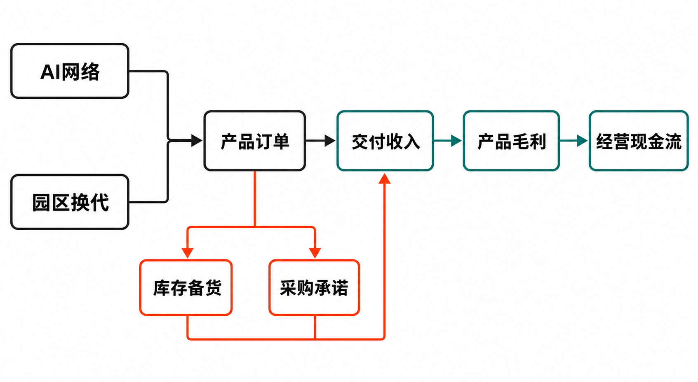

思科交出了一份增长强劲、但资产负债表信号更复杂的季度成绩单。

据公司《CISCO REPORTS FOURTH QUARTER AND FISCAL YEAR 2026 EARNINGS》披露，截至2026年7月25日的第四季度，思科收入为172.52亿美元，同比增长18%；产品订单同比增长35%，网络产品订单增长40%。但截至期末，公司库存已升至56.94亿美元，同比增长约80%；库存采购承诺达到171.65亿美元，同比增加约126%。

这构成了本次研报的核心问题：AI网络与园区换代确实推高了订单，但这些订单能否及时转化为收入、毛利和现金，进而消化已经形成的库存与供应承诺？

需要先区分三个层次：订单增长是事实；Silicon One可能提高产品复用能力，是基于产品架构的推断；它足以完全化解库存风险，则目前没有数据支持。

## 一、公司与报告期资料卡

- 研究主体：Cisco Systems, Inc.（思科）
- 证券市场：本次资料包未提供可核验的上市市场与证券代码，本文不作补充
- 报告期：FY2026第四季度及全年，财年截至2026年7月25日
- 财务口径：美国GAAP及公司调整后的非GAAP口径
- 币种：美元
- 数据核实日期：2026年8月21日
- 信息限制：截至核实日，资料包尚未包含FY2026正式Form 10-K；第四季度采购承诺的期限分布和不可取消比例仍待监管文件确认

## 二、商业模式：硬件放量，服务提供稳定器

思科的收入来自网络、安全、协作、可观测性产品及服务。FY2026第四季度，Networking收入为97.91亿美元，同比增长28%，约占当季总收入的56.8%；Security收入22.26亿美元，同比增长14%；Collaboration收入11.67亿美元，增长12%；Observability收入2.75亿美元，增长6%；Services收入37.93亿美元，基本持平。（来源：思科FY2026第四季度业绩公告，2026-08-12）

这组结构表明，本轮增长主要由网络产品而非服务拉动。产品收入当季达到134.59亿美元，同比增长24%；服务收入没有同步增长。经营含义是：思科正在重新获得硬件增长弹性，却也因此更容易受到芯片、内存、光学器件成本和客户交付节奏影响。

服务业务仍有稳定价值。公司披露，第四季度非GAAP服务毛利率为71.6%，同比提高80个基点，明显高于产品毛利率。不过，资料没有给出本轮AI硬件后续能够带来多少服务收入，因此不能把硬件订单机械外推为订阅或服务增长。

## 三、增长驱动：AI网络与园区换代形成“双周期”

第一条增长线是超大规模客户的AI基础设施投入。根据公司业绩材料，第四季度相关订单为40亿美元，FY2026全年累计93亿美元，约为上一财年的4.5倍；其中约60%来自Silicon One系统，约40%来自光学产品。四家主要超大规模客户的相关订单均实现三位数增长，Service Provider and Cloud产品订单总体增长95%。（来源：思科《Q4 FY2026 Prepared Remarks》，2026-08-12）

公司还披露三个新增AI设计胜出，包括P200 scale-across、G200 scale-out和一个光线路系统，并称已经收到订单。这支持Silicon One进入大型客户网络架构的事实，但客户身份、合同期限、取消条款和单项目毛利率均未披露。

第二条增长线来自企业园区。FY2026园区网络技术订单增长超过15%，第四季度园区网络订单增长20%；与此同时，公司称仅约7%的园区交换机安装基础完成更新。Wi-Fi 7已占当季无线订单的一半以上，无线预订增长超过25%。这意味着交换机、无线接入与多千兆以太网可能形成配套更新，但公司所称“超过1000亿美元的更新机会”属于市场空间估算，并非在手订单。

反例在于，订单不等于收入。思科FY2026超大规模客户AI订单为93亿美元，而当年确认的相关收入约40亿美元；期末剩余履约义务（RPO）为467.34亿美元，同比增长7%，递延收入为297.81亿美元，同比增长约3%，均明显慢于产品订单增速。不同指标的确认条件并不相同，不能直接用订单减去收入来计算积压。

## 四、财务质量：利润增长快，现金转化仍需修复

营收层面，思科FY2026全年收入为633.25亿美元，同比增长12%。第四季度GAAP净利润38.59亿美元，同比增长51%，GAAP稀释每股收益0.97美元；非GAAP净利润48.68亿美元、每股收益1.22美元，均增长23%。非GAAP结果剔除了股权激励、并购相关无形资产摊销等项目，不能与GAAP利润混用。

利润率传递出另一层信号。第四季度GAAP营业利润率为24.7%，非GAAP营业利润率为35.9%；非GAAP总毛利率为66.3%，同比下降210个基点，其中产品毛利率降至64.8%，下降270个基点。公司将压力归因于硬件占比提高和内存成本上涨，生产率改善及提价仅部分抵消影响。（来源：思科FY2026第四季度业绩材料，2026-08-12）

换言之，AI网络正在扩大收入，却尚未证明能带来更高的单位经济性。费用控制维持了营业利润率，但不能替代对产品毛利的观察。

现金流更能揭示扩张成本。FY2026经营现金流为141.77亿美元，略低于上年的141.93亿美元，没有随收入和GAAP净利润同步增长。全年购置固定资产14.10亿美元，高于上年的9.05亿美元；按经营现金流减去固定资产购置推算，自由现金流约127.67亿美元，同比下降约4%。这一定义是本文依据公司数据作出的计算，不应与其他机构的自由现金流口径混淆。

全年库存变动消耗现金25.41亿美元，融资应收款增加18.35亿美元，所得税净支付也构成拖累；应付账款增加贡献8.42亿美元、递延收入增加贡献11.25亿美元，提供了部分抵消。第四季度经营现金流达到53.86亿美元，同比增长27%，说明单季回款改善，但尚不足以改变全年现金转化基本持平的结果。

期末现金、现金等价物及投资合计159.18亿美元。FY2026分红65.53亿美元、回购61.06亿美元，合计126.59亿美元，约等于公司定义的全年自由现金流。资本回报本身不是问题，但它意味着当库存或供应承诺超预期恶化时，新增现金缓冲相对有限。

## 五、Silicon One是壁垒，也是尚待验证的“库存转换器”

思科官方将Silicon One描述为统一、可编程的芯片架构，覆盖AI集群、超大规模数据中心、运营商、企业园区与接入网络。G系列面向AI scale-out和scale-up，P系列面向域间互联与核心路由，其他系列覆盖交换、路由和接入；产品既可进入思科系统，也可用于第三方系统。

由此可以作出一项合理推断：统一架构、软件复用和多种系统形态，可能扩大零部件及设计的适用范围，降低单一用途ASIC的部分滞销风险。微软Azure采用以及Meta计划部署G200相关系统，也构成重要客户验证。

但这种推断存在边界。思科没有按芯片、客户或产品代际披露库存和采购承诺；端口速度、内存、光模块及散热方案仍会迭代。公司Q3 Form 10-Q还明确说明，相当部分采购安排属于确定、不可取消且无条件的承诺，需求骤降或技术变化可能带来库存减值及采购承诺损失，并计入销售成本。

竞争方面，资料将Broadcom和NVIDIA列为可比方案提供者，但没有提供统一口径的性能、价格、功耗、良率或市场份额测试。因此，本文的观点是：Silicon One已经形成架构差异化和客户导入基础，但现有证据不足以证明其壁垒不可替代，更不足以证明它能无损消化全部供应承诺。

## 六、库存与采购承诺：风险不在规模本身，而在转化速度

截至FY2026末，思科库存为56.94亿美元，较上年增加25.30亿美元；库存采购承诺由上年同期75.99亿美元升至171.65亿美元。两者合计约228.59亿美元，高于期末159.18亿美元的现金、现金等价物及投资。不过，采购承诺并非全部立即付款，也不能等同于已确认负债，直接比较只用于衡量潜在资金敞口，不能据此判断偿付能力。（来源：思科《Q4 Fiscal Year 2026 Earnings Slides》，2026-08-12）

真正需要跟踪的是三条转化链：订单能否按时交付并确认收入；硬件收入能否维持毛利；利润能否在扣除库存和融资应收款占用后形成现金。如果其中一环中断，备货就可能从供应保障变成资产减值压力。

## 七、估值敏感因素：不设目标价，只看关键变量

资料包未提供核实日股价、股本及一致预期估值倍数，因此本文不计算目标价。估值可以用三个经营情景理解：

**顺利消化情景：** FY2027超大规模客户AI收入接近公司预计的75亿美元，园区换代持续，库存增速回落，产品毛利企稳。此时市场更可能重视收入上修和AI平台化能力。

**温和转化情景：** 订单继续增长，但硬件占比和内存成本使毛利承压，库存仅缓慢下降。收入增长与自由现金流改善不同步，估值敏感点将转向现金转化率。

**需求回落情景：** 大客户资本开支、交付时点或技术路线发生变化，不可取消承诺转化为库存或损失准备。此时毛利、经营现金流和资产负债表将同时承压。

公司给出的FY2027收入指引为722亿至734亿美元，高于路透报道中LSEG汇总的686.9亿美元市场预期；但第一季度非GAAP毛利率指引为65%至66%，略低于报道所引66.10%的市场预期。收入预期强、毛利预期偏谨慎，正是估值分歧的来源。（来源：Reuters，2026-08-12）

## 八、下行风险与跟踪清单

至少需要持续观察以下风险与指标：

1. **订单兑现风险：** 跟踪AI订单转收入的速度、RPO与递延收入增速，以及订单取消或延期信息。
2. **库存减值风险：** 跟踪库存绝对额、环比增速、周转变化，以及正式Form 10-K中的减值和采购承诺损失准备。
3. **不可取消承诺风险：** 跟踪171.65亿美元采购承诺的期限、不可取消比例及按零部件划分的集中度。
4. **毛利率风险：** 跟踪非GAAP产品毛利率、内存和光学器件成本、提价效果，避免把费用控制误认为产品盈利改善。
5. **客户集中风险：** 跟踪四家主要超大规模客户的订单结构、资本开支周期及设计胜出能否扩展至更多客户。
6. **现金配置风险：** 跟踪经营现金流、库存和融资应收款占用，以及分红回购占自由现金流的比例。

## 结语：订单证明需求，现金流才完成验证

思科FY2026第四季度已经证明，AI网络和园区换代能够重新推动硬件增长，Silicon One也获得了订单与关键客户验证。但收入增长、产品毛利和现金流呈现出不同步：订单快速扩张，库存与采购承诺更快上升，全年经营现金流却基本持平。

因此，中性结论是：Silicon One是消化这些投入的重要条件，却不是充分条件。下一阶段最重要的证据，不是再增加多少订单，而是库存能否回落、采购承诺能否转为高质量收入、产品毛利能否企稳，以及经营现金流能否重新超过利润增长。

> 本文仅供信息交流，不构成投资建议。市场有风险，投资决策应结合个人风险承受能力并独立判断。

## 参考资料

1. Cisco Systems, Inc. Investor Relations：《CISCO REPORTS FOURTH QUARTER AND FISCAL YEAR 2026 EARNINGS》（FY2026第四季度及全年，披露于2026-08-12）  
   https://investor.cisco.com/news/news-details/2026/CISCO-REPORTS-FOURTH-QUARTER-AND-FISCAL-YEAR-2026-EARNINGS/default.aspx
2. Cisco Systems, Inc.：《Q4 Fiscal Year 2026 Earnings Slides》（披露于2026-08-12）  
   https://s21.q4cdn.com/812015656/files/doc_earnings/2026/q4/presentation/Q4FY26-Cisco-Earnings-Slides.pdf
3. Cisco Systems, Inc.：《Q4 FY2026 Prepared Remarks》（披露于2026-08-12）  
   https://s21.q4cdn.com/812015656/files/doc_earnings/2026/q4/transcript/Q4FY26-Prepared-Remarks.pdf
4. Cisco Systems, Inc. / U.S. Securities and Exchange Commission：《Form 10-Q for the quarter ended April 25, 2026》（提交于2026-05-19）  
   https://www.sec.gov/Archives/edgar/data/858877/000085887726000078/csco-20260425.htm
5. Cisco Systems, Inc.：《Cisco Silicon One – Processors for Unified Network Architecture》（访问于2026-08-21）  
   https://www.cisco.com/site/us/en/products/networking/silicon-one/index.html
6. Reuters：《Cisco forecasts annual revenue above estimates on sustained AI spending》（发布于2026-08-12）  
   https://www.investing.com/news/stock-market-news/cisco-forecasts-upbeat-annual-revenue-4856000
