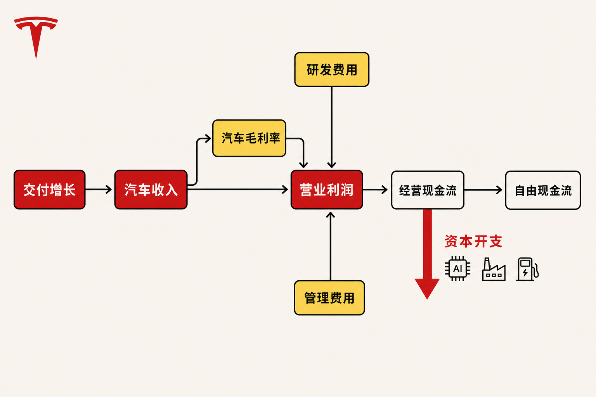

2026年第二季度，特斯拉交付480,126辆汽车，较当季451,758辆的产量高出28,368辆；同期GAAP营收达到282.36亿美元，同比增长26%。单看销量和收入，公司似乎重新进入增长轨道。

问题在于，交付反弹没有带来利润率同步改善：汽车业务GAAP总毛利率由上年同期17.2%降至16.9%，GAAP营业利润仅3.98亿美元。与此同时，特斯拉预计2026年资本开支超过250亿美元。

因此，本季真正需要回答的不是“车卖得是否更多”，而是：汽车业务能否产生足够稳定的利润和现金流，为AI、Robotaxi与机器人投资提供支撑？如果不能，当前估值所隐含的增长预期又需要哪些经营证据来兑现？

## 公司与报告资料卡

- 公司：Tesla, Inc.（特斯拉）
- 证券市场：美国证券市场，SEC申报主体；现有资料未列明具体交易所及证券代码
- 报告期：截至2026年6月30日的季度及上半年
- 财务口径：未经审计，除特别说明外采用GAAP
- 币种：美元；财务报表金额除每股数据外以百万美元计
- 数据核实日期：2026年8月6日

本文以特斯拉提交美国证券交易委员会的二季度10-Q为主要财务依据，并用一季度10-Q推导单季现金流。自由现金流采用“经营现金流减购置物业、厂房及设备支出”的派生定义，不属于GAAP指标。

## 商业模式：汽车仍是基本盘，能源与服务尚未改变利润结构

据特斯拉二季度10-Q披露，公司2026年第二季度GAAP总营收为282.36亿美元，其中汽车收入205.16亿美元、能源发电与储能收入31.39亿美元、服务及其他收入45.81亿美元。汽车业务约占总营收73%，仍是收入和盈利分析的核心。（来源：特斯拉2026年二季度10-Q，披露于2026-07-23）

汽车收入包括整车销售、租赁和监管积分等。第二季度汽车销售收入同比增长27%至200.06亿美元，公司解释主要动力是现金交付量增长约25%；监管积分收入则同比下降67%至1.46亿美元。这说明收入反弹主要由车辆销售数量推动，而不是依靠监管积分。

能源业务提供第二条增长曲线，但当季表现揭示了“规模增长不等于利润增长”。该业务第二季度收入同比增长13%至31.39亿美元，毛利率却由上年同期30.3%降至20.4%。公司将变化归因于销售组合、单位MWh成本上升和不利的质保调整。（来源：特斯拉2026年二季度10-Q）

由此可以作出一个推断：能源业务扩大了收入来源，却尚未在本季度形成更强的利润缓冲。该判断只针对当期财务结果，不等于否定其长期价值。

## 增长驱动与产品周期：销量修复，结构仍然集中

根据特斯拉7月2日发布的生产、交付与储能部署公告，公司第二季度生产451,758辆、交付480,126辆，其中Model 3/Y交付467,762辆，约占总交付量97.4%；其他车型交付12,364辆。产品组合仍高度依赖Model 3/Y。（来源：特斯拉《2026年第二季度生产、交付与部署》，2026-07-02）

交付高于产量，可能意味着公司消化了部分成品车库存。但这只是合理推断，不能直接当作库存质量改善的事实，因为在途车辆、地区结构和收入确认时点同样会影响两项数据。

储能产品当季部署13.5 GWh，是能源业务扩张的产品侧证据。不过，公司也明确提醒，交付量和储能部署量不能单独代表财务表现；平均售价、销售成本、汇率和业务组合都会影响收入、利润及现金流。

下一阶段的产品周期则更多押注于AI软件、Robotaxi、Cybercab和Optimus。美联社在二季度业绩报道中指出，管理层没有提供Robotaxi或Cybercab近期规模的充分量化细节。因此，这些项目目前属于未来增长选项，而不是已经得到财报验证的收入支柱。

## 财务质量：营收恢复，但核心经营利润承压

特斯拉2026年第二季度GAAP营收同比增长26%，但GAAP研发费用同比增长49%至23.71亿美元，销售、一般及行政费用同比增长45%至19.82亿美元。后者部分受到2025年CEO绩效奖励相关股权激励影响。费用增速明显高于营收增速，使GAAP营业利润降至3.98亿美元，营业利润率约1.4%。（来源：特斯拉2026年二季度10-Q）

归属于普通股股东的GAAP净利润为11.14亿美元，同比下降5%，但净利润明显高于营业利润。当季其他收入净额为5.90亿美元，财报还包含约10亿美元SpaceX股权投资未实现收益以及2.74亿美元所得税利益。这些项目说明，不能把全部净利润视为汽车、能源和服务业务产生的核心经营盈利。

美联社援引的剔除特定项目后每股收益为0.33美元，属于非GAAP指标。它可以辅助观察经营趋势，但不能与GAAP净利润或GAAP每股收益直接混用，更不能代替现金流分析。

汽车业务GAAP总毛利率由17.2%降至16.9%，而且这一口径包含监管积分收入。现有资料不足以证明剔除监管积分后的汽车毛利率已经改善。销量修复而毛利率未扩张，意味着价格、产品组合、成本和产能利用率之间的改善仍不充分。

## 现金流：250亿美元资本开支进入兑现阶段

截至2026年6月30日，特斯拉持有的现金、现金等价物与短期投资合计435.24亿美元，流动性缓冲仍然可观。上半年GAAP经营现金流为86.34亿美元，购置物业及设备支出为82.82亿美元，据此计算的上半年自由现金流约为3.52亿美元。（来源：特斯拉2026年二季度10-Q）

结合一季度10-Q，可以推导出第二季度经营现金流约46.97亿美元、资本开支约57.89亿美元，单季自由现金流约为负10.92亿美元。该结果是两份累计报表相减所得的非GAAP派生数据，并非公司直接披露的单季指标。

公司预计2026年资本开支超过250亿美元，投向包括AI算力与数据中心、制造及研发产线、公司运营的AI资产，以及零售、服务和充电网络。截至上半年已经支出82.82亿美元；若全年超过250亿美元，下半年还需支出至少约167亿美元。公司同时提示，高资本开支阶段可能需要经营现金流以外的资金。（来源：特斯拉2026年二季度10-Q）

管理层预计高投入可能持续两至三年。这是前瞻性判断，不是已经发生的财务事实。资本开支本身也不是价值创造的证明；只有当相关资产形成可计量收入、增量毛利和现金回收时，投入才可能转化为估值支撑。

## 竞争壁垒：制造规模与“物理AI”叙事仍待财务验证

从现有资料可以确认，特斯拉同时布局整车、储能、充电网络、AI算力、自动驾驶出行和机器人。跨业务协同可能形成数据、制造能力和基础设施复用，这是潜在壁垒，但目前仍属于分析推断。

路透社报道援引Morgan Stanley分析师观点称，投资者将关注资本开支增加是否强化特斯拉的“物理AI”护城河。该说法是外部机构的估值观点，不是公司已实现的经营结果。判断壁垒是否成立，需要看到Robotaxi覆盖范围、AI资产利用率、单位经济性及商业收入，而不只是技术展示或投入规模。

来源材料没有提供主要竞争对手同期的可比财务数据，因此本文不编造同业排名。可以确认的竞争压力包括整车价格与成本竞争、储能业务的单位成本和产品组合变化，以及自动驾驶与机器人项目的商业化速度竞争。

## 估值敏感因素：不猜目标价，观察三种情景

**改善情景：**汽车交付继续增长，汽车毛利率企稳或扩张；AI和制造资产逐步产生商业收入，使经营现金流能够覆盖资本开支。在这一情景下，市场对长期增长选项的信心可能增强。

**中性情景：**交付保持增长，但汽车与能源毛利率仍低位波动；Robotaxi和Optimus取得进展，却暂未形成可观收入。估值将更依赖时间表可信度，并对资本开支持续年限和自由现金流变化更敏感。

**承压情景：**价格或成本压力使汽车毛利率继续下降，高额研发与资本开支延续，而AI项目商业化晚于预期。即使账面流动性充足，核心经营利润和自由现金流承压也可能削弱估值基础。

上述均为条件推演，不是业绩预测。最关键的变量不是单一交付数字，而是“交付量×单车经济性”能否形成足够现金回报，以及AI投资何时从成本中心转为可验证的收入与利润来源。

## 下行风险与持续跟踪指标

第一，**汽车盈利能力风险**。若降价、产品组合或成本压力持续，销量增长可能无法转化为利润。应跟踪汽车业务GAAP总毛利率、监管积分收入、汽车销售收入与交付量的相对变化。

第二，**AI项目执行与回报风险**。Robotaxi覆盖和商业化进度可能晚于市场预期。应跟踪实际运营区域、付费使用规模、相关收入、增量毛利及AI资产利用率，而非只看发布节点。

第三，**资本开支与现金流错配风险**。应跟踪季度经营现金流、资本开支和派生自由现金流，以及公司是否需要经营现金流之外的融资。

第四，**能源业务利润率风险**。关税、单位MWh成本、销售组合和质保调整都可能压低盈利。应同时观察储能部署量、能源收入和能源毛利率，避免只用GWh判断业务质量。

第五，**政策与供应链风险**。特斯拉在10-Q中提示，贸易及财政政策、关税和地缘冲突可能影响成本、需求与供应链，且现行关税对能源储能业务的相对影响大于汽车业务。

## 结语

特斯拉2026年第二季度完成了交付量和营收的明显反弹，但财务质量尚未同步修复：汽车毛利率同比略降，能源毛利率显著回落，研发及管理费用快速增长，GAAP营业利润率约为1.4%，单季派生自由现金流转负。

超过250亿美元的年度资本开支不是天然利好或利空，而是一项需要持续验收的长期投资。汽车业务能否稳定创造现金、AI资产能否提高利用率、Robotaxi与Optimus能否形成可计量收入，将共同决定这轮投资最终是扩张护城河，还是延长现金回收周期。

现阶段较中性的结论是：交付反弹改善了增长叙事，却不足以单独证明当前估值获得了更坚实的盈利支撑。判断还需要等待利润率、核心营业利润、自由现金流和AI商业化数据形成连续证据。

**本文仅供信息交流，不构成投资建议。**

## 参考资料

1. Tesla, Inc. / 美国证券交易委员会：《Tesla, Inc. Quarterly Report on Form 10-Q for the quarter ended June 30, 2026》（报告期截至2026-06-30，披露于2026-07-23）  
https://www.sec.gov/Archives/edgar/data/1318605/000162828026049270/tsla-20260630.htm

2. Tesla Investor Relations：《Tesla Releases Second Quarter 2026 Financial Results》（披露于2026-07-22）  
https://ir.tesla.com/press-release/tesla-releases-second-quarter-2026-financial-results

3. Tesla Investor Relations：《Tesla Second Quarter 2026 Production, Deliveries & Deployments》（披露于2026-07-02）  
https://ir.tesla.com/press-release/tesla-second-quarter-2026-production-deliveries-and-deployments

4. Associated Press：《Earnings at Musk’s car company fall as research spending cuts into profit from selling cars》（发布于2026-07-22）  
https://apnews.com/article/tesla-musk-electric-vehicles-robotaxis-robots-976cc9e895bbdcbd3728e7ba178ffe40

5. Reuters：《Tesla cash burn to test investor faith in AI bets》（发布于2026-07-21）  
https://www.investing.com/news/stock-market-news/tesla-cash-burn-to-test-investor-faith-in-ai-bets-4802497

6. Tesla, Inc. / 美国证券交易委员会：《Tesla, Inc. Quarterly Report on Form 10-Q for the quarter ended March 31, 2026》（报告期截至2026-03-31，披露于2026-04-23）  
https://www.sec.gov/Archives/edgar/data/1318605/000162828026026673/tsla-20260331.htm
