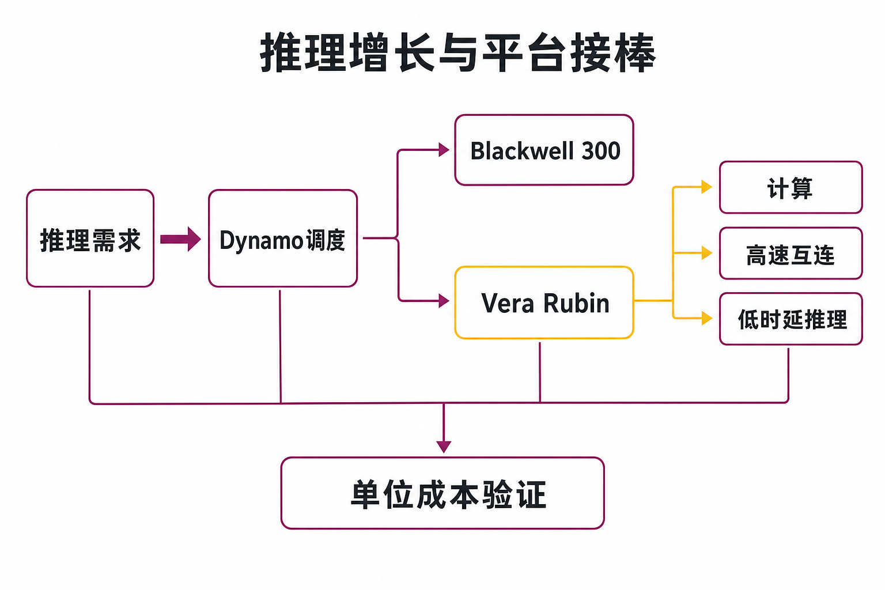
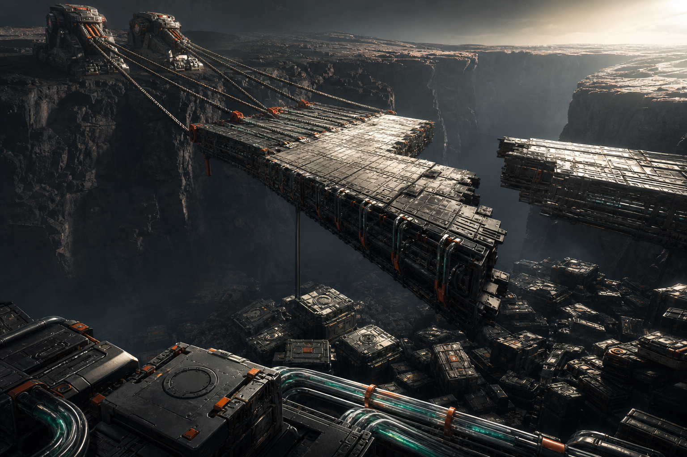

英伟达截至2026年4月26日的 FY2027 第一季度，GAAP 营收达到816.15亿美元，同比增长85%，其中数据中心收入752.46亿美元，占总营收约92.2%。与此同时，公司给出的第二季度营收指引为910亿美元、上下浮动2%，且没有计入任何中国数据中心计算收入。

这组数据提出了一个比“AI 需求还强不强”更关键的问题：当增长已高度集中于数据中心，中国市场又基本缺席，英伟达能否依靠推理需求、Blackwell 延续放量和 Rubin 平台接棒，继续支撑高增长、高毛利与高估值？（来源：英伟达 FY2027 第一季度业绩公告及 Form 10-Q，披露于2026-05-20）

## 一、公司与报告期资料卡

- 公司：NVIDIA Corporation（英伟达）
- 证券市场：美国纳斯达克市场
- 报告期：FY2027 第一季度，截至2026年4月26日的13周
- 财年说明：FY2027 为53周财年
- 财务口径：未经审计，GAAP 与公司调整后的 non-GAAP 并列
- 币种：美元，财务报表主要以百万美元列示
- 数据核实日期：2026年7月31日

需要特别注意，英伟达自 FY2027 第一季度起调整了 non-GAAP 口径，不再剔除股权激励费用，并重列历史比较数据。因此，本季度 non-GAAP 数据不能与未经重列的更早旧口径直接比较。

## 二、商业模式：从 GPU 供应商走向整座“AI 工厂”

英伟达当前的商业模式，已经不是单卖计算芯片。其数据中心方案将 GPU、CPU、NVLink、InfiniBand 或 Spectrum-X 以太网、DPU、存储和软件编排组合成机架乃至 POD 级系统。计算规模越大，网络互连和系统配套的单客户价值量通常也越高。

这种变化已经反映在收入结构中。按公司旧分类，FY2027 第一季度数据中心计算收入为604亿美元，同比增长77%；数据中心网络收入为148亿美元，同比增长199%。网络明显快于计算，说明机架级部署正在把增长由 GPU 扩展至互连环节，但现有资料没有披露 Rubin 已确认多少收入，不能把产品投产直接等同于收入兑现。（来源：英伟达《NVIDIA Announces Financial Results for First Quarter Fiscal 2027》）

客户结构也出现了值得观察的变化。该季度 Hyperscale 收入378.69亿美元，环比增长12%；AI 云、工业、企业等客户合计收入373.77亿美元，环比增长31%。事实是，两类客户规模已大致相当；合理推断是，需求正由传统超大规模云厂商向更多主体扩散。但由于这套分类缺乏足够长的历史序列，目前还不能断言客户集中问题已经解决。

## 三、增长动力：推理扩容与 Rubin 产品周期交汇

当期增长首先来自 Blackwell 300 放量，以及 InfiniBand、Spectrum-X Ethernet 和 NVLink 需求。更重要的产业变化，则是 AI 工作负载从集中训练进一步延伸到生成式推理和智能体任务。推理并非模型训练结束后的附属需求：用户调用越频繁、上下文越长、智能体执行步骤越多，持续计算需求就越大。

英伟达试图同时从硬件和软件两端降低单位推理成本。公司称，Dynamo 1.0 在特定基准下可使 Blackwell 上的生成式及智能体推理性能最高提升7倍。这里的“最高”是厂商测试上限，不代表所有模型和生产环境都能实现；其经营意义更可能是提高现有设备利用率、延长 Blackwell 周期，并降低客户迁移至 Rubin 的软件摩擦，而不是立刻形成一项可单独计量的收入。

下一棒是 Vera Rubin。英伟达在2026年3月宣布，包括 Vera CPU、Rubin GPU、NVLink 6、ConnectX-9、BlueField-4、Spectrum-6和 Groq 3 LPU 在内的七款芯片已经全面投产。Vera Rubin NVL72 集成72颗 Rubin GPU与36颗 Vera CPU，试图覆盖预训练、后训练、测试时扩展及低时延推理。

公司宣称，NVL72 相比 Blackwell 可用四分之一的 GPU 数量训练大型混合专家模型，并实现最高10倍每瓦推理吞吐和十分之一每 token 成本。这些数据应被视为厂商性能主张，仍需客户实际利用率、系统配置、良率及总体拥有成本验证。（来源：英伟达《NVIDIA Vera Rubin Opens Agentic AI Frontier》，2026-03-16）

笔者的观点是，Rubin 接棒是否成功，不能只看芯片峰值性能。由于销售单元已经扩大到机架与 POD，收入兑现同时依赖先进封装、HBM、网络、液冷、电力和整机协同。系统价值量上升扩大了机会，也增加了交付复杂度。

## 四、财务质量：高增长之外，要拆开利润与现金流

FY2027 第一季度，英伟达 GAAP 营收816.15亿美元，同比上升85%；GAAP 毛利率74.9%，上年同期为60.5%。但毛利率同比大幅恢复，主要因为上年同期45亿美元 H20 过剩库存及采购义务费用没有重演，并不完全来自产品组合改善。本季度仍有11亿美元库存及过剩采购义务拨备，对毛利率净拖累1.2个百分点。

利润口径尤其需要拆开。公司该季度 GAAP 净利润583.21亿美元，同比增长211%，其中包含159.36亿美元股权证券净收益；剔除股权证券损益等项目后的 non-GAAP 净利润为455.48亿美元。GAAP 净利润增长显著快于主营经营表现，不能把投资收益当成可稳定复制的芯片利润。相应地，GAAP 摊薄每股收益为2.39美元，non-GAAP 摊薄每股收益为1.87美元。

现金流表现仍然强劲。公司 FY2027 第一季度 GAAP 经营现金流为503.44亿美元，上年同期为274.14亿美元；公司定义的自由现金流为485.54亿美元。两者差额主要对应17.57亿美元不动产、设备和无形资产购买，以及0.33亿美元相关本金付款。这里应区分：经营现金流反映经营活动的现金创造，自由现金流则进一步扣除了公司定义的资本性支出相关项目。

现金转化也并非没有压力。季度内库存增加44.20亿美元，应收账款增加22.43亿美元，应付及应计负债上升抵消了部分占用；公司同时提示第二季度现金税预计显著增加，因此不能把第一季度自由现金流水平机械外推。（来源：英伟达《CFO Commentary on First Quarter Fiscal 2027 Results》）

## 五、壁垒与竞争：完整系统也是“双刃剑”

英伟达的主要壁垒，是计算、互连、系统和软件调度之间的协同。客户购买的不只是 GPU 峰值性能，还包括跨节点通信、开发工具、模型适配和部署效率。Rubin 加入 CPU、DPU、网络及面向低时延推理的 Groq 3 LPU，进一步扩大了平台覆盖范围。

但推理市场比训练更重视单位成本、能耗和特定负载效率。路透在《Nvidia’s outlook will be a test of its strategy to maintain AI dominance》中指出，Alphabet TPU、Amazon Trainium、AMD 和 Intel 都可能参与分流；部分大型客户一边采购英伟达产品，一边开发自研芯片。该判断属于外部市场观点，但揭示了一个重要矛盾：大客户既贡献巨大需求，也最有资本和动机降低对单一供应商的依赖。

因此，真正的竞争指标不是“有没有替代芯片”，而是 Rubin 在实际生产环境中的每 token 成本、软件迁移成本、供货速度和系统稳定性。若这些指标兑现，完整平台会加深壁垒；若客户只在部分推理负载上采用定制芯片，英伟达的收入增速也可能低于整个推理市场的增速。

## 六、中国缺位与客户集中：增长背后的结构性风险

按直接客户总部所在地统计，英伟达 FY2027 第一季度来自中国（含香港）的收入为45.50亿美元，上年同期为96.59亿美元。该地域口径不等同于最终用户或发货地点。更直接的事实是，本季度没有向中国交付数据中心 Hopper 产品，而上年同期相关收入为46亿美元。

公司表示，截至季度末实际上已无法参与中国数据中心计算市场；H200 虽取得少量许可证，但尚未形成收入，也不能确定能否获准进口。第二季度指引不包含中国数据中心计算收入，说明短期增长假设不依赖中国恢复，却不能证明中国的长期市场与生态损失已经被完全替代。

客户集中则是另一面。截至2026年4月26日，三名直接客户分别占英伟达应收账款的30%、18%和16%，合计64%。应收账款集中不等同于收入集中，但公司也披露，部分间接客户各自贡献总收入10%以上。这意味着少数客户的采购节奏、资本开支和自研芯片进展，可能同时影响收入增长与议价关系。（来源：英伟达 FY2027 第一季度 Form 10-Q）

## 七、估值敏感因素：不算目标价，只看变量组合

彭博报道显示，在 FY2027 第一季度财报发布前的2026年5月14日，英伟达市值已接近6万亿美元，七个交易日累计上涨约20%。这是特定时点的市场背景，不代表2026年7月底的即时估值，也不能单独证明高估或低估；它只说明市场当时已经计入了相当强的增长预期。

可以用三种情景理解估值敏感性：

- 强兑现情景：Blackwell 与 Rubin 交接顺畅，推理使用量增长转化为计算及网络收入，毛利率维持在指引附近，非 Hyperscale 客户继续扩张。估值的主要支撑来自盈利增速和现金流，而非倍数继续上升。
- 中性情景：总需求保持增长，但产品切换、供应约束和客户议价令收入增速逐步回落；毛利率稳定但缺少上行空间。市场会更关注实际收入相对高预期的差距。
- 压力情景：大客户资本开支放缓、定制芯片分流推理负载，或 Rubin 交付延迟叠加库存拨备。此时收入、毛利率和估值倍数可能形成同向压力。

英伟达第二季度910亿美元、上下浮动2%的收入指引，高于路透报道中 LSEG 汇总的约868.4亿美元一致预期，但指引不是已实现收入。财报后盘后股价仍一度下跌约1.6%，也侧面说明：高预期环境下，“超过预期”本身未必足够，增长质量和后续可持续性同样影响定价。（来源：Reuters《Nvidia bets on new data center chips for growth as sales outlook tops estimates》）

## 八、需要持续跟踪的风险与指标

第一，产品切换与供应风险。期末库存257.97亿美元，较上一季度增加约44亿美元；制造、供应及产能承诺达到1190亿美元，其中950亿美元预计在 FY2027 剩余期间支付。应持续跟踪库存增速、拨备规模、Rubin 量产收入及毛利率，而不能把供应承诺误读为客户订单。

第二，客户集中和资本开支风险。应持续观察 Hyperscale 与其他客户的收入增速、前三大直接客户应收账款占比，以及大型云厂商 AI 基础设施支出的实际兑现。客户越集中，其采购延迟或自研芯片替代造成的波动越大。

第三，中国市场与出口管制风险。需要跟踪 H200 等产品的许可、进口与收入确认，而非只看许可证数量；同时关注中国本地生态是否因英伟达缺位而扩大。

第四，推理竞争风险。应跟踪 Rubin 的实际每 token 成本、功耗、利用率和软件迁移情况，以及 TPU、Trainium、AMD、Intel 和其他专用芯片在真实负载中的采用范围。

第五，利润质量风险。需要把 GAAP 净利润中的股权证券收益单列，并持续比较经营利润、经营现金流、自由现金流、库存和应收账款的变化，避免用一次性投资收益解释主营盈利能力。

## 结语：接棒已经开始，验证才刚开始

英伟达 FY2027 第一季度证明，即使中国数据中心计算收入缺席，Blackwell、网络互连和更广泛的 AI 客户仍能推动营收与现金流高速增长。Rubin 全面投产则为下一轮周期提供了产品基础。

但事实与推断需要分开：已投产不等于已形成规模收入，厂商基准不等于客户实测，供应承诺不等于订单，强劲指引也不等于已经实现。笔者认为，未来几个季度的核心研究问题不是 AI 是否继续扩张，而是英伟达能否把推理需求转化为分散、可持续且现金回报良好的收入，同时控制客户集中、产品切换和中国市场缺位带来的风险。

本文仅供信息交流，不构成投资建议。证券市场存在风险，历史数据、公司指引及外部机构判断均不代表未来表现。

## 参考资料

1. U.S. Securities and Exchange Commission / NVIDIA Corporation：《NVIDIA Corporation Form 10-Q — For the Quarter Ended April 26, 2026》（披露于2026-05-20）  
https://www.sec.gov/Archives/edgar/data/1045810/000104581026000052/nvda-20260426.htm

2. NVIDIA Investor Relations：《NVIDIA Announces Financial Results for First Quarter Fiscal 2027》（披露于2026-05-20）  
https://investor.nvidia.com/news/press-release-details/2026/NVIDIA-Announces-Financial-Results-for-First-Quarter-Fiscal-2027/default.aspx

3. NVIDIA Corporation / U.S. Securities and Exchange Commission：《CFO Commentary on First Quarter Fiscal 2027 Results》（披露于2026-05-20）  
https://www.sec.gov/Archives/edgar/data/1045810/000104581026000051/q1fy27cfocommentary.htm

4. NVIDIA Newsroom：《NVIDIA Vera Rubin Opens Agentic AI Frontier》（发布于2026-03-16）  
https://nvidianews.nvidia.com/news/nvidia-vera-rubin-platform

5. NVIDIA Newsroom：《NVIDIA Enters Production With Dynamo, the Broadly Adopted Inference Operating System for AI Factories》（发布于2026-03-16）  
https://nvidianews.nvidia.com/news/dynamo-1-0

6. Reuters：《Nvidia’s outlook will be a test of its strategy to maintain AI dominance》（发布于2026-05-19）  
https://www.investing.com/news/stock-market-news/nvidias-outlook-will-be-a-test-of-its-strategy-to-maintain-ai-dominance-4697870

7. Reuters：《Nvidia bets on new data center chips for growth as sales outlook tops estimates》（发布于2026-05-20，2026-05-21更新）  
https://www.marketscreener.com/news/nvidia-forecasts-quarterly-revenue-above-estimates-announces-80-billion-share-buyback-ce7f5ad9df8af026

8. Bloomberg：《Nvidia Gains 20% in Seven Days, Nearing $6 Trillion Market Value》（发布于2026-05-14）  
https://www.bloomberg.com/news/articles/2026-05-14/nvidia-gains-20-in-seven-days-nearing-6-trillion-market-value
