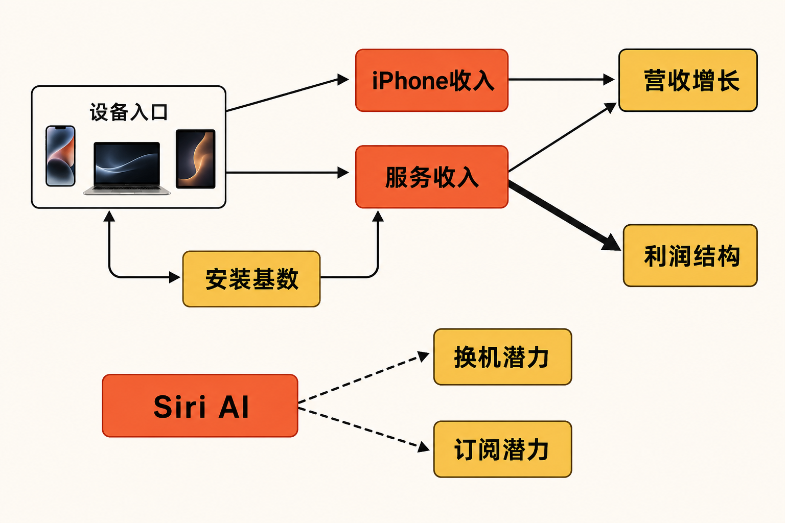
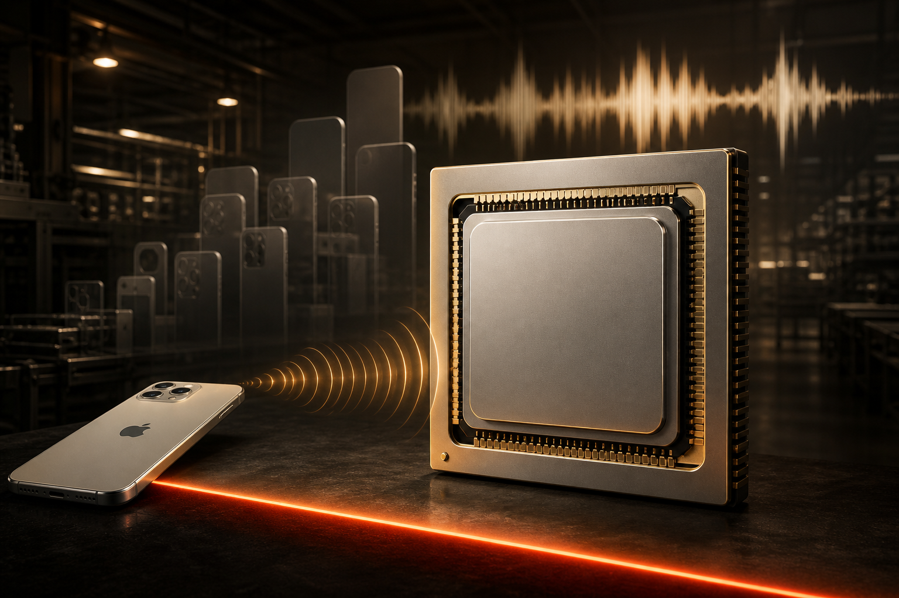

苹果交出了一份增长强劲、却不能简单外推的季报。

据苹果《FY26 Q3 Consolidated Financial Statements》披露，截至 2026 年 6 月 27 日的三个月，公司 GAAP 营收为 1094.17 亿美元，同比增长约 16.4%；其中 iPhone 收入同比增长约 21.7%，服务收入同比增长约 12.1%。问题是：当一次性利润增益消失、存储器成本上升后，尚处测试阶段的 Siri AI，以及超过 300 亿美元的 Broadcom 芯片合作，能否把本季增长转化为常态增长？

先给结论：现有证据支持“基本盘仍强”，尚不足以证明“AI 已成为财务增长引擎”。芯片协议增强的是供应链与产品能力，不是可以直接计入收入的订单。

## 公司资料卡

- **公司：**Apple Inc.（苹果）
- **证券市场：**美国纳斯达克市场；本文来源材料未提供证券代码，故不作扩展
- **报告期：**FY2026 第三季度，截至 2026 年 6 月 27 日
- **报表性质：**未经审计、GAAP 合并财务报表
- **币种：**美元；除每股数据外，公司报表金额以百万美元列示
- **数据核实日期：**2026 年 8 月 11 日

## 一、商业模式仍是“设备入口＋高毛利服务”

苹果的产品收入来自 iPhone、Mac、iPad、可穿戴设备及相关硬件；服务则依托活跃设备安装基数，覆盖数字内容、订阅及云服务等生态业务。公司称本季活跃设备安装基数创下新高，但没有披露绝对数量。

本季产品销售额为 786.78 亿美元，服务销售额为 307.39 亿美元。iPhone 单项收入 542.52 亿美元，与服务合计达到 849.91 亿美元，占总营收约 77.7%。这表明增长并未摆脱核心手机与生态服务的双重依赖，也说明 Siri AI 当前首先影响的可能是换机、留存和订阅，而非独立的“AI 收入”。（来源：苹果 FY2026 第三季度合并财务报表，披露于 2026-07-30）

利润结构比收入占比更能解释服务的重要性。按公司披露的收入与销售成本计算，本季产品毛利率约 40.1%，服务毛利率约 75.6%。这是研究计算值，并非苹果公布的调整后指标。由此推断，服务即使增速低于 iPhone，只要保持扩张，仍可能改善利润组合；反过来，若 AI 推理成本上升而无法形成订阅增量，服务的高毛利优势也可能被稀释。

## 二、增长来自成熟业务，Siri AI 尚待验证

本季 iPhone 收入由上年同期的 445.82 亿美元升至 542.52 亿美元，服务收入由 274.23 亿美元升至 307.39 亿美元，两者均创六月季度纪录。Mac 也实现双位数增长。事实层面，这是硬件与服务共同扩张；但苹果没有单列 AI 收入、AI 带来的销量增量或付费转化，因此不能把本季增长归因于 Siri AI。

苹果在 WWDC26 公告中称，新一代 Siri AI具备个人上下文、屏幕感知、跨应用操作和网页知识问答等能力，并结合设备端模型与 Private Cloud Compute。开发者测试已于 2026 年 6 月 8 日启动，用户版本计划在年内先以英文测试版推出。上述能力是公司产品描述，并非经独立验证的采用结果。（来源：苹果 WWDC26 公告，发布于 2026-06-08）

Siri AI 的商业路径大致有两条。第一，部分旧设备不受支持，可能推动兼容机型换机；第二，部分服务器模型功能设有每日使用限制，更高额度随多数 iCloud+ 订阅提供，可能促进服务变现。这些均属于合理推断，关键证据——正式上线时间、活跃使用率、换机贡献、订阅净增和单位推理成本——目前全部缺失。

地区限制同样重要。公司称 Siri AI 在中国暂不提供，欧盟的 iPhone、iPad 与 Apple Watch 初期也不支持。即便功能体验达到预期，关键市场缺席仍会限制早期规模效应。

## 三、财务质量：利润亮眼，但一次性因素不可忽略

苹果本季 GAAP 营业利润为 356.95 亿美元，同比增长约 26.6%；GAAP 净利润为 297.89 亿美元，同比增长约 27.1%；GAAP 摊薄每股收益为 2.02 美元，同比增长约 29%。利润增速明显高于营收增速，但其中包含关税退款影响。

公司披露的 GAAP 毛利率为 50.1%，约两个百分点来自关税退款；每股收益也有 0.11 美元由该退款贡献。以公司披露口径推算，剔除退款后的毛利率约为 48.1%。因此，50.1% 不应直接作为常态利润率外推。（来源：苹果《Apple reports third quarter results》，披露于 2026-07-30）

现金流仍具韧性。FY2026 前九个月，苹果经营现金流为 1169.96 亿美元，购置物业、厂房及设备支出为 67.99 亿美元；两者相减得到约 1101.97 亿美元的自由现金流代理值。该数值是研究者计算的非 GAAP 观察指标，并非公司正式披露的自由现金流。同期股票回购现金支出为 620.94 亿美元，显示公司仍有较强资本回报能力。

研发投入也在加速：FY2026 前九个月研发费用为 340.35 亿美元，同比增长约 32.5%，快于同期营收约 16.1%的增速。它说明投入强度上升，却不能证明 Siri AI 已产生回报，因为苹果没有拆分相关研发费用。

另一个警讯是库存。截至期末，苹果库存为 110.92 亿美元，较 2025 年 9 月 27 日的 57.18 亿美元增加约 94%；前九个月库存增加占用现金 54.61 亿美元。库存可以缓冲短期供应紧张，也会提高需求误判、价格下跌和减值风险。

## 四、300 亿美元协议解决什么，又不能解决什么？

苹果 7 月 8 日宣布与 Broadcom 达成新的多年期合作，预计金额超过 300 亿美元，将为多代苹果产品设计和生产定制硅器件、先进射频组件及无线连接技术，并推动在美国生产超过 150 亿颗芯片。Broadcom 向美国证交会提交的 Form 8-K 进一步确认，合作延长至 2031 年，涉及用于多代苹果产品的定制 ASIC 硅产品。

必须澄清三个口径：300 亿美元是多年期采购或投入承诺，不是苹果收入，不是苹果财务报表中的资本开支，也不是 Broadcom 已确认收入；Broadcom 拟为科罗拉多州设施投入的 15 亿美元资本开支属于 Broadcom；这项协议覆盖定制硅、射频和连接组件，并非单一的 AI 训练芯片协议。（来源：苹果 Broadcom 合作公告，发布于 2026-07-08）

它可能提高关键组件的供应可见度、本土化程度和跨世代协同效率，这是苹果硬件整合壁垒的一部分。但公告没有披露采购单价、最低采购量、良率、成本节约或取消条款，因而无法证明协议将改善毛利率。如果终端需求或技术路线变化，长期承诺反而可能降低采购灵活性。

协议也不能解决所有芯片压力。Tom’s Hardware 根据苹果报表及电话会信息指出，存储器成本是当季常态毛利率的压力来源；Broadcom 合作所覆盖的连接与定制硅，并不等同于 DRAM 等存储器供应。

## 五、壁垒与竞争：优势在整合，压力在替代选择

苹果的核心壁垒不是某个单点 AI 模型，而是硬件、操作系统、芯片、应用分发、服务和安装基数的整合。Siri AI 若能在设备端与私有云之间稳定协同，隐私架构可能成为差异化因素；但苹果关于数据不被存储或访问的说法仍需后续运行表现与独立验证支持。

竞争压力则来自其他大型科技公司的 AI 助手、云端模型与移动生态。现有来源没有提供各竞争对手的可比收入、用户规模或性能测试，因此本文不作量化排名。可以确认的是，苹果当前尚未披露 Siri AI 的使用率和付费率，这使其竞争壁垒仍停留在产品主张，而非商业结果。

## 六、估值敏感因素：不看目标价，看变量组合

本文不给目标价。对苹果估值更有解释力的是以下三种经营情景：

**积极情景：**Siri AI 按期扩大地区与设备覆盖，兼容机型换机率和 iCloud+ 订阅同步提高；服务维持双位数增长，AI 推理成本被新增收入吸收，Broadcom 合作改善供应稳定性。

**中性情景：**iPhone 与服务继续增长，但 Siri AI 主要提升留存而非直接变现；关税退款退出、存储器涨价令常态毛利率低于报告毛利率。此时估值更依赖安装基数与现金流稳定性。

**承压情景：**Siri AI 延期或地区限制延续，使用率不足；存储器成本与库存风险上升，长期采购承诺又降低供应调整空间。即使营收增长，利润率和现金转换也可能走弱。

需要持续跟踪的变量包括：iPhone 收入增速、服务收入及推算毛利率、Siri AI 正式上线与地区覆盖、兼容设备换机表现、iCloud+ 订阅转化、AI 单位推理成本、库存与经营现金流，以及 Broadcom 协议的采购节奏和良率。

## 七、至少四项下行风险

1. **AI 商业化风险：**Siri AI 仍为测试阶段，可靠性、使用频率和付费转化均未披露。
2. **地区与监管风险：**中国暂不可用、欧盟部分平台初期缺席，可能延后规模化变现。
3. **利润率风险：**关税退款不可持续，存储器价格上涨可能继续压缩常态毛利率。
4. **供应与库存风险：**库存同比大幅提高，长期芯片协议又可能带来供应商集中、技术路线变化及需求错配风险。

## 结语

苹果 FY2026 第三季度证明了 iPhone 与服务基本盘仍有增长能力，现金创造也保持强劲；但报告利润率包含明显的一次性利好。Siri AI 提供了换机、留存和订阅增量的可能性，超过 300 亿美元的 Broadcom 合作则增强了多代产品的组件可见度。两者都具有战略意义，却都还没有形成足以验证常态增长的财务证据。

对投资研究而言，更稳妥的判断不是预先给 AI 收益定价，而是等待产品覆盖、用户采用、服务转化、推理成本和常态毛利率共同给出答案。

**本文仅供信息交流，不构成投资建议。**

## 参考资料

1. Apple Inc.：《Apple reports third quarter results》（披露于 2026-07-30）  
https://www.apple.com/newsroom/2026/07/apple-reports-third-quarter-results/

2. Apple Inc.：《FY26 Q3 Consolidated Financial Statements》（FY2026 第三季度，披露于 2026-07-30）  
https://www.apple.com/newsroom/pdfs/fy2026q3/FY26_Q3_Consolidated_Financial_Statements.pdf

3. Apple Inc.：《Apple to increase spend with Broadcom to produce billions more U.S. chips》（发布于 2026-07-08）  
https://www.apple.com/newsroom/2026/07/apple-to-increase-spend-with-broadcom-to-produce-billions-more-us-chips/

4. Broadcom Inc.／美国证券交易委员会：《Form 8-K — Item 8.01 Other Events》（提交于 2026-07-06）  
https://www.sec.gov/Archives/edgar/data/1730168/000119312526295589/d84378d8k.htm

5. Apple Inc.：《WWDC26: Apple unveils next generation of Apple Intelligence, Siri AI, powerful parental controls, and an expansive set of software improvements》（发布于 2026-06-08）  
https://www.apple.com/newsroom/2026/06/apple-unveils-next-generation-of-apple-intelligence-siri-ai-and-more/

6. Apple Inc.：《Apple introduces Siri AI, a profoundly more capable and personal assistant》（发布于 2026-06-08）  
https://www.apple.com/uk/newsroom/2026/06/apple-introduces-siri-ai-a-profoundly-more-capable-and-personal-assistant/

7. Associated Press：《Strong iPhone sales propel Apple’s fiscal Q3 results past Wall Street’s expectations》（发布于 2026-07-30）  
https://apnews.com/article/apple-earnings-revenue-iphone-ai-94102918cb3592ebc1d2a38c4d7d819a

8. Tom’s Hardware：《Apple CEO Tim Cook says the company is fighting “a hundred-year flood” on memory pricing》（发布于 2026-07-31）  
https://www.tomshardware.com/tech-industry/apple-nearly-doubled-its-inventory-to-11-09-billion-as-memory-costs-ate-its-gross-margin
