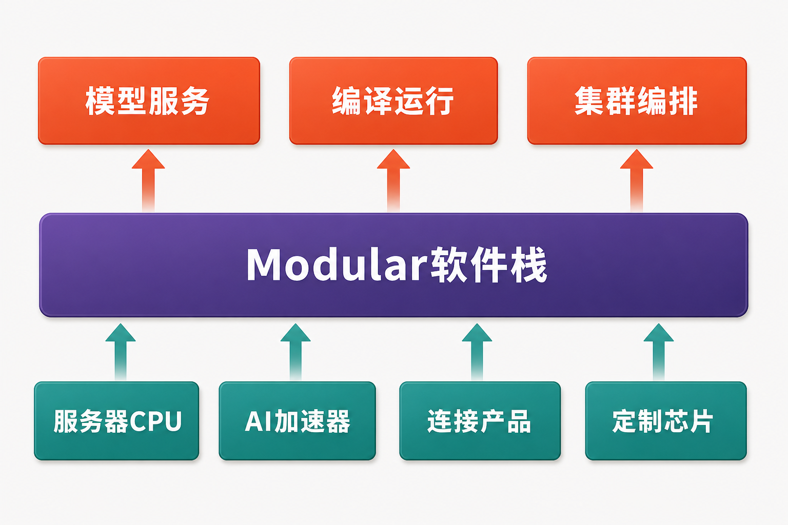

高通在 2026 财年第二季度回购了 1900 万股，耗资 28 亿美元；两个月后，公司又披露，拟在收购 Modular 时发行最多 1920 万股普通股。两组数字几乎相等，却代表相反方向：前者减少股本，后者可能重新增加股本。

根据高通提交的 Form 8-K，1920 万股是发行上限，并非确定数量，更不是“1920 万美元收购价”。以高通 2026 财年第二季度末 10.59 亿股已发行普通股静态计算，上限约相当于交割前股本的 1.8%。交易预计在 2026 年下半年完成，但仍取决于监管批准和惯常交割条件。（来源：高通 Form 8-K，披露于 2026-06-24）

真正的问题因而不是这笔交易“贵不贵”——现有材料没有固定美元对价，也没有 Modular 的收入、利润或现金流——而是高通能否用约 1.8% 的潜在股本稀释，补齐从端侧芯片进入数据中心 AI 最难复制的软件与开发者生态。

## 公司与行业资料卡

- **研究主体：** QUALCOMM Incorporated（高通）
- **证券市场：** 美国纳斯达克市场
- **财务基准期：** 截至 2026 年 3 月 29 日的季度及财年前六个月
- **会计及币种：** GAAP，美元；财务报表金额单位为百万美元
- **交易状态：** 已签署最终协议，资料核实日尚未完成交割
- **数据核实日期：** 2026 年 7 月 31 日
- **口径提示：** 2029 财年收入和非 GAAP EPS 均为管理层目标，不是已实现业绩或已签订单

## 商业模式：芯片、许可，以及尚待验证的数据中心第三支柱

高通现有商业模式主要由两部分组成。QCT销售手机、汽车和物联网等领域的芯片及系统解决方案；QTL依靠蜂窝通信专利组合取得许可收入。2026 财年第二季度，QCT收入为 90.76 亿美元，同比下降 4%；QTL许可收入约 15.42 亿美元，税前利润率约 72%。这意味着高利润许可业务仍是利润的重要支撑，而数据中心尚未形成单列收入。

QCT内部的结构变化解释了高通为什么需要寻找新增长曲线：当季手机收入 60.24 亿美元，同比下降 13%；汽车收入 13.26 亿美元，增长 38%；IoT收入 17.26 亿美元，增长 9%。汽车与IoT合计增长 20%，但绝对增量仍不足以抵消手机业务下降。（来源：高通《2026 财年第二季度业绩》，披露于 2026-04-29）

Modular可能带来的不是一项独立硬件收入，而是一层横跨CPU、GPU、NPU和定制ASIC的软件栈。公司公告称，其能力涵盖模型推理、部署、编译和编排。若这些工具能降低客户适配高通硬件的成本，软件可能成为芯片销售的“入口”；但公告没有披露 Modular 的付费客户、订单、递延收入或单位经济性，因此现在还不能把技术互补推导成收入增厚。

## 增长驱动：收购必须嵌入产品周期才有意义

高通为数据中心业务安排了一条密集路线：连接产品预计未来四个季度形成有意义收入；定制芯片预计自 2027 财年第一季度贡献收入；AI250及HBC计划于 2027 年中推出；AI300和第二代HBC计划于 2028 年推出；Oryon服务器CPU计划于 2028 年中推出。这些均为管理层计划，存在延期、验证和量产风险。（来源：高通《Investor Day 2026 Transcript》，活动日期 2026-06-24）

Modular的价值恰好位于这些硬件上方。其 MAX 框架、模型服务、量化、推测解码以及 OpenAI API 兼容能力，可以在理论上连接模型与不同处理器；MoE服务所需的跨云层、运行时和内核优化，也与高通聚焦推理能效的方向吻合。

但产品成熟度并不一致。Modular称其云服务覆盖 500 多个模型架构，这只是模型覆盖口径，不是客户数量；Mojo在收购前仍处于 1.0 Beta 2。由此可以作出的合理推断是：高通买到了一条有战略位置的软件技术栈，却未必买到已经稳定商业化的生态。（来源：Modular《Modular 26.4》，发布于 2026-06-18）

管理层提出，2029 财年QCT非手机收入将达到 400 亿美元，其中汽车 100 亿美元、IoT超过 140 亿美元、数据中心超过 150 亿美元；同期手机预计降至QCT收入约三分之一。这些是远期目标，而非合同金额。它们同时揭示了检验交易成败的时间窗口：Modular必须在 2027—2028 年主要芯片落地前完成工具链适配，才能影响客户选型，而不是在硬件上市后补课。

## 财务质量：净利润很高，但不能忽略税项与投入周期

高通 2026 财年第二季度GAAP营收为 105.99 亿美元，同比下降 3%；GAAP营业利润为 23.09 亿美元，同比下降 26%。GAAP净利润却达到 73.70 亿美元，稀释每股收益 6.88 美元，主要因为其中包含 57 亿美元、折合每股 5.33 美元的估值备抵转回所得税利益。

剔除该项目及其他非 GAAP 调整后，当季非 GAAP 净利润为 28.40 亿美元，同比下降 10%；非 GAAP 每股收益为 2.65 美元，同比下降 7%。因此，评估经营质量应更多观察营业利润、非 GAAP 利润和现金流，不能把税项抬高的GAAP净利润直接视为持续盈利能力。

截至 2026 年 3 月 29 日，高通持有现金及现金等价物 54.35 亿美元、可交易证券 43.64 亿美元，合计约 97.99 亿美元；同期短期债务为 4.98 亿美元，长期债务为 147.72 亿美元。股票支付可以减少交割时的现金消耗，但代价是稀释，且未来还可能产生无形资产摊销、股权激励和整合费用；现有披露不足以量化这些影响。

2026 财年前六个月，公司经营活动现金流为 74.14 亿美元，上年同期为 71.41 亿美元；资本开支由 4.91 亿美元升至 10.82 亿美元。按“经营现金流减资本开支”的简化口径，自由现金流约 63.32 亿美元，低于上年同期约 66.50 亿美元。同期季度研发费用为 24.63 亿美元，同比增长约 11.1%。现金创造仍有韧性，但资本开支和研发同步上升，说明数据中心与AI布局正从叙事进入投入期。（来源：高通截至 2026-03-29 的 Form 10-Q，披露于 2026-04-29）

## 壁垒之争：开放软件既是突破口，也是内在张力

高通的硬件组合包括 C1000服务器CPU、HBC、AI200/AI250/AI300推理加速器、连接产品和定制芯片。Modular若能提供统一的编译器、运行时、模型服务和集群编排，就可能减少客户为不同加速器重复改写软件的成本。

这构成区别于封闭生态的一种打法，却尚不能等同于壁垒已经形成。数据中心竞争不仅来自 Nvidia CUDA，也包括 AMD ROCm、云厂商自研加速器、Arm及x86服务器生态和其他开放编译栈。开发者真正关心的是主流模型覆盖、性能稳定性、调试工具、向后兼容以及生产部署可靠性，而不是“开放”这一标签本身。

更微妙的是，Modular的卖点是硬件中立；高通收购它的目的之一，却是让自家芯片获得首日优化。若过度倾斜高通硬件，可能削弱其他平台开发者的信任；若坚持完全中立，又可能降低交易对高通芯片的独占价值。这是收购后必须处理的战略张力。

高通还声称，HBC相对竞品HBM方案可实现约6倍带宽/瓦优势，并在不同工作负载下带来4至8倍总体拥有成本优势。上述数据来自公司估计，缺乏量产硬件、统一测试条件和独立复核，现阶段应视为待验证主张，而非已建立的竞争壁垒。

## 估值敏感因素：不算目标价，先看三种情景

由于交易没有披露固定美元对价、Modular财务数据和购买价分摊，精确计算市销率、盈利增厚或商誉回报都缺乏依据。更合适的方法是观察变量组合：

**顺利情景：** 交易按期交割，核心团队稳定；Modular在AI250、AI300和C1000上市时完成主流模型适配；客户协议转化为生产部署。此时潜在稀释可能换来软件采用、芯片收入和客户黏性的共同提升。

**中性情景：** 软件可以运行，但跨硬件性能不稳定，开发者采用缓慢；数据中心收入晚于产品发布时间释放。交易主要提高研发效率，却难以形成外部生态溢价。

**承压情景：** 交割或产品延期，关键人才流失，开放定位与高通优先优化发生冲突；同时手机业务继续走弱。此时新增股份、整合费用和持续研发投入可能先于收入出现。

影响市场判断的核心变量包括最终发行股数、交割后GAAP摊销和股权激励、数据中心毛利率、研发强度、客户收入确认速度，以及2029财年超过150亿美元的数据中心收入目标是否获得可核验的中间里程碑。

## 下行风险与跟踪清单

第一，**产品和量产风险**。AI250、AI300、HBC及C1000多数尚未商业化。需跟踪样片、量产、云客户生产部署与首次单列收入，而不能只看伙伴数量。

第二，**软件生态风险**。Mojo尚处测试阶段，跨CPU、GPU、NPU和ASIC的性能一致性未经充分公开验证。需跟踪稳定版本发布、活跃开发者、主流模型覆盖、向后兼容和独立基准测试。

第三，**整合及稀释风险**。最终发行数量可能调整，关键人才、商业关系和未知负债均可能影响交易回报。需跟踪最终交割股数、留任情况、无形资产摊销、股权激励及整合费用。

第四，**现金流和库存风险**。截至 2026 年 3 月 29 日，高通库存为 73.68 亿美元，较 2025 年 9 月 28 日的 65.26 亿美元增加约 12.9%。需结合手机需求、存储器供应与价格、经营现金流和资本开支变化判断库存是否与需求错配。

第五，**客户、供应链与监管风险**。主要客户自研芯片、先进制程产能、出口管制及许可模式争议不会因收购 Modular 而消失。相关指标包括主要客户集中度、先进制程供给、区域收入限制和QTL利润率。

## 结语：补到“能力”，距离形成“壁垒”仍有一段路

从技术拼图看，Modular确实对应高通数据中心路线中最明显的空白：硬件之上的编译、运行时、模型服务和集群编排。从资本安排看，最多发行1920万股减少了即时现金压力，但可能带来约1.8%的静态上限稀释。

中性判断是，高通通过收购补到了建设软件壁垒所需的能力，却还没有证明壁垒已经形成。答案最终不在交易公告里，而在2027—2028年的产品按期交付、开发者采用、生产部署和收入确认中。尤其在Modular财务数据、交易美元价值和会计影响均未披露的情况下，任何精确回报预测都为时过早。

**本文仅供信息交流，不构成投资建议。证券与科技产业投资存在风险，历史数据、公司目标及管理层估计均不代表未来结果。**

## 参考资料

1. U.S. Securities and Exchange Commission / QUALCOMM Incorporated：《Form 8-K Current Report》（事件日期 2026-06-21；披露于 2026-06-24）  
https://www.sec.gov/Archives/edgar/data/804328/000110465926077071/tm2618522d1_8k.htm

2. Qualcomm Incorporated：《Qualcomm to Acquire Modular》（披露于 2026-06-24）  
https://www.qualcomm.com/news/releases/2026/06/qualcomm-to-acquire-modular

3. U.S. Securities and Exchange Commission / QUALCOMM Incorporated：《QUALCOMM Incorporated Quarterly Report on Form 10-Q for the Quarter Ended March 29, 2026》（披露于 2026-04-29）  
https://www.sec.gov/Archives/edgar/data/804328/000080432826000061/qcom-20260329.htm

4. QUALCOMM Incorporated：《Qualcomm Announces Second Quarter Fiscal 2026 Results》（报告期截至 2026-03-29；披露于 2026-04-29）  
https://www.sec.gov/Archives/edgar/data/804328/000080432826000060/qcom032926erex991.htm

5. Qualcomm Investor Relations：《Qualcomm Accelerates Diversification with Comprehensive Strategy for Data Center and Sees Multiple Inflection Points Over the Next 3 to 5 Years》（披露于 2026-06-24）  
https://investor.qualcomm.com/news-events/press-releases/news-details/2026/Qualcomm-Accelerates-Diversification-with-Comprehensive-Strategy-for-Data-Center-and-Sees-Multiple-Inflection-Points-Over-the-Next-3-to-5-Years/default.aspx

6. Qualcomm Investor Relations：《Qualcomm Investor Day 2026 Transcript》（活动日期 2026-06-24）  
https://s204.q4cdn.com/645488518/files/doc_events/2026/July/InvestorDay2026_Transcript_Final.pdf

7. Qualcomm Technologies, Inc.：《Qualcomm Unveils Comprehensive Data Center Roadmap for the Agentic AI Era with New Qualcomm Dragonfly Portfolio》（披露于 2026-06-24）  
https://www.qualcomm.com/news/releases/2026/06/qualcomm-unveils-comprehensive-data-center-roadmap-for-the-agent

8. Modular Team：《Modular 26.4: SOTA MoE Serving, Model Bringup via Agent Skills, Mojo 1.0 Beta 2 and More》（发布于 2026-06-18）  
https://www.modular.com/blog/modular-26-4-sota-moe-serving-model-bringup-via-agent-skills-mojo-beta-2-and-more
