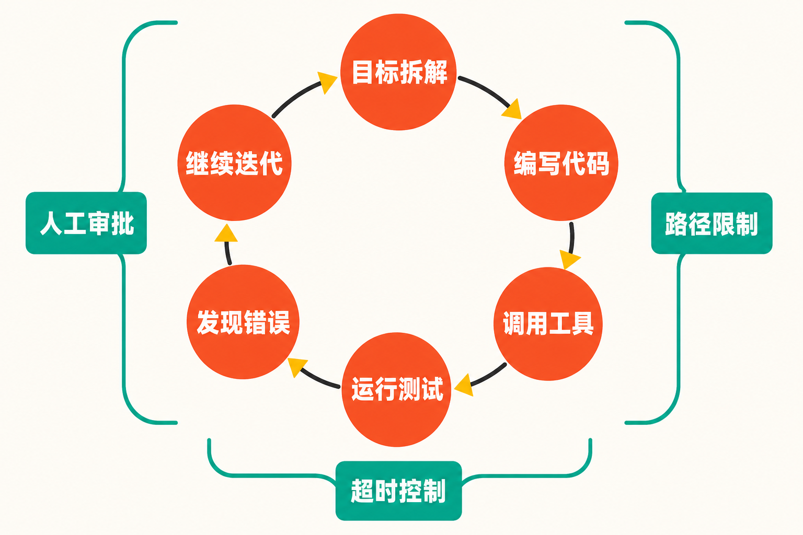

当一个大模型的总参数量达到2.4万亿，最容易传播的自然是数字。

但Qwen3.8-Max真正值得关注的变化，可能并不是模型又“大”了一轮，而是阿里把竞争重点进一步推向了一个更难验证、也更接近实际生产的问题：模型能否在较长时间里持续工作，自己拆解任务、调用工具、修改代码、运行测试，并在遇到错误后继续迭代？

据TechNode报道，阿里已经正式发布Qwen3.8，旗舰版本Qwen3.8-Max拥有[2.4万亿总参数](https://technode.com/2026/08/03/alibaba-launches-qwen3-8-with-2-4-trillion-parameters/)，重点面向编程、专业工作和长周期智能体任务。阿里同时表示，未来将开放Qwen3.8-Max以及较小版本Qwen3.8-27B的模型权重。

这让Qwen3.8-Max不只是一次常规的模型升级，也成为观察大模型竞争方向变化的一个窗口。

## 从预览到正式发布：阿里在铺一条产品化路径

**事实：**Qwen3.8-Max并非突然亮相。7月19日，Qwen3.8-Max-Preview已经在阿里云Model Studio的个人Token Plan中首发。官方当时将其称为Qwen家族最新、能力最强的模型，并介绍了多文件代码生成、重构、调试、数据分析、办公工作流和图像理解等能力。[Token Plan还提供OpenAI兼容与Anthropic兼容接口](https://modelstudio.alibabacloud.com/intl/blog/model-studio-token-plan-individual/)，降低了开发者迁移现有应用的门槛。

预览阶段，模型也已接入Qoder和QoderWork。换句话说，阿里并非只发布一个聊天入口，而是把模型放进代码开发与办公任务的工具链中，先验证真实调用场景，再推进正式版本。

**推断：**这种节奏说明，Qwen3.8-Max的目标并不局限于回答问题。接口兼容、开发工具接入和长周期任务能力共同指向一种产品定位：让模型从“生成一次答案”转向“接手一段工作”。

**观点：**参数规模决定模型能力上限的说法过于简单。对企业和开发者而言，更重要的是模型能否稳定接入现有系统，是否能连续执行复杂任务，以及出错时能否被追踪、约束和纠正。

## 2.4万亿参数很醒目，但不能直接等同于能力

**事实：**多家来源交叉确认，Qwen3.8-Max的总参数规模为2.4万亿。PChome在预览阶段的报道还称其采用MoE架构，最高上下文窗口为100万Token，可处理文本、图像、视频和文档，并支持多智能体协作。[相关技术信息见其预览版报道](https://article.pchome.net/content-2197010.html)。

但“总参数”只是理解模型的一项指标。MoE模型通常不会在每次推理时调用全部参数，因此，总参数规模与单次计算成本、响应速度乃至最终效果之间，并不存在简单的线性关系。

这里必须划清证据边界：iThome在7月21日指出，当时完整模型卡、基准方法、激活参数量与许可证尚未公布；PChome也提示，彼时仍缺少完整模型卡、权威评测结果和开源许可证。因此，预览阶段有关性能位置的宣传不能被直接视为独立评测结论。

美联社的报道同样采用了审慎表述：所谓“全球最强模型之一、仅次于Anthropic Fable 5”，是[阿里方面的主张](https://apnews.com/article/kimi-k3-china-ai-model-us-4c66a2e0f557ce79d3cc2d769c9a6226)，而不是媒体独立测试得出的判断。

**观点：**面对“2.4万亿”这样的数字，合理的阅读方式不是立刻得出“参数更多，所以一定更强”，而是继续追问：实际激活多少参数？测试方法是否公开？成本和延迟如何？在长任务中能否保持稳定？这些问题比单个榜单名次更能决定模型的真实价值。

## “十天自主编程”，究竟证明了什么？

此次发布中更具想象力的展示，是一项持续十余天的自主编程项目。

**事实：**公开项目名为oh-my-cli，是一个基于Qwen Code构建的最小化自主代码智能体CLI。其[GitHub仓库](https://github.com/qwen-code-dev-bot/oh-my-cli)包含实际代码、测试、配置和文档，呈现了项目从空目录开始持续迭代并形成可运行工具的结果。

项目不只是生成几段示例代码。按照仓库资料，它实现了提供者、工具、MCP与工作流扩展，并加入审批、超时、路径限制和敏感信息脱敏等安全边界。这一点很关键：真正的代码智能体不仅要“会写”，还必须知道哪些操作需要批准、运行多久应当停止、可以访问哪些路径，以及如何避免泄露敏感信息。

不过，证据同样有边界。

**事实：**公开仓库能够证明有一个可检查的项目产物，也能让外界查看代码、测试和功能结构。

**不能据此确认的是：**整个十余天过程是否完全无人干预、人工介入了多少次、模型经历了多少失败，以及算力和Token消耗如何。仅凭最终仓库，无法完整复原开发全过程。

因此，把它称为“长周期自主开发演示”是合适的；把它直接解释成“模型已经可以十天无人值守地替代一支工程团队”，则超出了现有材料能够支持的范围。

## 从代码生成到持续行动，难点变了

传统代码模型的典型任务，是根据提示补全函数、修复报错或解释一段代码。这类任务通常边界明确，反馈周期短。

长周期智能体面对的却是另一套问题：它要保持目标一致，管理不断增长的上下文，在多个文件间协调修改，调用外部工具，并根据测试结果反复纠错。任何一个小错误如果没有及时发现，都可能在后续步骤中被放大。

**推断：**oh-my-cli项目最值得关注的意义，并不在于它最终做出了一个多么复杂的产品，而在于它把模型放进了一个有状态、可持续、会失败的工作过程。模型需要处理的，不再是单轮“答案是否正确”，而是几十乃至更多步骤之后，“项目是否仍沿着正确方向前进”。

**观点：**这也解释了为什么审批、超时、路径限制等机制会成为项目的一部分。自主能力越强，系统边界越重要。未来企业评估代码智能体时，不能只看生成质量，还要检查权限控制、过程日志、失败恢复和人工接管机制。

## 权重将开放，意义与悬念并存

阿里已表示，未来会开放Qwen3.8-Max和Qwen3.8-27B的权重。这可能是此次发布中影响最深远的一步。

**推断：**如果权重按计划开放，研究机构和企业将有机会在自有环境中部署、测试和定制模型，也能更细致地研究模型在专业任务与长周期智能体场景中的表现。较小的27B版本，则可能为资源有限的开发者提供更现实的实验入口。

但“开放权重”不应自动等同于“完全开源”。是否允许商业使用、是否能够自由修改和再分发，仍取决于最终许可证；实际部署门槛还会受到模型体量、硬件需求和推理成本影响。

截至预览阶段报道发布时，许可证和若干关键技术细节仍未披露。[iThome当时对此作出了明确提示](https://www.ithome.com.tw/news/177467)。因此，在正式文件公布前，更准确的说法是“阿里宣布将开放权重”，而不是提前断言其开放范围与使用条件。

## 结语：真正的比赛，是模型能工作多久

Qwen3.8-Max带来了三个清晰信号：前沿模型的参数规模仍在扩张；代码能力正在从片段生成走向完整工作流；开放权重仍是中国大模型参与全球竞争的重要路径。

但对这次发布最有价值的理解，不是把2.4万亿参数、十余天自主编程或某个性能排名孤立地当成结论。

**事实**告诉我们，模型已经正式发布，长周期代码项目存在可检查的产物，权重开放也已列入计划；**推断**是，这些变化正在把大模型从对话工具推向持续执行任务的智能体；**观点**则是，行业下一阶段的关键指标，将不只是模型瞬间能答对多少题，而是它能否在清晰的权限边界内，可靠地把一件复杂工作做完。

> 这场竞争，正在从“谁更聪明”，转向“谁能更久、更稳、更可控地工作”。

## 参考资料

1. [TechNode：Alibaba launches Qwen3.8 with 2.4 trillion parameters](https://technode.com/2026/08/03/alibaba-launches-qwen3-8-with-2-4-trillion-parameters/)
2. [GitHub：qwen-code-dev-bot/oh-my-cli](https://github.com/qwen-code-dev-bot/oh-my-cli)
3. [Alibaba Cloud Model Studio：Token Plan for Individual](https://modelstudio.alibabacloud.com/intl/blog/model-studio-token-plan-individual/)
4. [iThome：阿里巴巴发表2.4兆参数Qwen3.8](https://www.ithome.com.tw/news/177467)
5. [Associated Press：中国前沿模型竞争报道](https://apnews.com/article/kimi-k3-china-ai-model-us-4c66a2e0f557ce79d3cc2d769c9a6226)
6. [PChome：阿里发布Qwen3.8预览版](https://article.pchome.net/content-2197010.html)
